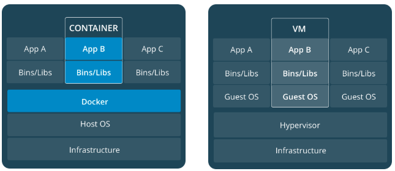
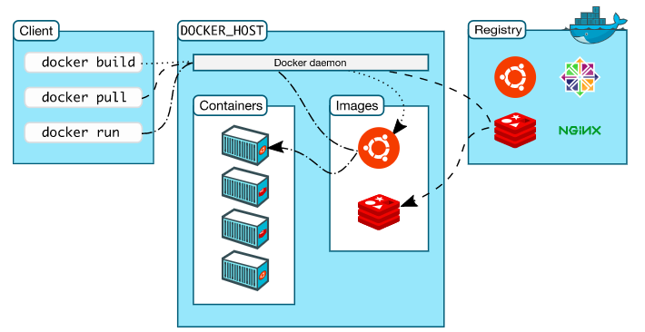
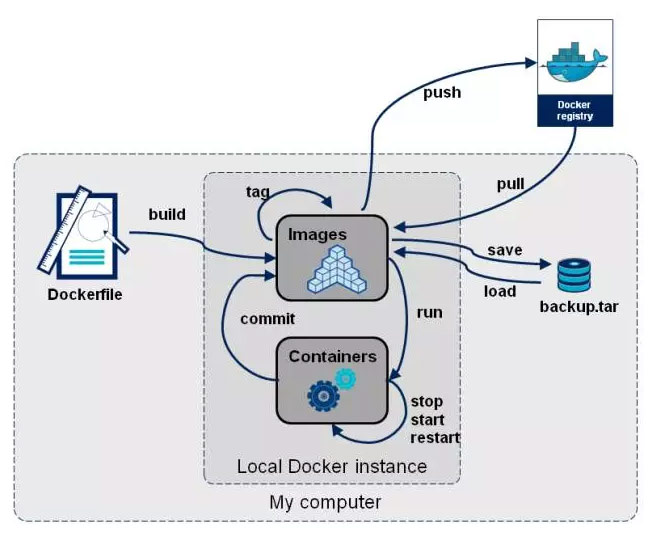
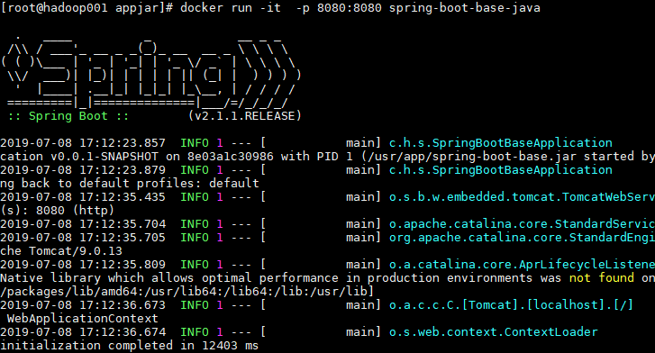

# Docker 基础

<nav>
<a href="#一Docker-简介">一、Docker 简介</a><br/>
<a href="#二Docker-架构与核心概念">二、Docker 架构与核心概念</a><br/>
<a href="#三Docker-常用命令">三、Docker 常用命令</a><br/>
<a href="#四DockerFile">四、DockerFile</a><br/>
<a href="#五案例">五、案例</a><br/>
</nav>

## 一、Docker 简介

Docker 是一个构建，发布和运行应用程序的开放平台。Docker 以容器为资源分隔和调度的基本单位，容器封装了整个项目运行时所需要的所有环境，通过 Docker 你可以将应用程序与基础架构分离，像管理应用程序一样管理基础架构，以便快速完成项目的部署与交付。

Docker 使用 Go 语言进行开发，基于 Linux 内核的 cgroup，namespace，以及 AUFS 类的 Union FS 等技术，对进程进行封装隔离，属于操作系统层面的虚拟化技术。最初实现是基于 LXC，从 0.7 版本以后开始去除 LXC，转而使用自行开发的 libcontainer，从 1.11 开始，则进一步演进为使用 runC 和 containerd。

- **runc** ：是一个 Linux 命令行工具，用于根据 [OCI容器运行时规范](https://github.com/opencontainers/runtime-spec) 创建和运行容器。
- **containerd** ：是一个守护程序，它管理容器生命周期，提供了在一个节点上执行容器和管理镜像的最小功能集。

下图体现了 Docker 和传统虚拟化方式的不同之处：传统虚拟机技术是虚拟出一套硬件后，在其上运行一个完整操作系统，再在该系统上运行所需应用进程；而 Docker 容器内的应用进程则是直接运行于宿主的内核，容器内没有自己的内核，而且也没有进行硬件虚拟，因此要比传统虚拟机更为轻便。

<div align="center">  </div>
## 二、Docker 架构与核心概念

Docker 使用 client-server 架构， Docker 客户端将命令发送给 Docker 守护进程，后者负责构建，运行和分发 Docker 容器。 Docker客户端和守护程序使用 REST API，通过 UNIX 套接字或网络接口进行通信。核心概念如下：

<div align="center">  </div>
### 2.1 镜像

Docker 镜像（Image）是一个特殊的文件系统，包含了程序运行时候所需要的资源和环境。镜像不包含任何动态数据，其内容在构建之后也不会被改变。

因为镜像包含操作系统完整的 `root` 文件系统，其体积往往是庞大的，因此在 Docker 设计时，充分利用 Union FS （联合文件系统）的技术，将其设计为分层存储的架构。所以一个镜像实际上是由多层文件系统联合组成。镜像构建时，会一层层构建，前一层是后一层的基础。每一层构建完就不会再发生改变，后一层上的任何改变只发生在自己这一层。比如，删除前一层文件的操作，实际不是真的删除前一层的文件，而是仅在当前层标记为该文件已删除。在最终容器运行的时候，虽然不会看到这个文件，但是实际上该文件会一直跟随镜像。因此，在构建镜像的时候，需要额外小心，每一层尽量只包含该层需要添加的东西，任何额外的东西应该在该层构建结束前清理掉。

分层存储的特征使得镜像的复用、定制变的更为容易。甚至可以用之前构建好的镜像作为基础层，然后进一步添加新的层，以定制自己所需的内容，构建新的镜像。

### 2.2 容器

镜像（Image）和容器（Container）的关系，就像是面向对象程序设计中的 `类` 和 `实例` 一样，镜像是静态的定义，容器是镜像运行时的实体。容器可以被创建、启动、停止、删除、暂停等。

容器的实质是进程，但与直接在宿主执行的进程不同，容器进程运行于属于自己的独立的命名空间。因此容器可以拥有自己的 `root` 文件系统、自己的网络配置、自己的进程空间，甚至自己的用户 ID 空间。容器内的进程是运行在一个隔离的环境里，使用起来，就好像是在一个独立于宿主的系统下操作一样，这种特性使得容器封装的应用比直接在宿主运行更加安全。

前面讲过镜像使用的是分层存储，容器也是如此。每一个容器运行时，是以镜像为基础层，在其上创建一个当前容器的存储层，我们可以称这个为容器运行时读写而准备的存储层称为 **容器存储层**。容器存储层的生存周期和容器一样，容器消亡时，容器存储层也随之消亡。因此，任何保存于容器存储层的信息都会随容器删除而丢失。

按照 Docker 最佳实践的要求，容器不应该向其存储层内写入任何数据，容器存储层要保持无状态化。所有的文件写入操作，都应该使用数据卷（Volume）、或者绑定宿主目录，在这些位置的读写会跳过容器存储层，直接对宿主（或网络存储）发生读写，其性能和稳定性更高。数据卷的生存周期独立于容器，容器消亡，数据卷不会消亡，因此，使用数据卷后，容器删除或者重新运行之后，数据却不会丢失。

### 2.3 仓库

镜像构建完成后，可以很容易的在当前宿主机上运行，但如果需要在其它服务器上使用这个镜像，就需要一个集中的存储、分发镜像的服务，这就是镜像仓库（Registry）。[Docker Hub](https://hub.docker.com/) 是 Docker 官方提供的镜像公有仓库，提供了大量常用软件的镜像，当然出于安全和保密的需要，你也可以构建自己的私有仓库。

### 2.4 Docker daemon

Docker daemon（dockerd）负责监听 Docker API 请求并管理 Docker 对象，如镜像，容器，网络和卷，守护程序彼此之间也可以进行通讯。

### 2.5 Docker Client

Docker 客户端（docker）是用户与 Docker 交互的主要方式。当你使用 docker run 等命令时，客户端会将这些命令发送到 dockerd，dockerd 负责将其执行。一个 Docker客户端可以与多个 dockerd 进行通讯。

## 三、Docker 常用命令

Docker 提供了大量命令用于管理镜像、容器和服务，命令的统一使用格式为：` docker [OPTIONS] COMMAND` ，其中 OPTIONS 代表可选参数。需要注意的是 Docker 命令的执行一般都需要获取 root 权限，这是因为 Docker 的命令行工具 docker 与 docker daemon 是同一个二进制文件，docker daemon 负责接收并执行来自 docker 的命令，它的运行需要 root 权限。所有常用命令及其使用场景如下：

<div align="center">  </div>
### 3.1 基础命令

- **docker version**：用于查看 docker 的版本信息
- **docker info**：用于查看 docker 的配置信息
- **docker help**：用于查看帮助信息

### 3.2 镜像相关命令

#### 1. docker search  镜像名

从官方镜像仓库 Docker Hub 查找指定名称的镜像。常用参数为`--no-trunc`，代表显示完整的镜像信息。

#### 2. docker images 

列出所有顶层镜像的相关信息。常用参数如下：

- **-a** ：显示所有镜像，包括中间隐藏的镜像
- **-q** ：只显示镜像 ID
- **--digests** ：显示摘要信息
- **--no-trunc** ：显示完整镜像信息

#### 3. docker pull  镜像名 [:TAG]

从官方仓库下载镜像，`:TAG`为镜像版本，不加则默认下载最新版本。

#### 4. docker rmi 镜像名或ID  [:TAG] 

删除指定版本的镜像，不加`:TAG`则默认删除镜像的最新版本。如果有基于该镜像的容器存在，则该镜像无法直接删除，此时可以使用参数`-f`，代表强制删除。rmi 命令支持批量删除，多个镜像名之间使用空格分隔。如果想要删除所有镜像，则可以使用命令`docker rmi -f $(docker images -qa)`。

## 3.3 容器相关命令

#### 1. docker run [OPTIONS] IMAGE [COMMAND] [ARG...]

run 是 docker 中最为核心的一个命令，用于新建并启动容器，其拥有众多可用参数，可以使用`docker run --help`查看所有可用参数。常用参数如下：

+ **-i** ：表示使用交互模式，始终保持输入流开放；
+ **-t** ：表示分配一个伪终端，通常和`-i`结合使用，表示使用伪终端与容器进行交互；
+ **-d** ：以后台方式运行容器；
+ **--name** ：指定容器启动容器的名字，如果不指定，则由 docker 随机分配；
+ **-c** ：用于给运行在容器中的所有进程分配 CPU 的 shares 值，这是一个相对权重，实际的处理速度与宿主机的 CPU 相关；
+ **-m** ：用于限制为容器中所有进程分配的内存总量，以B、K、M、G为单位；
+ **-v** ：用于挂载数据卷 volume，可以用多个`-v`参数同时挂载多个 volume。volume 的格式为：`[host-dir]:[container-dir]:[rw:ro]`，`[rw:ro]`用于指定数据卷的模式，`rw`代表读写模式，`ro`代表只读模式。
+ **-p** ：用于将容器的端口暴露给宿主机的端口，格式为：`hostPort:containerPort`，通过端口的暴露，可以让外部主机能够访问容器内的应用。

#### 2. docker ps [OPTIONS]

列出当前所有正在运行的容器。常用参数如下：

- **-a** ：列出所有容器，包括运行的和已经停止的所有容器
- **-n** ：显示最近创建的 n 个容器
- **-q** ：只显示容器编号
- **--no-trunc** ：不要截断输出信息

#### 3. 启动\重启\停止\强制停止容器

与容器启动、停止相关的命令为：`docker start|restart|stop|kill 容器名或ID`，start 命令用于启动已有的容器，restart 用于重启正在运行的容器，stop 用于停止正在运行的容器，kill  用于强制停止容器。

#### 4. 进入正在运行的容器 

想要进入正在运行的容器，与容器主进程交互，有以下两种常用方法：

+ docker attach 容器名或ID
+ docker exec -it 容器名或ID /bin/bash

#### 5. 退出容器

想要退出正在运行的容器，有以下两种常用方法：

+ **exit** ：退出并停止容器；
+ **ctrl+P+Q** ：退出。

#### 6. docker rm 容器名或ID

删除已停止的容器，常用参数为`-f`，表示强制删除容器，即便容器还在运行。想要删除所有容器，可以使用`docker rm -f $(docker ps -aq)`命令。

#### 7. 查看容器信息

可以使用`docker inspect [OPTIONS] NAME|ID [NAME|ID...]`查看容器或者镜像的详细信息，想要查看指定的信息，可以使用 `-- format`参数来指定输出的模板格式，示例如下：

```shell
docker inspect --format='{{.NetworkSettings}}'  32cb3ace3279
```

#### 8. 查看容器运行日志

可以使用`docker logs [OPTIONS] CONTAINER`查看容器中进程的运行日志，常用参数如下：

- **--details** ：显示日志详情
- **-f** ：跟随日志输出显示
- **--tail** ：从末尾开始显示指定行的数据
- **-t** ：显示时间戳
- **--since** ：开始时间
- **--until** ： 结束时间

## 四、DockerFile

dockerfile 是 Docker 用来构建镜像的文本文件，包含自定义的指令和格式，可以通过 build 命令从 dockerfile 中构建镜像，命令格式为：`docker build [OPTIONS] PATH | URL | -` 。

dockerfile 描述了组装镜像的步骤，其中每条指令都是单独执行的。除了 FROM 指令，其他的每一条指令都会在上一条指令所生成镜像的基础上执行，执行完后会生成一个新的镜像层，新镜像层覆盖在原来的镜像之上从而形成新的镜像。为了提高镜像构建的速度， Docker Daemon 会缓存构建过程中的中间镜像。在构建镜像时，它会将 dockerfile 中下一条指令和基础镜像的所有子镜像做比较，如果有一个子镜像是由相同的指令生成的，则命中缓存，直接使用该镜像，而不用再生成一个新的镜像。常用指令如下：

### 1. FROM

FROM 指令用于指定基础镜像，因此所有的 dockerfile 都必须使用 FROM 指令开头。FROM 指令可以出现多次，这样会构建多个镜像，每个镜像创建完成后，Docker 命令行界面会输出该镜像的 ID。常用指令格式为：`FROM <image>[:<tag>] [AS <name>]`。

### 2. MAINTAINER

MAINTAINER 指令可以用来设置作者名称和邮箱，目前 MAINTAINER  指令被标识为废弃，官方推荐使用 LABEL 代替。

### 3. LABEL

LABEL 指令可以用于指定镜像相关的元数据信息。格式为：`LABEL <key>=<value> <key>=<value> <key>=<value> ...` 。

### 4. ENV

ENV 指令用于声明环境变量，声明好的环境变量可以在后面的指令中引用，引用格式为`$variable_name`或`${variable_name}`。常用格式有以下两种：

+ `ENV <key> <value>` ：用于设置单个环境变量；
+ `ENV <key>=<value> ...` ：用于一次设置多个环境变量。

### 5. EXPOSE

EXPOSE 用于指明容器对外暴露的端口号，格式为：`EXPOSE <port> [<port>/<protocol>...]`，您可以指定端口是侦听 TCP 还是 UDP，如果未指定协议，则默认为 TCP。

### 6. WORKDIR

WORKDIR 用于指明工作目录，它可以多次使用。如果指明的是相对路径，则它将相对于上一个WORKDIR指令的路径。示例如下：

```shell
WORKDIR /a
WORKDIR b
WORKDIR c
RUN pwd # 此时pwd为：/a/b/c
```

### 7. COPY

COPY 指令的常用格式为：`COPY  <src>... <dest>`，用于将指定路径中的文件添加到新的镜像中，拷贝的目标路径可以不存在，程序会自动创建。

### 8. ADD

ADD 指令的常用格式为：`COPY  <src>... <dest>`，作用与 COPY 指令类似，但功能更为强大，例如`Src`支持文件的网络地址，且如果`Src`指向的是压缩文件，ADD 在复制完成后还会自动进行解压。

### 9.  RUN

RUN 指令会在前一条命令创建出的镜像基础上再创建一个容器，并在容器中运行命令，在命令结束后提交该容器为新的镜像。它支持以下两种格式：

- `RUN <command>` （shell 格式）
- `RUN ["executable", "param1", "param2"]` (*exec* 格式)

使用 shell 格式时候，命令通过`/bin/sh -c`运行，而当使用 exec 格式时，命令是直接运行的，容器不调用 shell 程序，这意味着不会发生正常的 shell 处理。例如，`RUN ["echo","$HOME"]`不会对`$HOME`执行变量替换，此时正确的格式应为：`RUN ["sh","-c","echo $HOME"]`。下面的 CMD 指令也存在同样的问题。

### 10. CMD

- `CMD ["executable","param1","param2"]` (*exec* 格式, 首选)
- `CMD ["param1","param2"]` (作为 *ENTRYPOINT* 的默认参数)
- `CMD command param1 param2` (*shell* 格式)

CMD 指令提供容器运行时的默认值，这些默认值可以是一条指令，也可以是一些参数。一个 dockerfile 中可以有多条 CMD 指令，但只有最后一条 CMD 指令有效。CMD 指令与 RUN 指令的命令格式相同，但作用不同：RUN 指令是在镜像的构建阶段用于产生新的镜像；而 CMD 指令则是在容器的启动阶段默认将 CMD 指令作为第一条执行的命令，如果用户在 docker run 时指定了新的命令参数，则会覆盖 CMD 指令中的命令。

### 11.  ENTRYPOINT

ENTRYPOINT 指令 支持以下两种格式：

- `ENTRYPOINT ["executable", "param1", "param2"]` (*exec* 格式，首先)
- `ENTRYPOINT command param1 param2` (*shell* 格式)

ENTRYPOINT 指令 和 CMD 指令类似，都可以让容器在每次启动时执行相同的命令。但不同的是 CMD 后面可以是参数也可以是命令，而 ENTRYPOINT 只能是命令；另外 docker run 命令提供的运行参数可以覆盖 CMD，但不能覆盖 ENTRYPOINT ，这意味着 ENTRYPOINT  指令上的命令一定会被执行。如下 dockerfile 片段：

```
ENTRYPOINT ["/bin/echo", "Hello"]
CMD ["world"]
```

当执行`docker run -it image`后，此时输出为`hello world`，而当你执行`docker run -it image spring`，此时 CMD 中的参数会被覆盖，此时输出为`hello spring`。

## 五、案例

### 5.1 基于 Centos 镜像部署 Spring Boot 项目

生产环境中的大多数项目通常都部署在 Linux 服务器上，这里我们从基础的 Linux 镜像开始，并将我们的项目（这里以 Spring Boot 项目为例）一起打包构建成为一个完整的可执行的镜像。首先需要创建**Dockerfile**文件，其内容如下：

```shell
# 以官方仓库的centos镜像为基础开始创建
FROM centos
# 作者信息
MAINTAINER  heibaiying@heibaiying.com

# 把JDK安装包拷贝到容器中并自动进行解压
ADD jdk-8u211-linux-x64.tar.gz /usr/java/
# 拷贝项目Jar包到容器中
COPY spring-boot-base.jar  /usr/app/
# 配置Java环境变量
ENV JAVA_HOME /usr/java/jdk1.8.0_211
ENV JRE_HOME ${JAVA_HOME}/jre
ENV CLASSPATH .:${JAVA_HOME}/lib:${JRE_HOME}/lib
ENV PATH ${JAVA_HOME}/bin:$PATH
# 项目启动命令
ENTRYPOINT ["java", "-jar", "/usr/app/spring-boot-base.jar"]
```

将 JDK 安装包，Spring Boot 项目的 Jar 包以及 Dockerfile 文件放在同一个目录，然后执行下面镜像构建命令：

```shell
docker build -t spring-boot-base-java:latest .
```

镜像构建完成后，可以使用以下命令进行启动：

```shell
docker run -it  -p 8080:8080 spring-boot-base-java
```

这里为了观察到启动效果，所以使用交互的方式启动，实际部署时可以使用`-d`参数来后台启动，输出如下：

<div align="center">  </div>

### 5.2 基于 JDK 镜像部署 Spring Boot 项目

上面的项目我们是基于最基础的 Centos 镜像开始构建，但由于 Docker Hub 上已经提供了 JDK 的镜像，我们也可以选择从 JDK 镜像开始构建，此时构建过程更加简单。构建步骤和上面的完全一致，只是 Dockerfile 的内容有所不同，如下：

```shell
# 由于只需要运行环境，这里我们直接以官方仓库的jre镜像为基础开始创建
FROM openjdk:8u212-jre
# 作者信息
MAINTAINER  heibaiying@heibaiying.com

# 拷贝项目Jar包到容器中
COPY spring-boot-base.jar  /usr/app/
# 项目启动命令
ENTRYPOINT ["java", "-jar", "/usr/app/spring-boot-base.jar"]
```


# 参考资料

1. Docker 官方简介：https://docs.docker.com/engine/docker-overview/
2. Docker CLI 和 Dockerfile 官方文档： https://docs.docker.com/reference/
3. 浙江大学SEL实验室 . Docker 容器与容器云（第2版）. 人民邮电出版社 . 2016-10
4. Docker 从入门到实践：https://yeasy.gitbooks.io/docker_practice/
