# Java NIO

<nav>
<a href="#一简介">一、简介</a><br/>
&nbsp;&nbsp;&nbsp;&nbsp;&nbsp;&nbsp;&nbsp;&nbsp;<a href="#11-面向缓冲">1.1 面向缓冲</a><br/>
&nbsp;&nbsp;&nbsp;&nbsp;&nbsp;&nbsp;&nbsp;&nbsp;<a href="#12-同步非阻塞">1.2 同步非阻塞</a><br/>
&nbsp;&nbsp;&nbsp;&nbsp;&nbsp;&nbsp;&nbsp;&nbsp;<a href="#13-多路复用">1.3 多路复用</a><br/>
<a href="#二Buffer">二、Buffer</a><br/>
&nbsp;&nbsp;&nbsp;&nbsp;&nbsp;&nbsp;&nbsp;&nbsp;<a href="#21-缓冲区属性">2.1 缓冲区属性</a><br/>
&nbsp;&nbsp;&nbsp;&nbsp;&nbsp;&nbsp;&nbsp;&nbsp;<a href="#22-创建缓冲区">2.2 创建缓冲区</a><br/>
&nbsp;&nbsp;&nbsp;&nbsp;&nbsp;&nbsp;&nbsp;&nbsp;<a href="#23-操作缓冲区">2.3 操作缓冲区</a><br/>
&nbsp;&nbsp;&nbsp;&nbsp;&nbsp;&nbsp;&nbsp;&nbsp;<a href="#24-复制缓冲区">2.4 复制缓冲区</a><br/>
&nbsp;&nbsp;&nbsp;&nbsp;&nbsp;&nbsp;&nbsp;&nbsp;<a href="#25-直接缓冲区">2.5 直接缓冲区</a><br/>
<a href="#三Channel">三、Channel</a><br/>
&nbsp;&nbsp;&nbsp;&nbsp;&nbsp;&nbsp;&nbsp;&nbsp;<a href="#31-通道基础">3.1 通道基础</a><br/>
&nbsp;&nbsp;&nbsp;&nbsp;&nbsp;&nbsp;&nbsp;&nbsp;<a href="#32-文件通道">3.2 文件通道</a><br/>
&nbsp;&nbsp;&nbsp;&nbsp;&nbsp;&nbsp;&nbsp;&nbsp;<a href="#33-Channel-To-Channel">3.3 Channel To Channel</a><br/>
&nbsp;&nbsp;&nbsp;&nbsp;&nbsp;&nbsp;&nbsp;&nbsp;<a href="#34-ScatterGather">3.4 Scatter/Gather</a><br/>
&nbsp;&nbsp;&nbsp;&nbsp;&nbsp;&nbsp;&nbsp;&nbsp;<a href="#35-Pipe">3.5 Pipe</a><br/>
<a href="#四Selector">四、Selector</a><br/>
&nbsp;&nbsp;&nbsp;&nbsp;&nbsp;&nbsp;&nbsp;&nbsp;<a href="#41-创建选择器">4.1 创建选择器</a><br/>
&nbsp;&nbsp;&nbsp;&nbsp;&nbsp;&nbsp;&nbsp;&nbsp;<a href="#42-注册通道">4.2 注册通道</a><br/>
&nbsp;&nbsp;&nbsp;&nbsp;&nbsp;&nbsp;&nbsp;&nbsp;<a href="#43-select">4.3 select</a><br/>
&nbsp;&nbsp;&nbsp;&nbsp;&nbsp;&nbsp;&nbsp;&nbsp;<a href="#44-SelectionKey">4.4 SelectionKey</a><br/>
<a href="#五聊天室实例">五、聊天室实例</a><br/>
&nbsp;&nbsp;&nbsp;&nbsp;&nbsp;&nbsp;&nbsp;&nbsp;<a href="#51-群聊服务器">5.1 群聊服务器</a><br/>
&nbsp;&nbsp;&nbsp;&nbsp;&nbsp;&nbsp;&nbsp;&nbsp;<a href="#52-客户端实现">5.2 客户端实现</a><br/>
</nav>

## 一、简介

Java NIO 是 JDK 1.4 中引入的新的 IO 方式，它主要包含 Buffer、Channel、Selector 这三个核心的组件，它与传统 IO 的区别如下：

 <table>
  <tr>
    <th width='430px'>NIO</th>
    <th width='430px'>IO</th>
  </tr>
  <tr>
    <td align="center">面向缓冲</td>
    <td align="center">面向流</td>
  </tr>
  <tr>
    <td align="center">同步非阻塞</td>
    <td align="center">同步阻塞</td>
  </tr>
  <tr>
    <td align="center">多路复用（选择器）</td>
    <td align="center">无</td>
  </tr>
</table>

### 1.1 面向缓冲

传统的 IO 是面向流的，传统 IO 每次从流中读取一个或者多个字节，直至读取完所有的字节。而 NIO 是面向缓冲区的，所有的读写操作都需要通过 Buffer 来完成，数据会被先写入 Buffer 中，然后再进行处理，Buffer 提供了多种方法用于操纵其中的数据，因此其在操作上更加灵活，读取速度也更加快。

### 1.2 同步非阻塞

传统 IO 的流都是单向的，因此它们需要分为 Input Stream 和 Output Stream。而 NIO 中的 Channel 则是双向的，数据可以从 Channel 读到 Buffer 中，也可以从 Buffer 写到 Channel：

<div align="center"> 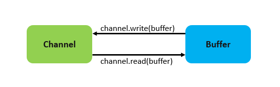 </div>


> 注意：从 Channel 写入到 Buffer 执行的是 read 方法，而从 Buffer 写出到 Channel 执行的是 write 方法。

Channel 可以设置为非阻塞模式，此时当 Channel 从 Buffer 中读取数据时，如果有待读取的数据则返回该数据；如果没有待读取的数据，对应的方法也不会阻塞，而是直接返回。

### 1.3 多路复用

Java NIO 通过 Reactor 模型实现了 IO 的多路复用，可以在一个线程上通过一个选择（Selector）使用轮询的方式去监听多个通道 Channel 上注册的事件，从而在一个线程上就能实现对多个 Channel 的处理：

<div align="center"> 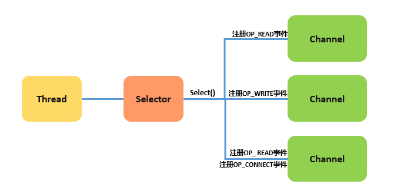 </div>


## 二、Buffer

### 2.1 缓冲区属性

<div align="center"> 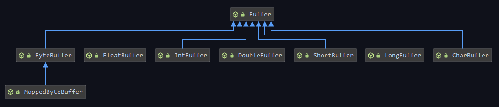 </div>


所有缓冲区（ByteBuffer、FloatBuffer、IntBuffer、DoubleBuffer、ShortBuffer、LongBuffer、CharBuffer、MappedByteBuffer）都直接或间接继承自 Buffer 抽象类，Buffer 中定义了缓冲区的四个基本属性：

```java
public abstract class Buffer {
 
    private int capacity;
    private int limit;
    private int position = 0;
    private int mark = -1;
    ...
}
```

+ **容量 (Capacity)** ：缓冲区所能容纳元素的个数。
+ **上界 (Limit)**：缓冲区中现存元素的个数。
+ **位置 (Position)**：下一个待操作元素的索引。
+ **标记 (Mark)**：标记位置。通过 `mark()` 方法可以让 mark 等于当前 position；之后通过 `reset()` 方法可以让 position 恢复到标记位置。

### 2.2 创建缓冲区

通常可以通过以下两种方法来创建缓冲区：

+ **allocate()**：通过指定缓冲区的容量大小来创建：

```java
CharBuffer buffer = CharBuffer.allocate(100);
```

+ **wrap()**：通过为缓冲区指定初始化数组来创建：

```java
char[] chars = new char[100];
CharBuffer buffer = CharBuffer.wrap(chars);
```

实际上，在缓冲区内部就是通过数组来存储元素，以 CharBuffer 为例，它的内部维持有一个名为 `hb` 的数组，用来存放实际的元素：

```java
public abstract class CharBuffer extends Buffer implements Comparable<CharBuffer>, Appendable, CharSequence, Readable
{
    final char[] hb;  
    ...
}
```

缓冲区创建完成后，它处于以下初始状态：

<div align="center"> 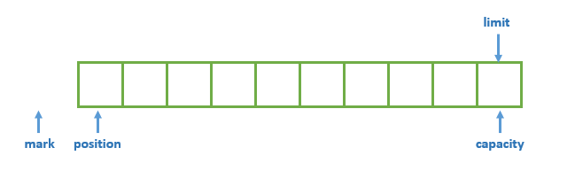 </div>


### 2.3 操作缓冲区

**1. put()**

用于向缓冲区中填充数据。以 CharBuffer 为例，有以下四个常用的重载方法：

```java
// 使用字符串填充数据
put(String src)
// 使用字符串填充数据，start为字符串的开始位置，end为字符串的结束位置（不包含）
put(String src, int start, int end)
// 使用数组填充数据
put(char[] src)
// 使用数组填充数据，offset为数组填充的开始位置，length为填充的长度,不允许越界  
put(char[] src, int offset, int length)
```

当我们向 Buffer 中添加数据后，position 属性也会随之变动：

<div align="center"> 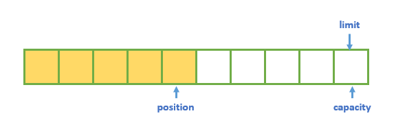 </div>


**2. get()**

用于读取缓冲区中的数据。以 CharBuffer 为例，有以下四个常用的重载方法：

```java
// 获取当前位置（postion）的数据
char get();
// 获取指定位置的数据
char get(int index);
// 获取数据并填充到数组中
CharBuffer get(char[] dst)
// 获取数据并填充到数据中，offset为数组填充的开始位置，length为填充的长度,不允许越界  
CharBuffer get(char[] dst, int offset, int length) 
```

**3. flip()**

该方法会将 position 的值赋给 limit，然后将 position 设置为 0，从而可以由写模式切换到读模式。无论任何情况，只要由写操作转换到读操作，都需要先执行该方法。示例如下：

```java
CharBuffer buffer = CharBuffer.allocate(100);
buffer.put("hello");
buffer.flip(); //由写模式切换到读模式
while (buffer.hasRemaining()) {
    System.out.println(buffer.get());
}
buffer.clear();
```

当使用 `filp()` 将 Buffer 由写模式切换到读模式后：position 属性会恢复到初始位置，代表从此处开始读取数据；limit 属性也会随之变动，代表我们所能读取数据的上界：

<div align="center"> 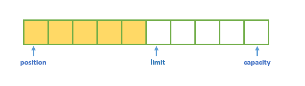 </div>


当我们再通过 `get()` 方法进行读取时，position 属性会随之移动，position 和 limit 之间就是待处理的数据：

<div align="center"> 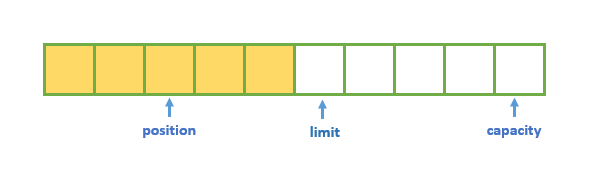 </div>


**4. hasRemaining()**

`hasRemaining()` 用于判断当前的 position 是否小于 limit：如果 position 小于 limit，则返回 true，代表仍有待处理的数据。

**5. clear()**

`clear()` 并不会真的清除缓冲区中的数据，它只是将 position 设置为 0，并将 limit 设置为 capacity 的大小，从而让缓冲区恢复到初始状态：

<div align="center"> 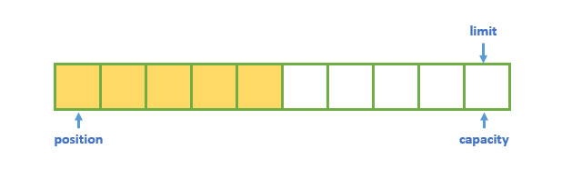 </div>

当有新的数据写入时，新的数据会覆盖原有位置上的数据。

**6. compact()**

用于压缩缓冲区，即将数组中待处理的数据复制到头部。如下所示，会将未读取的 `LL0` 复制到头部：

<div align="center"> 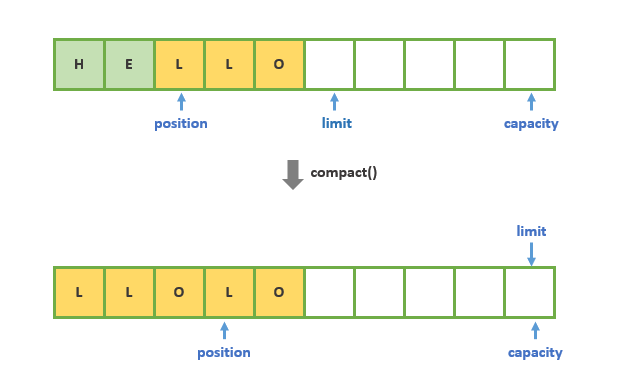 </div>


需要注意的是这里执行的是复制操作，而不是移动操作，底层调用的是 `System.arraycopy` 方法，因此原有位置上的数据依然存在。但由于 position 会移动到未处理数据的下一个位置上，所以不用担心原有位置上的数据会被读取到，原因是你切换到读模式时，原有的 `LO` 数据仍处于 limit 之后：

<div align="center">  </div>

**7. mark()**

用于设置标志位，设置好后可以使用 `reset()` 将 position 恢复到该位置：

```java
 buffer.position(2).mark().position(5).reset().position(); //从位置2移动到位置5，之后又恢复到位置2
```

### 2.4 复制缓冲区

如果想要对一个已有的缓冲区进行复制，可以有以下三种方法：

```java
public abstract CharBuffer duplicate();
public abstract CharBuffer asReadOnlyBuffer();
public abstract CharBuffer slice();
```

使用 `duplicate()` 复制的缓冲区具有以下特性：

- 与原缓冲区共享相同的数据元素，这意味着对原缓冲区数据的修改也会影响复制缓冲区；
- 复制缓冲区的 mark、position、limit、capcaity 属性的初始值与复制时原缓冲区的 mark、position、limit、capcaity 的值相同，但这些属性与原缓冲区的属性相互独立，创建后就不再受原有缓冲区的影响；
- 如果原缓冲区是只读缓冲区或直接缓冲区，则复制缓冲区也将继承这些属性。

<div align="center"> 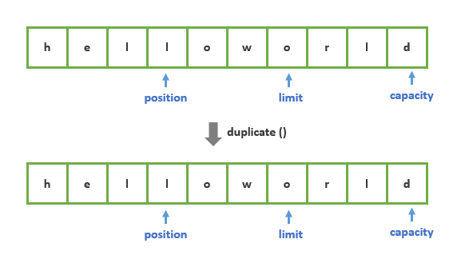 </div>


`asReadOnlyBuffer()` 与 `duplicate()` 类似，但创建的复制缓冲区为只读缓冲区。

`slice()` 也与 `duplicate()` 类似，但创建的复制缓冲区与原缓冲区只共享部分数据元素，并且所有标志位都处于原始状态：

<div align="center"> 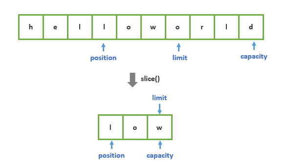 </div>


使用示例如下：

```java
CharBuffer buffer = CharBuffer.allocate(100);
buffer.put("helloworld");
buffer.position(2).limit(5);
CharBuffer duplicate = buffer.duplicate();
buffer.position(3).limit(6);
CharBuffer slice = buffer.slice();

System.out.println("buffer:" + buffer.position() + "," + buffer.limit());     // buffer:3,6
System.out.println("duplicate:" + duplicate.position() + "," + duplicate.limit()); // duplicate:2,5
System.out.println("slice:" + slice.position() + "," + slice.limit());        //slice:0,3
```

### 2.5 直接缓冲区

ByteBuffer 支持使用 `allocateDirect()` 方法来创建直接缓冲区，示例如下：

```java
ByteBuffer byteBuffer = ByteBuffer.allocate(100);
```


## 三、Channel

### 3.1 通道基础

Channel 接口的定义如下，其中定义了两个基础方法：

+ **isOpen()**：判断当前 Channel 是否处于打开状态；
+ **close()**：关闭当前 Channel 。Channel 关闭后，就不能在其上再进行任何 IO 操作，否则将抛出 ClosedChannelException 异常。

```java
public interface Channel extends Closeable {

    public boolean isOpen();

    public void close() throws IOException;
}
```

对于常见的文件操作和网络操作都可以直接获取到其对应的 Channel：

```java
// 获取serverSocketChannel
ServerSocket serverSocket = new ServerSocket(8888);
ServerSocketChannel serverSocketChannel = serverSocket.getChannel();

// 获取SocketChannel
Socket socket = new Socket("127.0.0.1", 8888);
SocketChannel socketChannel = socket.getChannel();

// 获取FileChannel
FileInputStream fileInputStream = new FileInputStream(new File("path"));
FileChannel fileChannel = fileInputStream.getChannel();
```

### 3.2 文件通道

FileChannel 是一个连接到文件的通道，通过该通道可以完成文件的读写。另外 FileChannel 无法设置为非阻塞模式，因为对文件读写操作设置非阻塞并没有什么意义。FileChannel 的使用示例如下：

```java
// 示例：文件拷贝
try {
    FileInputStream inputStream = new FileInputStream(new File("D:\\a.png"));
    FileOutputStream outputStream = new FileOutputStream(new File("D:\\b.png"));
    FileChannel inChannel = inputStream.getChannel();
    FileChannel outChannel = outputStream.getChannel();
    ByteBuffer buffer = ByteBuffer.allocate(256);
    // 从输入channel中读取数据到buffer中
    while (inChannel.read(buffer) > 0) {
        // 由写模式切换到读模式
        buffer.flip();
        while (buffer.hasRemaining()) {
            //将buffer中的数据写出到输出channel
            outChannel.write(buffer);
        }
        buffer.clear();
    }
    inputStream.close();
    outputStream.close();
} catch (IOException e) {
    e.printStackTrace();
}
```

这里的最后我们只需要关闭 Stream 即可，其上的 Channel 也会被关闭，源码如下：

```java
public void close() throws IOException {
    synchronized (closeLock) {
        if (closed) {
            return;
        }
        closed = true;
    }
    // 如果channel不为空，则关闭
    if (channel != null) {
       channel.close();
    }

    fd.closeAll(new Closeable() {
        public void close() throws IOException {
           close0();
       }
    });
}
```

### 3.3 Channel To Channel

在 Java NIO 中，如果两个 Channel 中有一个是 FileChannel，那么可以直接将数据从一个 Channel 传输到另外一个 Channel：

```java
// 将该通道上的数据直接传送到目标通道
transferTo(long position, long count, WritableByteChannel target) ;
// 将原通道上的数据直接传送到该通道
transferFrom(ReadableByteChannel src, long position, long count)
```

还是以文件拷贝为例，使用示例如下：

```java
try {
    FileInputStream inputStream = new FileInputStream(new File("D:\\a.png"));
    FileOutputStream outputStream = new FileOutputStream(new File("D:\\b.png"));
    FileChannel inChannel = inputStream.getChannel();
    FileChannel outChannel = outputStream.getChannel();
    inChannel.transferTo(0,inChannel.size(),outChannel);        //使用transferTo实现
    // outChannel.transferFrom(inChannel, 0, inChannel.size()); //使用transferFrom实现
    inputStream.close();
    outputStream.close();
} catch (IOException e) {
    e.printStackTrace();
}
```

### 3.4 Scatter/Gather

Java NIO 支持 scatter 和 gather 操作：

- **分散 (scatter)**：把 Channel 中的数据依次写入到多个 Buffer 上。示例如下：

```java
ByteBuffer buffer01 = ByteBuffer.allocate(32);
ByteBuffer buffer02 = ByteBuffer.allocate(64);
ByteBuffer buffer03 = ByteBuffer.allocate(128);

ByteBuffer[] buffers = new ByteBuffer[]{buffer01, buffer02, buffer03};
fileInputStream.getChannel().read(buffers);
```

此时 Channel 中的数据会依次写入到 Buffer01， Buffer02， Buffer03 上。Scatter 通常用于固定长度数据的处理，假设一个数据单元由 header，body，footer 三部分组成，并且每部分的长度都是固定的，此时通过 Scatter 操作，每一组数据的 header，body，footer 都会分别固定地写到 Buffer01， Buffer02， Buffer03 上，此时就可以对每个 Buffer 应用不同的处理逻辑：

<div align="center"> 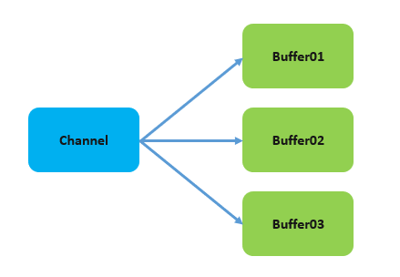 </div>


+ **聚集 (gather)**：将多个 Buffer 中的数据依次写入到同一个 Channel 上。示例如下：

```java
ByteBuffer buffer01 = ByteBuffer.allocate(32);
ByteBuffer buffer02 = ByteBuffer.allocate(64);
ByteBuffer buffer03 = ByteBuffer.allocate(128);

ByteBuffer[] buffers = new ByteBuffer[]{buffer01, buffer02, buffer03};
fileInputStream.getChannel().read(buffers);
```

<div align="center"> 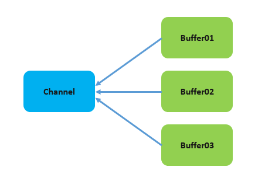 </div>


### 3.5 Pipe

Java NIO 还提供了 Pipe 管道用于在不同线程之间传递数据：

<div align="center"> 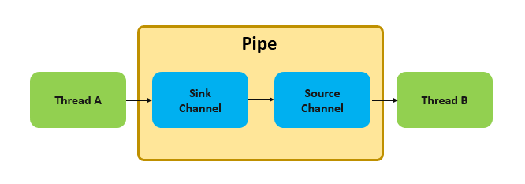 </div>


Pipe 管道可以通过 Pipe 类的静态方法 `open()` 来创建：

```java
Pipe pipe = Pipe.open();
```

创建完成后可以通过其 `sink()` 和 `source()` 方法来创建对应的 SinkChannel 和 SourceChannel：

```java
Pipe.SinkChannel sinkChannel = pipe.sink();
Pipe.SourceChannel sourceChannel = pipe.source();
```

SinkChannel 和 SourceChannel 的使用与基本的 Channel 类似，示例如下：

```java
Pipe pipe = Pipe.open();
new Thread(() -> {
    try {
        Pipe.SinkChannel sink = pipe.sink();
        ByteBuffer buffer = ByteBuffer.allocate(1024);
        buffer.put("HelloWorld".getBytes());
        buffer.flip();
        while (buffer.hasRemaining()) {
            // 将数据写入SinkChannel
            sink.write(buffer);
        }
        sink.close();
    } catch (IOException e) {
        e.printStackTrace();
    }
}).start();
new Thread(() -> {
    try {
        Pipe.SourceChannel source = pipe.source();
        ByteBuffer buffer = ByteBuffer.allocate(1024);
        // 读取SourceChannel中的数据
        while (source.read(buffer) > 0) {
            buffer.flip();
            while (buffer.hasRemaining()) {
                System.out.print((char) buffer.get()); //输出：HelloWorld
            }
            buffer.clear();
        }
        source.close();
    } catch (IOException e) {
        e.printStackTrace();
    }
}).start();
```


## 四、Selector

### 4.1 创建选择器

想要创建一个选择器，可以通过 Selector 类的静态方法 `open()` 来实现：

```java
Selector selector = Selector.open();
```

### 4.2 注册通道

之后须要通过 `register()` 方法将 Channel 注册到 Selector 上，示例如下：

```java
// 创建ServerSocketChannel
ServerSocketChannel serverChannel = ServerSocketChannel.open();
// 与 Selector一起使用的Channel必须处于非阻塞模式下
serverChannel.configureBlocking(false);
serverChannel.bind(new InetSocketAddress(hostname, port));

// 注册监听CONNECT事件
serverChannel.register(selector, SelectionKey.OP_ACCEPT);
```

`register()` 方法的第二个参数表示需要监听的事件，它有以下四个可选值：

```java
//读取事件
public static final int OP_READ = 1 << 0;
//写入事件
public static final int OP_WRITE = 1 << 2;
//连接事件
public static final int OP_CONNECT = 1 << 3;
//接受连接事件
public static final int OP_ACCEPT = 1 << 4;
```

如果你需要监听多个事件，可以使用位操作符进行连接：

```java
int interestSet = SelectionKey.OP_READ | SelectionKey.OP_WRITE;
```

除此之外，你还可以在注册时通过调用 register 的另外一个重载方法来指定附加信息：

```java
register(Selector sel, int ops, Object att)
```

这个附加信息可以在事件触发时通过 SelectionKey 对象再次得到。

### 4.3 select

当你在 Selector 上注册好通道后，就可以使用 `select()` 方法来获取处于就绪状态的事件的集合。示例如下：

```java
int select = selector.select();
```

select 有以下三个重载方法：

+ **select()**：持续阻塞，直到至少有一个通道在其注册的事件上处于就绪状态；
+ **select(long timeout)**：与 `select()` 类似，但最长只阻塞 timout 毫秒；
+ **selectNow()**：不会阻塞，如果不存在就绪事件，则直接返回 0。

需要注意的是如果是 Ready 操作集发生了变化，select 操作的返回值也可能是 0。这意味着如果某个通道注册的是 `OP_READ` 事件，那么该通道在第一次收到消息时，select 操作返回的值是 1；但是之后收到消息时，select 的返回值却可能是 0。因此在循环获取消息时，对于 select 返回值的判断应该加上为 0 的情况：

```java
// 如果选择器上存在就绪事件，则进行处理
while (selector.select() >= 0) {
  ....
}
```

### 4.4 SelectionKey

当注册的事件处于就绪状态时，可以通过 Selector 的  `selectedKeys()` 方法来获取处于就绪状态的事件信息：

```java
Set<SelectionKey> selectionKeys = selector.selectedKeys();
```

其返回的是 SelectionKey 的集合，SelectionKey 是对多个属性的综合封装：

```java
public abstract class SelectionKey {

    // SelectionKey对应的channel
    public abstract SelectableChannel channel();

    // SelectionKey对应的选择器
    public abstract Selector selector();
 
    // 当前SelectionKey是否有效
    public abstract boolean isValid();
   
    // 取消channel在selector上注册的事件
    public abstract void cancel();

    // 当前channel注册的事件的合集
    public abstract int interestOps();

    // 当前channel是否对指定的事件感兴趣
    public abstract SelectionKey interestOps(int ops);

    // 处于就绪状态的事件的合集
    public abstract int readyOps();

    // Read事件是否就绪
    public final boolean isReadable() {return (readyOps() & OP_READ) != 0;}

    // Write事件是否就绪
    public final boolean isWritable() {return (readyOps() & OP_WRITE) != 0;}
    
    // Connect事件是否就绪
    public final boolean isConnectable() {return (readyOps() & OP_CONNECT) != 0;}
    
    // Accept事件是否就绪
    public final boolean isAcceptable() {return (readyOps() & OP_ACCEPT) != 0;}

    // 为SelectionKey指定附加属性，也可以在注册时通过register方法指定
    public final Object attach(Object ob) {return attachmentUpdater.getAndSet(this, ob);}

    // 获取附加属性
    public final Object attachment() { return attachment;}

}
```


## 五、聊天室实例

下面以一个群聊的聊天室为例，来展示 Java NIO 三大组件的综合使用，效果如下：

<div align="center"> 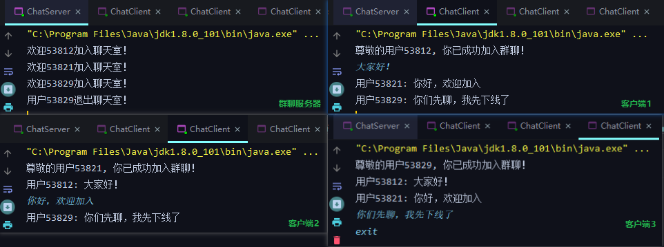 </div>


### 5.1 群聊服务器

群聊服务器的实现如下：

```java
package chat;

import java.io.IOException;
import java.net.InetSocketAddress;
import java.nio.ByteBuffer;
import java.nio.channels.*;
import java.nio.charset.StandardCharsets;
import java.util.Set;

public class ChatServer {

    private String hostname;
    private int port;
    private Selector selector;
    private final ByteBuffer rBuffer = ByteBuffer.allocate(1024);
    private final ByteBuffer wBuffer = ByteBuffer.allocate(1024);

    ChatServer(int port) {
        this("127.0.0.1", port);
    }

    ChatServer(String hostname, int port) {
        this.hostname = hostname;
        this.port = port;
    }

    public void start() {
        try {
            // 创建ServerSocketChannel
            ServerSocketChannel serverChannel = ServerSocketChannel.open();
            // 设置为非阻塞模式
            serverChannel.configureBlocking(false);
            serverChannel.bind(new InetSocketAddress(hostname, port));

            // 创建selector
            selector = Selector.open();
            // 注册监听CONNECT事件
            serverChannel.register(selector, SelectionKey.OP_ACCEPT);

            // 持续调用select()
            while (true) {
                selector.select();
                Set<SelectionKey> selectionKeys = selector.selectedKeys();
                for (SelectionKey selectionKey : selectionKeys) {
                    // 处理Accept事件
                    if (selectionKey.isAcceptable()) {
                        // 获取ServerSocketChannel
                        ServerSocketChannel server = (ServerSocketChannel) selectionKey.channel();
                        // 通过ServerSocketChannel获取SocketChannel
                        SocketChannel clientChannel = server.accept();
                        clientChannel.configureBlocking(false);
                        // 注册Read事件
                        clientChannel.register(selector, SelectionKey.OP_READ);
                        System.out.println("欢迎" + clientChannel.socket().getPort() + "加入聊天室！");
                        // 处理Readable事件
                    } else if (selectionKey.isReadable()) {
                        handleMessage(selectionKey);
                    }
                }
                selectionKeys.clear();
            }

        } catch (IOException e) {
            e.printStackTrace();
        } finally {
            // 关闭selector后，与之相关的所有资源都会被释放
            try {
                selector.close();
            } catch (IOException e) {
                e.printStackTrace();
            }
        }
    }

    /**
     * 处理客户端消息
     *
     * @param selectionKey 处于Read状态的SelectionKey
     */
    private void handleMessage(SelectionKey selectionKey) {
        SocketChannel clientChannel = (SocketChannel) selectionKey.channel();
        try {
            // 获取来自客户端的消息
            StringBuilder buffer = new StringBuilder();
            while (clientChannel.read(rBuffer) > 0) {
                rBuffer.flip();
                buffer.append(StandardCharsets.UTF_8.decode(rBuffer));
                rBuffer.clear();
            }
            String msg = buffer.toString();
            // 将消息发送给其他客户端
            broadcastMessage(clientChannel, msg);
        } catch (IOException e) {
            // 该异常由clientChannel.read(rBuffer)方法抛出，如果出现该异常，则说明clientChannel已经关闭
            // 此时需要调用cancel()取消注册在selector上的事件
            selectionKey.cancel();
            // 在多线程环境下，如果另一个线程正在阻塞地调用select()，因为事件集已经改变，
            // 因此需要通过wakeup()让其立刻返回并重新select()
            selector.wakeup();
            System.out.println("用户" + clientChannel.socket().getPort() + "退出聊天室！");
        }
    }

    /**
     * 将客户端发来的消息广播给其他客户端
     *
     * @param clientChannel 消息源
     * @param msg           消息
     */
    private void broadcastMessage(SocketChannel clientChannel, String msg) {
        try {
            // 遍历当前selector上所有channel
            for (SelectionKey selectionKey : selector.keys()) {
                SelectableChannel channel = selectionKey.channel();
                // 消息不需要转发给ServerSocketChannel和当前客户端自己
                if (selectionKey.isValid() && !(channel instanceof ServerSocketChannel) 
                && !channel.equals(clientChannel)) {
                    SocketChannel otherClient = (SocketChannel) channel;
                    wBuffer.put(("用户" + clientChannel.socket().getPort() + ": " + msg).getBytes());
                    while (wBuffer.hasRemaining()) {
                        wBuffer.flip();
                        otherClient.write(wBuffer);
                    }
                    wBuffer.clear();
                }
            }
        } catch (IOException e) {
            e.printStackTrace();
        }

    }

    public static void main(String[] args) {
        new ChatServer(8888).start();
    }
}
```

### 5.2 客户端实现

客户端的实现如下：

```java
package chat;

import java.io.IOException;
import java.net.InetSocketAddress;
import java.nio.ByteBuffer;
import java.nio.channels.ClosedSelectorException;
import java.nio.channels.SelectionKey;
import java.nio.channels.Selector;
import java.nio.channels.SocketChannel;
import java.nio.charset.StandardCharsets;
import java.util.Scanner;
import java.util.Set;

public class ChatClient {

    private String hostname;
    private int port;
    private Selector selector;
    private final ByteBuffer rBuffer = ByteBuffer.allocate(1024);
    private final ByteBuffer wBuffer = ByteBuffer.allocate(1024);

    ChatClient(String hostname, int port) {
        this.hostname = hostname;
        this.port = port;
    }

    public void start() {
        try {
            // 创建SocketChannel
            SocketChannel socketChannel = SocketChannel.open();
            socketChannel.configureBlocking(false);
            socketChannel.connect(new InetSocketAddress(hostname, port));

            // 创建selector
            selector = Selector.open();
            // 注册监听CONNECT事件
            socketChannel.register(selector, SelectionKey.OP_CONNECT);

            // 持续调用select
            while (true) {
                selector.select();
                Set<SelectionKey> selectionKeys = selector.selectedKeys();
                for (SelectionKey selectionKey : selectionKeys) {
                    // 处理Connect事件
                    if (selectionKey.isConnectable()) {
                        SocketChannel clientChannel = (SocketChannel) selectionKey.channel();
                        // 有可能正处于连接中的状态
                        if (clientChannel.isConnectionPending()) {
                            // 等待连接完成
                            clientChannel.finishConnect();
                            // 开始监听用户输入
                            inputListening(clientChannel);
                            // 为clientChannel注册上Read
                            clientChannel.register(selector, SelectionKey.OP_READ);
                            System.out.println("尊敬的用户" + clientChannel.socket().getLocalPort() 
                            + ", 你已成功加入群聊！");
                        }
                        // 处理Read事件
                    } else if (selectionKey.isReadable()) {
                        handleMessage(selectionKey);
                    }
                }
            }
        } catch (ClosedSelectorException e) {
            // 主动关闭客户端，不做任何处理
        } catch (IOException e) {
            e.printStackTrace();
        } finally {
            try {
                selector.close();
            } catch (IOException e) {
                e.printStackTrace();
            }
        }
    }

    /**
     * 监听用户来自控制台的输入
     *
     * @param clientChannel 客户端Channel
     */
    private void inputListening(SocketChannel clientChannel) {
        // 要持续监听用户输入，但又不能阻塞主线程，所以需要一个单独的线程来完成
        new Thread(() -> {
            Scanner scanner = new Scanner(System.in);
            try {
                while (scanner.hasNextLine()) {
                    String input = scanner.nextLine();
                    if (!input.isEmpty()) {
                        if ("exit".equals(input)) {
                            selector.close();
                            return;
                        }
                        wBuffer.put(input.getBytes());
                        wBuffer.flip();
                        while (wBuffer.hasRemaining()) {
                            clientChannel.write(wBuffer);
                        }
                        wBuffer.clear();
                    }
                }
            } catch (IOException e) {
                e.printStackTrace();
            }
        }).start();
    }

    /**
     * 处理来自其他客户端的消息
     *
     * @param selectionKey 处于Read状态的selectionKey
     */
    private void handleMessage(SelectionKey selectionKey) {
        try {
            SocketChannel channel = (SocketChannel) selectionKey.channel();
            StringBuilder buffer = new StringBuilder();
            while (channel.read(rBuffer) > 0) {
                rBuffer.flip();
                buffer.append(StandardCharsets.UTF_8.decode(rBuffer));
                rBuffer.clear();
            }
            System.out.println(buffer.toString());
        } catch (IOException e) {
            selectionKey.cancel();
            selector.wakeup();
            System.out.println("聊天室服务器已关闭！");
        }
    }


    public static void main(String[] args) {
        new ChatClient("127.0.0.1", 8888).start();
    }
}
```


## 参考资料

+ [Ron Hitchens . Java NIO . O'Reilly Media . 2002-08-15](https://book.douban.com/subject/1433583/)
+ [Java NIO Tutorial](http://tutorials.jenkov.com/java-nio/index.html)
+ [一文读懂 Java NIO 和 IO 的不同](https://baijiahao.baidu.com/s?id=1632673729522644150&wfr=spider&for=pc)


