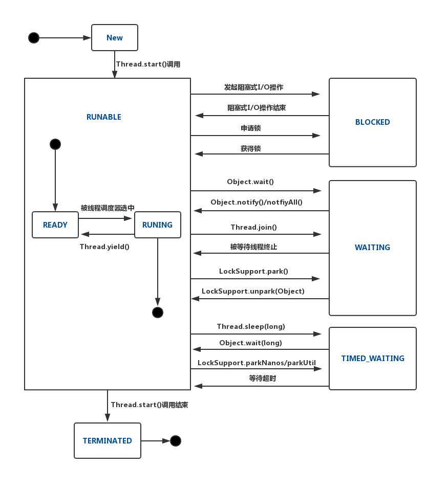
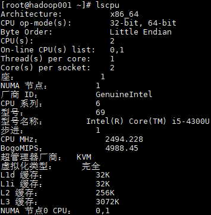
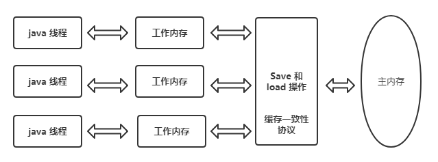

# Java 并发编程基础

## 一、线程基础

### 1.1 创建线程

创建线程通常有以下两种方式：

- 实现 Runnable 接口，并重写其 run 方法：

```java
public class J1_Method01 {
    public static void main(String[] args) {
        System.out.println("Main线程的ID为：" + Thread.currentThread().getId());
        Thread thread = new Thread(new CustomRunner());
        thread.start();
    }
}

class CustomRunner implements Runnable {
    @Override
    public void run() {
        System.out.println("CustomRunner线程的ID为：" + Thread.currentThread().getId());
    }
}
```

- 继承自 Thread 类，并重写其 run 方法：

```java
public class J2_Method02 {
	public static void main(String[] args) {
		System.out.println("Main线程的ID为：" + Thread.currentThread().getId());
		CustomThread customThread = new CustomThread();
		customThread.start();
	}
}

class CustomThread extends Thread {
	@Override
	public void run() {
		System.out.println("CustomThread线程的ID为：" + Thread.currentThread().getId());
	}
}
```

### 1.2 线程属性

**编号 (ID)** ：用于标识线程的唯一编号，只读属性。

**名称 (Name)**：用于定义线程名称，可读可写。

**线程类别 (Daemon)**：通过线程的 `setDaemon(boolean on)` 方法进行设置，为 true 表示设置为守护线程，否则为用户线程。用户线程会阻止 Java 虚拟机正常停止，守护线程则不会。通常可以把一些不重要的线程设置为守护线程，比如监控其他线程状态的监控线程，当其他工作线程停止后，虚拟机就可以正常退出。

**优先级 (Priority)**：Java 线程支持 1到10 十个优先级，默认值为 5 。Java 线程的优先级本质上只是给线程调度器一个提示信息，它并不能保证线程一定按照优先级的高低顺序运行，所以它是不可靠的，需要谨慎使用。在 Java 平台中，子线程的优先级默认与其父线程相同。

### 1.3 线程状态

Java 线程的生命周期分为以下五类状态：

**RUNABLE**：该状态包括两个子状态：READY 和 RUNING 。处于 READY 状态的线程被称为活跃线程，被线程调度器选中后则开始运行，转化为 RUNING 状态。

**BLOCKED**：一个线程发起一个阻塞式 IO 操作后（如文件读写或者阻塞式 Socket 读写），或者申请一个由其他线程持有的独占资源（比如锁）时，相应的线程就会处于该状态。

**WAITING**：线程处于无时间限制的等待状态。

**TIMED_WAITING**：有时间限制的等待状态，如果在指定时间内并没有执行的特定的操作，则该线程自动转换为 RUNABLE。

**TERMINATED**：`Thread.run()`正常返回或者由于抛出异常而提前终止，则对应的线程都会处于终止状态。

各个状态之间的转换关系如下图：



## 二、状态变量与共享变量

**状态变量 (State Variable)** ：即类的实例变量，非共享的静态变量。

**共享变量 (Shared Variable)** : 即可以被多个线程共同访问的变量。

## 三、原子性

### 3.1 定义

对于涉及共享变量的操作，若该操作从其执行线程以外的任意线程来看都是不可分割的，那么我们就说该操作具有原子性。它包含以下两层含义：

+ 访问（读、写）某个共享变量的操作从其执行线程以外的其他任何线程来看，该操作要么已经执行结束要么尚未发生，即其他线程不会看到该操作的中间部分的结果。
+ 访问同一组共享变量的原子操作不能被交错执行。

### 3.2 非原子性协定

在 Java 语言中，除了 long 类型 和 double 类型以外的任何类型的变量的写操作都是具有原子性的，但对于没有使用  volatile 关键字修饰的 64 位的 long 类型和 double 类型，允许将其的读写操作划分为两次 32 位的操作来进行，这就是 long 和 double 的非原子性协定 ( Nonatomic Treatment of double and long Variables ) 。

### 3.3  保证原子性

通过 Java 虚拟机规范和非原子性协定， Java 语言可以保证对基本数据类型的访问具有有原子性，如果想要保证更大范围内的原子性（如多行操作的原子性），此时可以使用字节码指令 monitorenter 和 monitorexit 来隐式执行 lock 和 unlock 操作，从而将串行变成并行来保证原子性。monitorenter 和 monitorexit 这两个字节码指令反映到 Java 代码中就是 Synchronized 关键字。

## 四、可见性

### 4.1 定义

如果一个线程对某个共享变量进行更新之后，后续访问该变量的其他线程可以读取到这个更新结果，那么我们就称该更新对其他线程可见，反之则是不可见，这种特性就是可见性。出现可见性问题，往往意味着线程读取到了旧数据，这会导致更新丢失，从而导致运行结果与预期结果存在差异。可见性问题与计算机的存储结构和 Java 的内存模型都有着密切的关系。

### 4.2 高速缓存

由于现代处理器对数据的处理能力远高于主内存（DRAM）的访问速率，为了弥补它们之间在处理能力上的鸿沟，通常在处理器和主内存之间都会存在高速缓存（Cache）。高速缓存相当于一个由硬件实现的容量极小的散列表（Hash Table），其键是一个内存地址，其值是内存数据的副本或者准备写入内存的数据。

现代处理器一般具有多个层次的高速缓存，如：一级缓存（L1 Cache）、二级缓存（L2 Cache）、三级缓存（L3 Cache）等。其中一级缓存通常包含两部分，其中一部分用于存储指令（L1i），另外一部分用于存储数据（L1d）。距离处理器越近的高速缓存，其存储速率越快，制造成本越高，因此其容量也越小。在 Linux 系统中，可以使用 `lscpu` 命令查看其高速缓存的情况：



### 4.3 缓存一致性协议

在多线程环境下，每个线程运行在不同的处理器上，当多个线程并发访问同一个共享变量时，这些线程的执行处理器都会在自己的高速缓存中保留一个该共享变量的副本，这种情况下如何让一个处理器对数据的更改能被其他处理器感知到？为了解决这个问题，需要引入一种新的通讯机制，这就是缓存一致性协议。

缓存一致性协议有着多种不同的实现，这里以广泛使用的 MESI (Modified-Exclusive-Shared-Invalid) 协议为例，和其名字一样，它将高速缓存中的缓存条目分为以下四种状态：

+ **Invalid**：该状态表示相应的缓存行中不包含任何内存地址对应的有效副本数据。
+ **Shared**：该状态表示相应的缓存行中包含相应内存地址所对应的副本数据，并且其他处理器的高速缓存中也可能存在该相同内存地址所对应的副本数据。
+ **Exclusive**：该状态表示相应的缓存行中包含相应内存地址所对应的副本数据，但其他处理器的高速缓存中不应存在该相同内存地址所对应的副本数据，即独占的。
+ **Modified**：该状态表示相应的缓存行中包含对相应内存地址所做的更新的结果。MESI 协议限制任意一个时刻只能有一个处理器能对同一内存地址上的数据进行更新，因此同一内存地址在任意一个时刻只能有一个缓存条目处于该状态。

根据以上状态，当某个处理器对共享变量进行读写操作时，其具体的行为如下：

+ **读取共享变量**：处理器首先在高速缓存上进行查找，如果对应缓存条目的状态为 M，E 或者 S，此时则直接读取；如果缓存条目为无效状态 I，此时需要向总线发送 Read 消息，其他处理器或主内存则需要回复 Read Response 来提供相应的数据，处理器在获取到数据后，将其存储相应的缓存条目，并将状态更新为 S 。
+ **写入共享变量**：此时处理器首先需要判断是否拥有对该数据的所有权，如果对应缓存条目的状态为 E 或者 M，代表此时均处于独占状态，此时可以直接写入，并将其状态变更为 M 。如果不为 E 或 M，此时处理器需要往总线上发送 Invalidate 消息来通知其他处理器将对应的缓存条目失效，之后在收到其他处理器的 Invalidate Acknowledge 响应后再进行更改，并将其状态变更为 M。

在只有高速缓存的情况下，通过缓存一致性协议能够保证一个线程对共享变量的更新对于其他线程是可见的。如果只是这样，多线程编程就不会存在可见性问题了，但实际上缓存一致性协议并不能保证最终的可见性，这是由于写缓冲器和无效化队列导致的。

### 4.4 写缓冲器与无效化队列

在上面的缓存一致性协议中，处理器必须等待其他处理器的应答（Read Response \ Invalidate Acknowledge）后才去执行后续的操作，这会带来一定的时间开销，为了解决这个问题，现代计算机架构又引入了写缓冲器和无效化队列：

+ **写缓冲器**：当处理器发现缓存条目的状态不为 E 或 M 时，此时不再等待其他处理器返回 Invalidate Acknowledge 消息，而是直接将变更写入到写缓冲器就认为操作完成。当收到对应的 Invalidate Acknowledge 消息，再将变更写入到对应的缓存条目中，此时写操作对于其他处理器而言，才算完成。
+ **无效化队列**：当其他处理器接收到 Invalidate 消息后，不再等待删除指定缓存条目中的副本数据后再回复  Invalidate Acknowledge ，而是将消息存入到无效化队列中后就直接回复，之后处理器再根据无效化队列中的消息来重置缓存行的状态到 Invalid。

写缓冲器是处理器的私有部件，一个处理器的写缓冲器所存储的内容是不能被其他处理器所读取的，这就会导致一个更新即便已经发生并写入到写缓冲器，但是其他处理器上的线程读取到的还是旧值，从而导致可见性问题。除了写缓冲器外，无效化队列也会导致可见性问题，当某个写入发生后，其他处理器上的对应缓存条目应该都立即失效，但是由于无效化队列的存在，Invalidate 操作不会立即执行，导致其他处理器仍然读取到的仍然是未失效的旧值。

### 4.5 内存屏障

想要解决写缓存器和无效化队列带来的问题，需要引入一个新的机制 —— 内存屏障：

+ **Store Barrier**：存储屏障，可以使执行该指令的处理器冲刷其写缓冲器。
+ **Load Barrier**：加载屏障，将无效化队列中所指定的缓存条目的状态都标志位 I ，并清空无效化队列，从而保证处理器在读取共享变量时必须发送 Read 消息去获取更新后的值。

冲刷写缓冲器和清空无效化队列都是存在时间消耗的，所以只有在必须要保证可见性的场景下，才应该去使用内存屏障。何种场景下必须要保证可见性，这是由用户来决定的，这也是多线程编程所需要考虑的问题。

### 4.6  保证可见性

在 Java 语言中，保证可见性的典型实现是 Volatile 关键字，它在 Java 语言中一共有三种作用：

+ **保证可见性**：Java 虚拟机（ JIT 编译器 ）会在 volatile 变量写操作之后插入一个通用的 StoreLoad 屏障，它可以充当存储屏障来清空执行处理器的写缓冲器；同时 JIT 编译器还会在变量的读操作前插入一个加载屏障来清空无效化队列。
+ **禁止指令重排序**：通过内存屏障， Java 虚拟机可以 volatile 变量之前的任何读写操作都先于这个 volatile 写操作之前被提交，而 volatile 变量的读操作先于之后任何变量的读写操作被提交。
+  除了以上两类语义外，Java 虚拟机规范还特别规定了对于使用 volatile 修饰的 64 的 long 类型和 double 类型的变量的读写操作具有原子性。

除了 Volatile 外，Synchronized 和 final 关键字都能保证可见性：

+ **Synchronized** ：Synchronized 关键字规定了对其所修饰的变量执行 unlock 操作前，必须先把此变量同步回主内存中。
+ **final** ：被 final 修饰的字段在构造器中一旦初始化完成，并且构造器没有把 `this` 的引用逃逸到外部，那么其他线程中就能看到 final 字段的值。

### 4.7 Java 内存模型

以上主要介绍计算机的内存模型对可见性的影响，但是不同架构的处理器在内存模型和支持的指令集上都存在略微的差异。 Java 作为一种跨平台的语言，必须尽量屏蔽这种差异，而且还要尽量利用硬件的各种特性（如寄存器，高速缓存和指令集中的某些特有指令）来获取更好而定执行速度，这就是 Java 的内存模型：

+ **Main Memory**：主内存，Java 内存模型规定了所有的变量都存储在主内存中，主内存可以类比为计算机的主内存，但其只是虚拟机内存的一部分，并不能代表整个计算机内存。
+ **Work Memory**：工作内存，Java 内存模型规定了每条线程都有自己的工作内存，工作内存可以类比为计算机的高速缓存。工作内存中保存了被该线程使用到的变量的拷贝副本。

线程对变量的所有操作都必须在工作内存中进行，而不能直接读写主内存中的变量；不同的线程之间也无法直接访问对方工作内存中的变量，线程间变量值的传递需要通过主内存来完成。



## 五、有序性

### 5.1 顺序语义

Java 语言中的顺序语义可以分为以下四类：

+ **源代码顺序**：程序员编写的代码的执行顺序；
+ **程序顺序**：编译后的代码的执行顺序；
+ **执行顺序**：给定代码在处理器上的实际执行顺；
+ **感知顺序**：处理器感知到的其他处理器上代码的执行顺序。

### 5.2 重排序类型

通常我们认为以上顺序都是完全相同的，但编译器和处理器出于性能考虑，通常会改变实际代码的执行顺序，这种情况就称为重排序，具体分为以下两类：

<table>
	<tr>
    	<th>重排序类型</th>
    	<th>重排序表现</th>
    	<th>重排序主体(原因)</th>
 	</tr>
	<tr>
		<td rowspan = "2">指令重排序</td>
    	<td>程序顺序和源代码顺序不一致</td>
    	<td>编译器</td>
 	</tr>
	<tr>
    	<td>执行顺序和程序顺序不一致</td>
    	<td>JIT 编译器、处理器</td>
 	</tr>
    <tr>
		<td>存储子系统重排序 <br/> （内存重排序）</td>
    	<td>源代码顺序、程序顺序和执行顺序这三者保持一致，<br/> 但是感知顺序与执行顺序不一致</td>
    	<td>高速缓存、写缓冲器</td>
 	</tr>
</table>

### 5.3 貌似串行语义

尽管编译器和处理器都能够进行指令重排序，但它们都必须遵循 貌似串行语义（As-if-serial Semantics），即重排序不能影响程序在单线程上执行结果的正确性。按照 As-if-serial 原则，只有不存在数据依赖关系的语句才会被重排序，存在数据依赖关系的语句不会被重排序，示例如下。此时第 1，2 行语句彼此之间可以进行重排序，但是第 3 行语句不能被重排序到 1 和 2 行语句之前：

```java
int a = 1; 
int b = 2; 
int c = a + b; 
```

同时为了保证单线下执行的正确性，处理器会将重排序指令的执行结果先写入到重排序缓冲器（ROB，Recorder Buffer）中，之后再按照这些指令被处理器读取的顺序提交到寄存器或者主内存中，因此虽然指令是乱序执行的，但结果却是顺序提交的，从而能够保证在单线程下的正确性。

### 5.4 内存重排序

由于写缓冲器和高速缓存的存在，并且写缓冲器是不能被其他处理器所访问的，因此其他处理器感知到的顺序可能仍然与执行顺序不同，这种情况就叫做内存重排序。但需要说明的是：指令重排序是一种实实在在的重排序，它改变了指令的执行顺序；但内存重排序只是一种现象，只是其他处理器的错觉。

### 5.5 保证顺序性

在 Java 语言中，Volatile 和 Synchronized 都能够保证有序性：

+ **Volatile**：通过内存屏障来禁止指令重排序，通过加载屏障和存储屏障来冲刷写缓冲器和清空无效化队列，从而可以避免内存重排序的现象；
+ **Synchronized** ：使用 Synchronized 修饰的变量在同一时刻只允许一个线程对其进行 lock 操作，这种限制决定了持有同一个锁的两个同步块只能串行执行，也就避免了乱序问题。


## 六、锁机制

### 6.1  内部锁

Java 平台中的任何一个对象都有着唯一一个与之相关联的锁，这种锁被称为监视器或内部锁，内部锁是一种非公平的排它锁，它能够保障原子性、可见性和有序性。内部锁通过 `synchronized` 关键字来实现，可以用于修饰方法以及代码块， 被修饰的方法称为同步方法，被修饰的代码块称为同步代码块。示例如下：

线程不安全的示例：

```java
public class J1_ThreadUnsafe {

    private static int i = 0;

    public static void main(String[] args) throws InterruptedException {
        IncreaseTask task = new IncreaseTask();
        Thread thread1 = new Thread(task);
        Thread thread2 = new Thread(task);
        thread1.start();
        thread2.start();
        // 等待线程结束再打印返回值
        thread1.join();
        thread2.join();
        System.out.println(i);
    }

    static class IncreaseTask implements Runnable {
        @Override
        public void run() {
            for (int j = 0; j < 100000; j++) {
                inc();
            }
        }

        private void inc() {
            i++;
        }
    }
}
```

使用 synchronized 修饰 `inr()` 方法来保证线程安全：

```java
public class J2_SynchronizedSafe {

    private static int i = 0;

    public static void main(String[] args) throws InterruptedException {
        // 两个线程调用的是同一个IncreaseTask实例，此时是线程安全的
        IncreaseTask task = new IncreaseTask();
        Thread thread1 = new Thread(task);
        Thread thread2 = new Thread(task);
        thread1.start();
        thread2.start();
        //等待结束后 才打印返回值
        thread1.join();
        thread2.join();
        //并打印返回值
        System.out.println(i);
    }

    static class IncreaseTask implements Runnable {
        @Override
        public void run() {
            for (int j = 0; j < 100000; j++) {
                inc();
            }
        }

        private synchronized void inc() {
            i++;
        }
    }
}
```

通常我们把被修饰的方法体和代码块称为临界区，需要注意的是必须保证多线程锁住的是同一个临界区，否则依然是线程不安全的。如果将上面的创建线程的方法修改为如下所示，此时 synchronized 锁住的是不同对象的  `inc()` 方法，所以仍然是线程不安全的：

```java
Thread thread1 = new Thread(new IncreaseTask());
Thread thread2 = new Thread(new IncreaseTask());
```

synchronized 除了可以修饰方法外，还可以用于修饰代码块，此时可以使用 this 关键字作为句柄，但仍然需要保证两个线程调用的是同一个 IncreaseTask 实例，示例如下：

```java
public class J3_SynchronizedSafe {

    private static int i = 0;

    static class IncreaseTask implements Runnable {
        @Override
        public void run() {
            for (int j = 0; j < 100000; j++) {
                // 锁住的是同一个对象，此时也是线程安全的
                synchronized (this) {
                    i++;
                }
            }
        }
    }

    public static void main(String[] args) throws InterruptedException {
        IncreaseTask task = new IncreaseTask();
        Thread thread1 = new Thread(task);
        Thread thread2 = new Thread(task);
        thread1.start();
        thread2.start();
        thread1.join();
        thread2.join();
        System.out.println(i);
    }
}
```

如果想要调用不同的 `IncreaseTask()` 实例，又想保证线程安全，此时可以使用同一个对象作为 synchronized 关键字的句柄，为避免竞态，作为句柄的对象通常使用 `private final` 关键字进行修饰，示例如下：

```java
public class J4_SynchronizedSafe {

    private static final String s = "";

    private static int i = 0;

    static class IncreaseTask implements Runnable {
        @Override
        public void run() {
            for (int j = 0; j < 100000; j++) {
                // 虽然调用的是不同的 IncreaseTask() 示例，但锁住的仍然是同一个对象，此时也是线程安全的
                synchronized (s) {
                    i++;
                }
            }
        }
    }

    public static void main(String[] args) throws InterruptedException {
        Thread thread1 = new Thread(new IncreaseTask());
        Thread thread2 = new Thread(new IncreaseTask());
        thread1.start();
        thread2.start();
        thread1.join();
        thread2.join();
        System.out.println(i);
    }
}
```

### 6.2  显示锁

显示锁是 `java.util.concurrent.locks.Lock` 接口的示例，该接口对显示锁进行了抽象，定义了如下方法：

+  **lock()**：获取锁；
+ **lockInterruptibly()**：如果当前线程未被中断，则获取锁；
+ **tryLock()**：仅在调用时锁为空闲状态才获取该锁；
+ **tryLock(long time, TimeUnit unit)**：如果锁在给定的等待时间内存在空闲，并且当前线程未被中断，则获取锁；
+ **unlock()**：释放锁；
+ **newCondition()**：返回绑定到此 Lock 实例的新的 Condition 实例。

`java.util.concurrent.locks.ReentrantLock` 类是 `Lock` 接口的默认实现，它是一种可重入锁，示例如下：

```java
/**
 * 利用ReentrantLock实现线程安全
 */
public class J1_ThreadSafe {

    private static ReentrantLock reentrantLock = new ReentrantLock();
    private static Integer i = 0;

    static class IncreaseTask implements Runnable {
        @Override
        public void run() {
            for (int j = 0; j < 100000; j++) {
                try {
                    reentrantLock.lock();
                    i++;
                } catch (Exception e) {
                    e.printStackTrace();
                } finally {
                    reentrantLock.unlock();
                }
            }
        }

        public static void main(String[] args) throws InterruptedException {
            Thread thread1 = new Thread(new IncreaseTask());
            Thread thread2 = new Thread(new IncreaseTask());
            thread1.start();
            thread2.start();
            thread1.join();
            thread2.join();
            System.out.println(i);
        }
    }
}
```

ReentrantLock 是一种可重入的锁， 它能够对共享资源进行重复加锁，即持有该锁的线程再次获取该锁时不会被阻塞，但解锁次数与加锁次数必须要保持一致，此时才能完全解锁：

```java
try {
    reentrantLock.lock();
    reentrantLock.lock();
    reentrantLock.lock();
    i++;
} catch (Exception e) {
    e.printStackTrace();
} finally {
    reentrantLock.unlock();
    reentrantLock.unlock();
    reentrantLock.unlock();
}
```

ReentrantLock 即支持公平锁也支持非公平锁，公平锁在调度时候往往需要频繁切换上下文来保证在等待时间上的公平性，所以默认的 ReentrantLock 锁是非公平的，如果想要使用公平锁，可以在创建时进行指定：

```java
// 参数为true,代表使用公平锁
private static ReentrantLock fairLock = new ReentrantLock(true);
```

### 6.3  读写锁

由于锁的排它性，导致多个线程无法以安全的方式并发地读取共享变量，这不利于提高系统的并发能力，因此产生了读写锁：

+ **读锁**：读锁是共享的，可以被多个线程所持有，即一个线程持有读锁时并不妨碍其他线程获得相应锁的读锁；
+ **写锁**：写锁是独占的，一个线程持有写锁时，其他线程无法获取相应锁的写锁或读锁。

基于读写锁的特性，其非常适合于读多写少的场景，示例如下：

```java
public class ReadWriteLock {

    // 可重入锁
    private static ReentrantLock reentrantLock = new ReentrantLock();
    // 读写锁
    private static ReentrantReadWriteLock readWriteLock = new ReentrantReadWriteLock();
    // 读锁
    private static ReentrantReadWriteLock.ReadLock readLock = readWriteLock.readLock();
    // 写锁
    private static ReentrantReadWriteLock.WriteLock writeLock = readWriteLock.writeLock();

    // 待赋值的变量
    private static String i = "";

    //写方法
    static class Write implements Runnable {

        private Lock lock;
        private String value;

        Write(Lock lock, String value) {
            this.lock = lock;
            this.value = value;
        }

        @Override
        public void run() {
            try {
                lock.lock();
                Thread.sleep(1000);
                i = value;
                System.out.println(Thread.currentThread().getName() + "写入值" + i);
            } catch (InterruptedException e) {
                e.printStackTrace();
            } finally {
                lock.unlock();
            }
        }
    }

    //读方法
    static class Read implements Runnable {

        private Lock lock;

        Read(Lock lock) {
            this.lock = lock;
        }

        @Override
        public void run() {
            try {
                lock.lock();
                Thread.sleep(1000);
                System.out.println(Thread.currentThread().getName() + "读取到值" + i);
            } catch (InterruptedException e) {
                e.printStackTrace();
            } finally {
                lock.unlock();
            }
        }
    }


    public static void main(String[] args) throws InterruptedException {

        // 写锁是排它的，但读锁是共享的，耗时3秒左右
        for (int j = 0; j < 2; j++) {
            Thread thread = new Thread(new Write(writeLock, String.valueOf(j)));
            thread.start();
        }
        for (int j = 0; j < 18; j++) {
            Thread thread = new Thread(new Read(readLock));
            thread.start();
        }


        // 使用重入锁时耗时20秒左右
        for (int j = 0; j < 2; j++) {
            Thread thread = new Thread(new Write(reentrantLock, String.valueOf(j)));
            thread.start();
        }
        for (int j = 0; j < 18; j++) {
            Thread thread = new Thread(new Read(reentrantLock));
            thread.start();
        }
    }
}
```

## 七、线程间的协作

### 7.1 等待与通知

为了支持多线程之间的协作，JDK 中提供了两个非常重要的方法：`wait()` 和 `notify()` ，这两个方法定义在 `Object` 类中，这意味着任何 Java 对象都可以调用者两个方法。如果一个线程调用了 `object.wait()` 方法，那么它就会进入该对象的等待队列中，这个队列中可能包含了多个线程，此时代表多个线程都在等待同一个对象；当 `object.notify()` 方法被调用时，它就会从这个等待队列中**随机**唤醒一个线程。

需要特别注意的是在调用这两个方法时，它们都必须位于对应对象的 synchronzied 语句中，因为这两个对象在调用前都需要获得对应对象的监视器，过程如下：

TODO

使用示例如下：

```java
public class J3_WaitAndNotify {

    private static final Object object = new Object();

    public static void main(String[] args) {
        new Thread(() -> {
            synchronized (object) {
                try {
                    System.out.println("对象object等待");
                    object.wait();
                    System.out.println("线程1后续操作");
                } catch (InterruptedException e) {
                    e.printStackTrace();
                }
            }
        }).start();
        new Thread(() -> {
            synchronized (object) {
                System.out.println("线程2开始操作");
                System.out.println("对象object唤醒");
                object.notify();
            }
        }).start();
    }
}

// 输出
对象object等待
线程2开始操作
对象object唤醒
线程1后续操作
```

`notify()` 表示随机唤醒任意一个等待线程，如果想要唤醒所有等待线程，则可以使用 `notifyAll()` 方法：

```java
public class J5_NotifyAll {

    private static final Object object = new Object();

    public static void main(String[] args) {
        new Thread(() -> {
            synchronized (object) {
                try {
                    System.out.println("对象object在线程1等待");
                    object.wait();
                    System.out.println("线程1后续操作");
                } catch (InterruptedException e) {
                    e.printStackTrace();
                }
            }
        }).start();
        new Thread(() -> {
            synchronized (object) {
                try {
                    System.out.println("对象object在线程2等待");
                    object.wait();
                    System.out.println("线程2后续操作");
                } catch (InterruptedException e) {
                    e.printStackTrace();
                }
            }
        }).start();
        new Thread(() -> {
            synchronized (object) {
                System.out.println("线程3开始操作");
                System.out.println("对象object唤醒");
                object.notifyAll();
            }
        }).start();
    }
}

// 输出
对象object在线程1等待
对象object在线程2等待
线程3开始操作
对象object唤醒
线程2后续操作
线程1后续操作
```

在上面的示例中，由于有两个线程处于等待状态，所以 `notifyAll()` 的效果等价于调用 `notify()` 两次：

```java
object.notify();
object.notify();
```

### 7.2 条件变量

综上所述可以使用 `wait()` 和 `notify()` 配合内部锁 synchronized 来实现线程间的等待与唤醒，如果你使用的是显示锁而不是内部锁，此时可以使用 Condition 来实现同样的等待唤醒效果。Condition 接口中定义了如下方法：

+ await()：
+ awaitUninterruptibly()：

使用示例如下：

```java
public class AwaitAndSignal {

    private static ReentrantLock lock = new ReentrantLock();
    private static Condition condition = lock.newCondition();

    static class IncreaseTask implements Runnable {
        @Override
        public void run() {
            try {
                lock.lock();
                String threadName = Thread.currentThread().getName();
                System.out.println(threadName + "线程等待通知...");
                condition.await();
                System.out.println(threadName + "线程后续操作");
            } catch (InterruptedException e) {
                e.printStackTrace();
            } finally {
                lock.unlock();
            }
        }
    }

    public static void main(String[] args) throws InterruptedException {
        Thread thread1 = new Thread(new IncreaseTask());
        thread1.start();
        Thread.sleep(1000);
        System.out.println("主线程开始操作");
        lock.lock();
        System.out.println("主线程唤醒");
        condition.signal();
        lock.unlock();
    }
}

// 输出：
Thread-0线程等待通知...
主线程开始操作
主线程唤醒
Thread-0线程后续操作
```

### 7.3 CountDownLatch

### 7.4 CyclicBarrier

### 7.5 Semaphore


