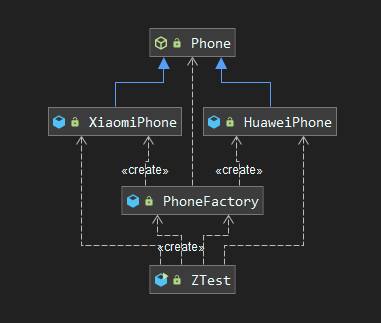
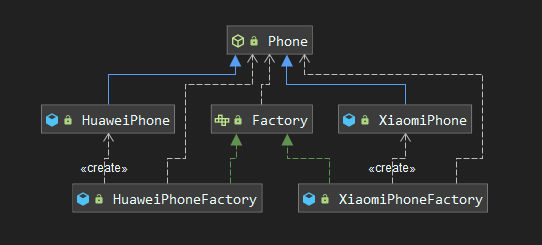
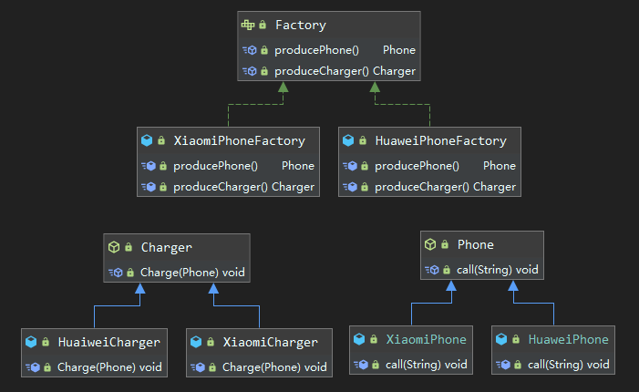
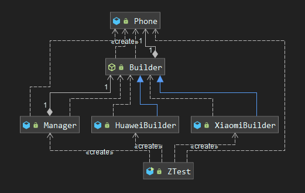
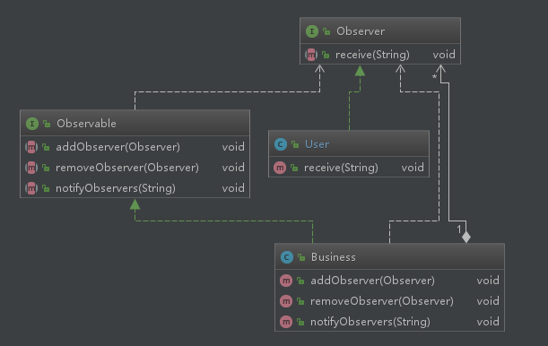

# 设计模式


<nav>
软件设计原则<br/>
&nbsp;&nbsp;&nbsp;&nbsp;<a href="#1-开闭原则">1. 开闭原则</a><br/>
&nbsp;&nbsp;&nbsp;&nbsp;<a href="#2-里氏替换原则">2. 里氏替换原则</a><br/>
&nbsp;&nbsp;&nbsp;&nbsp;<a href="#3-依赖倒置原则">3. 依赖倒置原则</a><br/>
&nbsp;&nbsp;&nbsp;&nbsp;<a href="#4-单一职责原则">4. 单一职责原则</a><br/>
&nbsp;&nbsp;&nbsp;&nbsp;<a href="#5-接口隔离原则">5. 接口隔离原则</a><br/>
&nbsp;&nbsp;&nbsp;&nbsp;<a href="#6-迪米特法则-最少知道原则">6. 迪米特法则 (最少知道原则)</a><br/>
&nbsp;&nbsp;&nbsp;&nbsp;<a href="#7-合成复用原则-组合复用原则">7. 合成复用原则 (组合复用原则)</a><br/>
创建型<br/>
&nbsp;&nbsp;&nbsp;&nbsp;<a href="#1-单例模式">1. 单例模式</a><br/>
&nbsp;&nbsp;&nbsp;&nbsp;<a href="#2-简单工厂模式">2. 简单工厂模式</a><br/>
&nbsp;&nbsp;&nbsp;&nbsp;<a href="#3-工厂模式">3. 工厂模式</a><br/>
&nbsp;&nbsp;&nbsp;&nbsp;<a href="#4-抽象工厂模式">4. 抽象工厂模式</a><br/>
&nbsp;&nbsp;&nbsp;&nbsp;<a href="#5-构建者模式">5. 构建者模式</a><br/>
&nbsp;&nbsp;&nbsp;&nbsp;<a href="#6-原型模式">6. 原型模式</a><br/>
结构型<br/>
&nbsp;&nbsp;&nbsp;&nbsp;<a href="#1-代理模式">1. 代理模式</a><br/>
&nbsp;&nbsp;&nbsp;&nbsp;<a href="#2-适配器模式">2. 适配器模式</a><br/>
&nbsp;&nbsp;&nbsp;&nbsp;<a href="#3-桥接模式">3. 桥接模式</a><br/>
&nbsp;&nbsp;&nbsp;&nbsp;<a href="#4-组合模式">4. 组合模式</a><br/>
&nbsp;&nbsp;&nbsp;&nbsp;<a href="#5-装饰模式">5. 装饰模式</a><br/>
&nbsp;&nbsp;&nbsp;&nbsp;<a href="#6-外观模式">6. 外观模式</a><br/>
&nbsp;&nbsp;&nbsp;&nbsp;<a href="#7-享元模式">7. 享元模式</a><br/>
行为型<br/>
&nbsp;&nbsp;&nbsp;&nbsp;<a href="#1-观察者模式">1. 观察者模式</a><br/>
&nbsp;&nbsp;&nbsp;&nbsp;<a href="#2-责任链模式">2. 责任链模式</a><br/>
&nbsp;&nbsp;&nbsp;&nbsp;<a href="#3-模板方法模式">3. 模板方法模式</a><br/>
&nbsp;&nbsp;&nbsp;&nbsp;<a href="#4-策略模式">4. 策略模式</a><br/>
&nbsp;&nbsp;&nbsp;&nbsp;<a href="#6-状态模式">6. 状态模式</a><br/>
&nbsp;&nbsp;&nbsp;&nbsp;<a href="#7-中介者模式">7. 中介者模式</a><br/>
&nbsp;&nbsp;&nbsp;&nbsp;<a href="#8-迭代器模式">8. 迭代器模式</a><br/>
&nbsp;&nbsp;&nbsp;&nbsp;<a href="#9-访问者模式">9. 访问者模式</a><br/>
&nbsp;&nbsp;&nbsp;&nbsp;<a href="#10-备忘录模式">10. 备忘录模式</a><br/>
&nbsp;&nbsp;&nbsp;&nbsp;<a href="#11-解释器模式">11. 解释器模式</a><br/>
</nav>


## 软件设计的原则

### 1. 开闭原则

定义：软件实体应当对扩展开放，对修改关闭。

### 2. 里氏替换原则

定义：继承必须保证超类所拥有的性质在子类中仍然成立。即子类在继承父类时，除了添加新的方法来新增功能外，尽量避免重写父类方法，因为这会导致整个继承体系的复用性变差。

### 3. 依赖倒置原则

定义：高层模块不应该依赖低层模块，两者都应该依赖其抽象；抽象不应该依赖细节，细节应该依赖抽象。其核心思想是要面向接口编程，而不是面向实现编程，这样可以降低耦合性，提高系统稳定性，提高代码的可读性和可维护性。

### 4. 单一职责原则

定义：一个类应该有且仅有一个引起它变化的原则，否则类应该被拆分。其核心思想是控制类的粒度大小、提高类的内聚性。

### 5. 接口隔离原则

定义：一个类对另一个类的依赖应该建立在最小的接口上。其核心思想是要为每个特定的功能建立对应的接口，而不是在一个接口中试图去包含所有功能，既要保证相对独立，也要避免过多接口所导致的臃肿。

### 6. 迪米特法则 (最少知道原则)

定义：如果两个软件实体不需要直接通讯，那么就应该避免直接互相调用，而是通过第三方转发该调用，从而降低耦合度，保证模块的相对独立。

### 7. 合成复用原则 (组合复用原则)

定义：应该优先使用组合、聚合等关联关系来实现复用，其次才是考虑使用继承关系。

**总结**：开闭原则是总纲，它告诉我们要对扩展开放，对修改关闭；里氏替换原则告诉我们不要破坏继承体系；依赖倒置原则告诉我们要面向接口编程；单一职责原则告诉我们实现类要职责单一；接口隔离原则告诉我们在设计接口的时候要精简单一；迪米特法则告诉我们要降低耦合度；合成复用原则告诉我们要优先使用组合或者聚合关系复用，少用继承关系复用。


# 创建型

## 1. 单例模式

### 1.1  饿汉式单例

饿汉式单例是最简单一种单例模式，它在类初始化时就完成相关单例对象的创建，可以通过静态代码块或静态内部类的方式来进行实现：

静态代码块方式：

```java
public class HungrySingleton implements Serializable {

    private static final HungrySingleton instance;

    static {
        instance = new HungrySingleton();
    }

    // 确保构造器私有
    private HungrySingleton() {}

    // 获取单例对象
    public static HungrySingleton getInstance() {
        return instance;
    }
}
```

静态内部类方式：

```java
public class StaticInnerClassHungrySingleton {

    private static class InnerClass {
        private static StaticInnerClassHungrySingleton instance = new StaticInnerClassHungrySingleton();
    }

    // 确保构造器私有
    private StaticInnerClassHungrySingleton() {}

    // 获取单例对象
    public static StaticInnerClassHungrySingleton getInstance() {
        return InnerClass.instance;
    }

}
```

饿汉式单例的优点在于其不存在线程安全问题，对象的唯一性由虚拟机在类初始化创建时保证；其缺点在于如果对象的创建比较消耗资源，并且单例对象不一定会被使用时就会造成资源的浪费。

### 1.2 懒汉式单例

懒汉式单例的思想在于在需要使用单例对象时才进行创建，如果对象存在则直接返回，如果对象不存在则创建后返回，示例如下：

```java
public class LazySingletonUnsafe {

    private static LazySingletonUnsafe instance = null;

    private LazySingletonUnsafe() {
    }

    public static LazySingletonUnsafe getInstance() {
        if (instance == null) {
            instance = new LazySingletonUnsafe();
        }
        return instance;
    }
}
```

需要注意的是上面的代码在单线程环境下是没有问题的，但是在多线程环境下是线程不安全的，原因在于下面的创建代码是非原子性的：

```java
if (instance == null) {
    instance = new LazySingletonUnsafe();
}
```

想要保证创建操作的原子性，可以通过 synchronized 关键字来进行实现：

```java
public synchronized static LazySingletonUnsafe getInstance() {
        if (instance == null) {
            instance = new LazySingletonUnsafe();
        }
        return instance;
    }
```

此时该方法是线程安全的，但是性能却存在问题。因为 synchronized 修饰的是静态方法，其锁住的是整个类对象，这意味着所有想要获取该单例对象的线程都必须要等待内部锁的释放。假设单例对象已经创建完成，并有 100 个线程并发获取该单例对象，则这 100 个线程都需要等待，显然这会降低系统的吞吐量，因此更好的方式是采用 **双重检查锁的机制** 来实现懒汉式单例：

```java
public class DoubleCheckLazySingletonSafe {

    // 使用volatile来禁止指令重排序 
    private static volatile DoubleCheckLazySingletonSafe instance = null;

    private DoubleCheckLazySingletonSafe() {
    }

    // 双重检查
    public static DoubleCheckLazySingletonSafe getInstance() {
        if (instance == null) {
            synchronized (DoubleCheckLazySingletonSafe.class) {
                if (instance == null) {
                    instance = new DoubleCheckLazySingletonSafe();
                }
            }
        }
        return instance;
    }
}
```

还是沿用上面的举例，假设单例对象已经创建完成，并有 100 个线程并发获取该单例对象，此时 `instance == null` 判断肯定是 false，所以所有线程都会直接获得该单例对象，而不会进入 synchronized 同步代码块，这减小了锁的锁定范围，用更小的锁粒度获得了更好的性能。但内部的 `if` 代码块仍然需要使用 synchronized 关键字修饰，从而保证整个 if 代码块的原子性。

需要注意的是这里的 instance 需要使用 volatile 关键修饰，用于禁止对象在创建过程中出现指令重排序。通常对象的创建分为以下三步：

1. 给对象分配内存空间；
2. 调用对象的构造器方法，并执行初始化操作；
3. 将变量指向相应的内存地址。

如果没有禁止指令重排序，则 2 ，3 步可能会发生指令重排序，这在单线程下是没有问题的，也符合 As-If-Serial 原则，但是如果在多线程下就会出现线程不安全的问题：

```java
// 2. 由于线程1已经将变量指向内存地址，所以其他线程判断instance不为空，进而直接获取，但instance可能尚未初始化完成
if (instance == null) { 
    synchronized (DoubleCheckLazySingletonSafe.class) {
        if (instance == null) {
            // 1. 假设线程1已经给对象分配了内存空间并将变量instance指向了相应的内存地址，但尚未初始化完成
            instance = new DoubleCheckLazySingletonSafe();
        }
    }
}
return instance;
```

由于重排序的存在，其他线程可能拿到的是一个尚未初始化完成的 instance，此时就可能会导致异常，所以需要禁止其出现指令重排序。

### 1.3  使用序列化破坏单例

饿汉式单例和双重检查锁的懒汉式单例都是线程安全的，都能满足日常的开发需求，但如果你是类库的开发者，为了防止自己类库中的单例在调用时被有意或无意地破坏，你还需要考虑单例模式的写法安全。其中序列化和反射攻击是两种常见的破坏单例的方式，示例如下：

```java
public class SerializationDamage {
    public static void main(String[] args) throws IOException, ClassNotFoundException {
        HungrySingleton instance = HungrySingleton.getInstance();
        ObjectOutputStream outputStream = new ObjectOutputStream(new FileOutputStream("SingletonFile"));
        outputStream.writeObject(instance);
        ObjectInputStream inputStream = new ObjectInputStream(new FileInputStream(new File("SingletonFile")));
        HungrySingleton newInstance = (HungrySingleton) inputStream.readObject();
        System.out.println(instance == newInstance); // false
    }
}
```

将 HungrySingleton 实现 Serializable 接口后，使用上面的代码将对象序列化写入文件，然后再反序列获取，你会发现两次得到的不是一个对象，这就代表单例模式受到了序列化和反序列化的破坏。想要解决这个问题，需要在对应的单例类中定义 `readResolve()` 方法：

```java
public class HungrySingleton implements Serializable {
    ......
    private Object readResolve() {
        return instance;
    }
    ......
}
```

此时在反序列化时该方法就会被调用来返回单例对象，对应的 ObjectInputStream 类的源码如下：

```java
  // 在本用例中，readObject在内部最终调用的是readOrdinaryObject方法
private Object readOrdinaryObject(boolean unshared) throws IOException{
       .......
        if (obj != null && handles.lookupException(passHandle) == null &&
            desc.hasReadResolveMethod()) //如果对应的对象中有readResolve方法
        {
            // 则通过反射调用该方法来获取对应的单例对象
            Object rep = desc.invokeReadResolve(obj);
            ........
           handles.setObject(passHandle, obj = rep);
        }
        return obj;
    }
```

### 1.4 使用反射破坏单例

使用反射也可以破坏单例模式，并且由于 Java 的反射功能过于强大，这种破坏几乎是无法规避的，示例如下：

```java
public class ReflectionDamage {
    public static void main(String[] args) throws Exception {
        Constructor<HungrySingleton> constructor = HungrySingleton.class.getDeclaredConstructor();
        // 获取私有构造器的访问权限
        constructor.setAccessible(true);
        HungrySingleton hungrySingleton = constructor.newInstance();
        HungrySingleton instance = HungrySingleton.getInstance();
        System.out.println(hungrySingleton == instance); // false
    }
}
```

即便在创建单例对象时将构造器声明为私有，此时仍然可以通过反射修改权限来获取，此时单例模式就被破坏了。如果你采用的是饿汉式单例，此时可以通过如下的代码来规避这种破坏：

```java
public class HungrySingleton implements Serializable {

    private static final HungrySingleton instance;

    static {
        instance = new HungrySingleton();
    }

    // 由于instance在类创建时就已经初始化完成，所以当使用反射调用构造器时就会抛出自定义的RuntimeException异常
    private HungrySingleton() {
        if (instance != null) {
            throw new RuntimeException("单例模式禁止反射调用");
        }
    }

    ......
}
```

以上是饿汉式单例防止反射攻击的办法，如果你使用的是懒汉式单例，此时由于无法知道对象何时会被创建，并且反射功能能够获取到任意字段，方法，构造器的访问权限，所以此时没有任何方法能够规避掉反射攻击。

那么有没有一种单例模式能够在保证线程安全，还能够防止序列化和反射功能呢？在 Java 语言中，可以通过枚举式单例来实现。

### 1.5  枚举式单例

使用枚举实现单例的示例如下：

```java
public enum EnumInstance {

    INSTANCE;

    private String field;

    public String getField() {
        return field;
    }

    public void setField(String field) {
        this.field = field;
    }

    public static EnumInstance getInstance() {
        return INSTANCE;
    }
}
```

想要实现一个单例枚举，对应的单例类必须要使用 enum 修饰，其余的字段声明（如：field）, 方法声明（如：setField）都和正常的类一样。首先枚举类是线程安全的，这点可以使用反编译工具 Jad 对类的 class 文件进行反编译来验证：

```java
// Decompiled by Jad v1.5.8g. Copyright 2001 Pavel Kouznetsov.
// Jad home page: http://www.kpdus.com/jad.html
// Decompiler options: packimports(3) 
// Source File Name:   EnumInstance.java

package com.heibaiying.creational.singleton;

// 不可变的类
public final class EnumInstance extends Enum
{

    public static EnumInstance[] values()
    {
        return (EnumInstance[])$VALUES.clone();
    }

    public static EnumInstance valueOf(String name)
    {
        return (EnumInstance)Enum.valueOf(com/heibaiying/creational/singleton/EnumInstance, name);
    }

    // 私有构造器，枚举类没有无参构造器，Enum中只定义了Enum(String name, int ordinal) 构造器
    private EnumInstance(String s, int i)
    {
        super(s, i);
    }

    // 自定义的方法
    public String getField()
    {
        return field;
    }

    public void setField(String field)
    {
        this.field = field;
    }

    public static EnumInstance getInstance()
    {
        return INSTANCE;
    }

    // 静态不可变的实例对象
    public static final EnumInstance INSTANCE;
    // 自定义字段
    private String field;
    private static final EnumInstance $VALUES[];

    // 在静态代码中进行初始化
    static 
    {
        INSTANCE = new EnumInstance("INSTANCE", 0);
        $VALUES = (new EnumInstance[] {
            INSTANCE
        });
    }
}
```

通过反编译工具可以看到其和饿汉式单例模式类似，因此它也是线程安全的。另外它也能防止序列化攻击和反射攻击：

```java
public class EnumInstanceTest {
    public static void main(String[] args) throws Exception {
        // 序列化攻击
        EnumInstance instance = EnumInstance.getInstance();
        ObjectOutputStream outputStream = new ObjectOutputStream(new FileOutputStream("EnumSingletonFile"));
        outputStream.writeObject(instance);
        ObjectInputStream inputStream = new ObjectInputStream(new FileInputStream(new File("EnumSingletonFile")));
        EnumInstance newInstance = (EnumInstance) inputStream.readObject();
        System.out.println(instance == newInstance);
        // 反射攻击，Enum类中只有一个两个参数的构造器：Enum(String name, int ordinal)
        Constructor<EnumInstance> constructor = EnumInstance.class.getDeclaredConstructor(String.class, int.class);
        constructor.setAccessible(true);
        EnumInstance enumInstance = constructor.newInstance("name", 0);
        System.out.println(instance == enumInstance);
    }
}
```

对于序列化与反序列化，枚举类单例能保证两次拿到的都是同一个实例。对于反射攻击，枚举类单例会抛出明确的异常：

```java
Exception in thread "main" java.lang.IllegalArgumentException: Cannot reflectively create enum objects
    at java.lang.reflect.Constructor.newInstance(Constructor.java:417)
    at com.heibaiying.creational.singleton.EnumInstanceTest.main(EnumInstanceTest.java:18)
```


## 2. 简单工厂模式

### 2.1 定义

对于调用者来说，它无需知道对象的具体创建细节，只需要将自己所需对象的类型告诉工厂，然后由工厂自动创建并返回。

### 2.2 示例

<div align="center">  </div>


产品抽象类：

```java
public abstract class Phone {
    public abstract void call(String phoneNum);
}
```

具体的产品：

```java
public class HuaweiPhone extends Phone {
    public void call(String phoneNum) {
        System.out.println("华为手机拨打电话：" + phoneNum);
    }
}
```

```java
public class XiaomiPhone extends Phone {
    public void call(String phoneNum) {
        System.out.println("小米手机拨打电话：" + phoneNum);
    }
}
```

手机工厂：

```java
public class PhoneFactory {

    public Phone getPhone(String type) {
        if ("xiaomi".equalsIgnoreCase(type)) {
            return new XiaomiPhone();
        } else if ("huawei".equalsIgnoreCase(type)) {
            return new HuaweiPhone();
        }
        return null;
    }
}
```

调用工厂类获取具体的实例：

```java
public class ZTest {
    public static void main(String[] args) {
        PhoneFactory phoneFactory = new PhoneFactory();
        phoneFactory.getPhone("xiaomi").call("123");
        phoneFactory.getPhone("huawei").call("321");
    }
}
```

### 2.3  优缺点

简单工厂的优点在于其向用户屏蔽了对象创建过程，使得用户可以不必关注具体的创建细节，其缺陷在于违背了开闭原则。在简单工厂模式中，如果想要增加新的产品，就需要修改简单工厂中的判断逻辑，这就违背了开闭原则，因此其并不属于 GOF 经典的 23 种设计模式。在 Java 语言中，可以通过泛型来尽量规避这一缺陷，此时可以将创建产品的方法修改为如下所示：

```java
public Phone getPhone(Class<? extends Phone> phoneClass) {
    try {
        return (Phone) Class.forName(phoneClass.getName()).newInstance();
    } catch (InstantiationException | IllegalAccessException | ClassNotFoundException e) {
        e.printStackTrace();
    }
    return null;
}
```

## 3. 工厂模式

### 3.1  定义

定义一个用于创建对象的工厂接口，但具体实例化哪一个工厂则由子类来决定。

### 3.2 示例

<div align="center">  </div>


产品抽象类：

```java
public abstract class Phone {
    public abstract void call(String phoneNum);
}
```

产品实现类：

```java
public class HuaweiPhone extends Phone {
    public void call(String phoneNum) {
        System.out.println("华为手机拨打电话：" + phoneNum);
    }
}
```

```java
public class XiaomiPhone extends Phone {
    public void call(String phoneNum) {
        System.out.println("小米手机拨打电话：" + phoneNum);
    }
}
```

工厂接口：

```java
public interface Factory {
    Phone produce();
}
```

工厂实现类：

```java
public class HuaweiPhoneFactory implements Factory {
    @Override
    public Phone produce() {
        return new HuaweiPhone();
    }
}
```

```java
public class XiaomiPhoneFactory implements Factory {
    @Override
    public Phone produce() {
        return new XiaomiPhone();
    }
}
```

由调用者来决定实例化哪一个工厂对象：

```java
public class ZTest {
    public static void main(String[] args) {
        XiaomiPhoneFactory xiaomiPhoneFactory = new XiaomiPhoneFactory();
        xiaomiPhoneFactory.produce().call("123");
        HuaweiPhoneFactory huaweiPhoneFactory = new HuaweiPhoneFactory();
        huaweiPhoneFactory.produce().call("456");
    }
}
```

### 3.3  优点

工厂模式的优点在于良好的封装性和可扩展性，如果想要增加新的产品（如：OppoPhone），只需要增加对应的工厂类即可，同时和简单工厂一样，它也向用户屏蔽了不相关的细节，使得系统的耦合度得以降低。

## 4. 抽象工厂模式

### 4.1  定义

提供一个创建一系列相关或相互依赖对象的接口，而无需指定它们具体的实现类。抽象工厂模式是工厂模式的升级版本，它适用于存在多个产品的情况。接着上面的例子，假设每个工厂不仅生产手机，而且还需要生产对应的充电器，这样才能算一个可以出售的产品，相关的代码示例如下：

### 4.2  示例

<div align="center">  </div>


充电器抽象类：

```java
public abstract class Charger {
    public abstract void Charge(Phone phone);
}
```

充电器实现类：

```java
public class HuaiweiCharger extends Charger {
    @Override
    public void Charge(Phone phone) {
        System.out.println("华为充电器给" + phone + "充电");
    }
}
```

```java
public class XiaomiCharger extends Charger {
    @Override
    public void Charge(Phone phone) {
        System.out.println("小米充电器给" + phone + "充电");
    }
}
```

工厂接口：

```java
public interface Factory {
    Phone producePhone();
    Charger produceCharger();
}
```

工厂实现类：

```java
public class HuaweiPhoneFactory implements Factory {
    @Override
    public Phone producePhone() {
        return new HuaweiPhone();
    }
    @Override
    public Charger produceCharger() {
        return new HuaiweiCharger();
    }
}
```

```java
public class XiaomiPhoneFactory implements Factory {
    @Override
    public Phone producePhone() {
        return new XiaomiPhone();
    }
    @Override
    public Charger produceCharger() {
        return new XiaomiCharger();
    }
}
```

调用具体的工厂实现类：

```java
public class ZTest {
    public static void main(String[] args) {
        XiaomiPhoneFactory xiaomiPhoneFactory = new XiaomiPhoneFactory();
        xiaomiPhoneFactory.produceCharger().Charge(xiaomiPhoneFactory.producePhone());
        HuaweiPhoneFactory huaweiPhoneFactory = new HuaweiPhoneFactory();
        huaweiPhoneFactory.produceCharger().Charge(huaweiPhoneFactory.producePhone());
    }
}
```

### 4.3 优缺点

抽象工厂模式继承了工厂模式的优点，能用于存在多个产品的情况，但其对应的产品族必须相对固定，假设我们现在认为 手机 + 充电器 + 耳机 才算一个可以对外出售的产品，则上面所有的工厂类都需要更改，但显然不是所有的手机都有配套的耳机，手机 + 充电器 这个产品族是相对固定的。

## 5. 构建者模式

### 5.1 定义

将一个复杂对象的构造与它的表示分离，使同样的构建过程可以创建不同的表示。它将一个复杂对象的创建过程分解为多个简单的步骤，然后一步一步的组装完成。

### 5.2 示例

<div align="center">  </div>


产品实体类：

```java
public class Phone {
    /*处理器*/
    private String processor;
    /*摄像头*/
    private String camera;
    /*屏幕*/
    private String screen;
}
```

建造者抽象类：

```java
public abstract class Builder {

    protected Phone phone = new Phone();
    /*安装处理器*/
    public abstract void addProcessor();
    /*组装摄像头*/
    public abstract void addCamera();
    /*安装屏幕*/
    public abstract void addScreen();
  
    public Phone produce() {
        return phone;
    }
}
```

建造者实现类：

```java
public class HuaweiBuilder extends Builder {
    @Override
    public void addProcessor() {
        phone.setProcessor("海思麒麟处理器");
    }

    @Override
    public void addCamera() {
        phone.setCamera("莱卡摄像头");
    }

    @Override
    public void addScreen() {
        phone.setScreen("OLED");
    }
}
```

```java
public class XiaomiBuilder extends Builder {
    @Override
    public void addProcessor() {
        phone.setProcessor("高通骁龙处理器");
    }

    @Override
    public void addCamera() {
        phone.setCamera("索尼摄像头");
    }

    @Override
    public void addScreen() {
        phone.setScreen("OLED");
    }
}
```

定义管理者类（也称为导演类），由它来驱使具体的构建者按照指定的顺序完成构建过程：

```java
public class Manager {

    private Builder builder;

    public Manager(Builder builder) {
        this.builder = builder;
    }

    public Phone buy() {
        builder.addCamera();
        builder.addProcessor();
        builder.addScreen();
        return builder.produce();
    }
}
```

调用管理者类获取产品：

```java
public class ZTest {
    public static void main(String[] args) {
        Phone huawei = new Manager(new HuaweiBuilder()).buy();
        System.out.println(huawei);
        Phone xiaomi = new Manager(new XiaomiBuilder()).buy();
        System.out.println(xiaomi);
    }
}
// 输出：
Phone(processor=海思麒麟处理器, camera=莱卡摄像头, screen=OLED)
Phone(processor=高通骁龙处理器, camera=索尼摄像头, screen=OLED)
```

### 5.3 优点

建造者模式的优点在于将复杂的构建过程拆分为多个独立的单元，在保证拓展性的基础上也保证了良好的封装性，使得客户端不必知道产品的具体创建流程。

## 6. 原型模式

### 6.1  定义

用原型实例指定创建对象的种类，并通过拷贝这些原型创建新的对象。

### 6.2  示例

在 Java 语言中可以通过 `clone()` 方法来实现原型模式：

```java
public class Phone implements Cloneable {

    private String type;

    Phone(String type) {
        System.out.println("构造器被调用");
        this.type = type;
    }

    public void call() {
        System.out.println(type + "拨打电话");
    }

    @Override
    protected Object clone() throws CloneNotSupportedException {
        System.out.println("克隆方法被调用");
        return super.clone();
    }
}
```

使用克隆来创建对象：

```java
Phone phone = new Phone("3G手机");
Phone clonePhone = (Phone) phone.clone();
clonePhone.call();
```

在使用 clone 方法时需要注意区分深拷贝和浅拷贝：即如果待拷贝的对象中含有引用类型的变量，也需要对其进行拷贝，示例如下：

```java
public class SmartPhone implements Cloneable {

    private String type;
    private Date productionDate;

    SmartPhone(String type, Date productionDate) {
        this.type = type;
        this.productionDate = productionDate;
    }

    public void call() {
        System.out.println(type + "拨打电话");
    }

    @Override
    protected Object clone() throws CloneNotSupportedException {
        SmartPhone smartPhone = (SmartPhone) super.clone();
        // 对引用对象进行拷贝
        smartPhone.productionDate = (Date) smartPhone.productionDate.clone();
        return smartPhone;
    }
}
```

### 6.3  适用场景

原型模式是直接在内存中进行二进制流的拷贝，被拷贝对象的构造函数并不会被执行，因此其性能表现非常优秀。如果对象的创建需要消耗非常多的资源，此时应该考虑使用原型模式。


# 结构型

## 1. 代理模式

### 1.1 定义

为目标对象提供一个代理对象以控制外部环境对其的访问，此时外部环境应访问该代理对象，而不是目标对象。通过代理模式，可以在不改变目标对象的情况下，实现功能的扩展。

在 Java 语言中，根据代理对象生成的时间点的不同可以分为静态代理和动态代理，其中动态代理根据实现方式的不同又可以分为 JDK 代理 和 Cglib 代理。

### 1.2 静态代理

此时代理对象和目标对象需要实现相同的接口：

```java
public interface IService {
    void compute();
}
```

目标对象：

```java
public class ComputeService implements IService {
    @Override
    public void compute() {
        System.out.println("业务处理");
    }
}
```

在代理对象中注入目标对象的实例：

```java
public class ProxyService implements IService {

    private IService target;

    public ProxyService(IService target) {
        this.target = target;
    }

    @Override
    public void compute() {
        System.out.println("权限校验");
        target.compute();
        System.out.println("资源回收");
    }
}
```

调用时候应该访问代理对象，而不是目标对象：

```java
ProxyService proxyService = new ProxyService(new ComputeService());
proxyService.compute();
```

### 1.3 JDK 代理

除了使用静态代理外，还可以利用 JDK 中的 Proxy 类和反射功能来实现对目标对象的代理：

```java
ComputeService target = new ComputeService();
IService proxyInstance = (IService) Proxy.newProxyInstance(
    target.getClass().getClassLoader(),
    target.getClass().getInterfaces(), //代理类要实现的接口列表
    (proxy, method, args1) -> {
        System.out.println("权限校验");
        Object invoke = method.invoke(target, args1);
        System.out.println("资源回收");
        return invoke;
    });
proxyInstance.compute();
```

静态代理和 JDK 动态代理都要求目标对象必须实现一个或者多个接口，如果目标对象不存在任何接口，此时可以使用 Cglib 方式对其进行代理。

### 1.4 Cglib 代理

要想使用 Cglib 代理，必须导入相关的依赖：

```xml
<dependency>
    <groupId>cglib</groupId>
    <artifactId>cglib</artifactId>
    <version>3.3.0</version>
</dependency>
```

此时目标对象不需要实现任何接口：

```java
public class ComputeService {
    public void compute() {
        System.out.println("业务处理");
    }
}
```

使用 Cglib 进行代理：

```java
public class Proxy implements MethodInterceptor {

    private Object target;

    public Proxy(Object target) {
        this.target = target;
    }

    public Object getProxyInstance() {
        // 创建用于生成生成动态子类的工具类
        Enhancer enhancer = new Enhancer();
        // 指定动态生成类的父类
        enhancer.setSuperclass(target.getClass());
        // 设置回调
        enhancer.setCallback(this);
        // 动态生成子类
        return enhancer.create();
    }

   /**
    * 我们只需要实现此处的拦截逻辑，其他代码都是相对固定的
    */
    @Override
    public Object intercept(Object obj, Method method, Object[] args, MethodProxy proxy) throws InvocationTargetException, IllegalAccessException {
        System.out.println("权限校验");
        Object invoke = method.invoke(target, args);
        System.out.println("资源回收");
        return invoke;
    }
}
```

访问代理对象：

```java
Proxy proxy = new Proxy(new ComputeService());
ComputeService service = (ComputeService) proxy.getProxyInstance();
service.compute();
```


## 2. 适配器模式

### 2.1  定义

将一个类的接口转换成客户希望的另外一个接口，从而使得原本由于接口不兼容而无法一起工作的类可以一起工作。

### 2.2 示例

将 220V 的电流通过适配器转换为对应规格的电流给手机充电：

<div align="center">  </div>


电源类：

```java
public class PowerSupply {

    private final int output = 220;

    public int output220V() {
        System.out.println("电源电压：" + output);
        return output;
    }
}
```

手机电压规格：

```java
public interface Target {
    int output5V();
}
```

适配器需要继承自源类，并实现目标类接口：

```java
public class ChargerAdapter extends PowerSupply implements Target {
    @Override
    public int output5V() {
        int output = output220V();
        System.out.println("充电头适配转换");
        output = output / 44;
        System.out.println("输出电压：" + output);
        return output;
    }
}
```

测试：

```java
public class ZTest {
    public static void main(String[] args) {
        Target target = new ChargerAdapter();
        target.output5V();
    }
}

// 输出：
电源电压：220
充电头适配转换
输出电压：5
```


## 3. 桥接模式

### 3.1 定义

将抽象部分与它的实现部分分离，使它们都可以独立地变化。它使用组合关系来代替继承关系，从而降低了抽象和实现这两个可变维度的耦合度。

### 3.2  优点

+ 抽象和实现分离；
+ 优秀的扩展能力；
+ 实现细节对客户端透明，客户可以通过各种聚合来实现不同的需求。

### 3.3 示例

将一个图形的形状和颜色进行分离，从而可以通过组合来实现的不同的效果：

<div align="center">  </div>


颜色的抽象和实现：

```java
public interface Color {
    String getDesc();
}

public class Blue implements Color {
    @Override
    public String getDesc() {
        return "蓝色";
    }
}

public class Red implements Color {
    @Override
    public String getDesc() {
        return "红色";
    }
}

public class Yellow implements Color {
    @Override
    public String getDesc() {
        return "黄色";
    }
}
```

图形的抽象和实现：

```java
public abstract class Shape {

    private Color color;

    public Shape setColor(Color color) {
        this.color = color;
        return this;
    }

    public Color getColor() {
        return color;
    }

    public abstract void getDesc();
}


public class Round extends Shape {
    @Override
    public void getDesc() {
        System.out.println(getColor().getDesc() + "圆形");
    }
}

public class Square extends Shape {
    @Override
    public void getDesc() {
        System.out.println(getColor().getDesc() + "正方形");
    }
}
```

通过聚合的方式来进行调用：

```java
new Square().setColor(new Red()).getDesc();
new Square().setColor(new Blue()).getDesc();
new Round().setColor(new Blue()).getDesc();
new Round().setColor(new Yellow()).getDesc();
```


## 4. 组合模式

### 4.1 定义

将对象组合成树形结构以表示 “部分-整体” 的层次结构，组合模式使得用户对单个对象和组合对象的使用具有一致性。

### 4.2 优点

+ 单个对象和组合对象具有一致性，这简化了客户端代码；

+ 可以在组合体类加入新的对象，而无需改变其源码。

### 4.3  示例

模拟 Linux 文件系统：

<div align="center">  </div>


组件类，定义文件夹和文件的所有操作：

```java
public abstract class Component {

    private String name;

    public Component(String name) {
        this.name = name;
    }

    public void add(Component component) {
        throw new UnsupportedOperationException("不支持添加操作");
    }

    public void remove(Component component) {
        throw new UnsupportedOperationException("不支持删除操作");
    }


    public void vim(String content) {
        throw new UnsupportedOperationException("不支持使用vim编辑器打开");
    }

    public void cat() {
        throw new UnsupportedOperationException("不支持查看操作");
    }

    public void print() {
        throw new UnsupportedOperationException("不支持打印操作");
    }

}
```

文件夹类：

```java
public class Folder extends Component {

    private List<Component> componentList = new ArrayList<>();

    public Folder(String name) {
        super(name);
    }

    @Override
    public void add(Component component) {
        componentList.add(component);
    }

    @Override
    public void remove(Component component) {
        componentList.remove(component);
    }

    @Override
    public void print() {
        System.out.println(getName());
        componentList.forEach(x -> System.out.println("    " + x.getName()));
    }
}
```

文件类：

```java
public class File extends Component {

    private String content;

    public File(String name) {
        super(name);
    }

    @Override
    public void vim(String content) {
        this.content = content;
    }

    @Override
    public void cat() {
        System.out.println(content);
    }

    @Override
    public void print() {
        System.out.println(getName());
    }
}
```

通过组合来实现层级结构：

```java
Folder rootDir = new Folder("ROOT目录");
Folder nginx = new Folder("Nginx安装目录");
Folder tomcat = new Folder("Tomcat安装目录");
File startup = new File("startup.bat");
rootDir.add(nginx);
rootDir.add(tomcat);
rootDir.add(startup);
rootDir.print();
startup.vim("java -jar");
startup.cat();
nginx.cat();
```


## 5. 装饰模式

### 5.1  定义

在不改变现有对象结构的情况下，动态地给该对象增加一些职责或功能。

### 5.2  优点

- 采用装饰模式扩展对象的功能比采用继承方式更加灵活。
- 可以通过设计多个不同的装饰类，来创造出多个不同行为的组合。

### 5.3 示例

在购买手机后，你可能还会购买屏幕保护膜，手机壳等来进行装饰：

<div align="center">  </div>


手机抽象类及其实现：

```java
public abstract class Phone {
    public abstract int getPrice();
    public abstract String  getDesc();
}

public class MiPhone extends Phone {
    
    @Override
    public int getPrice() {
        return 1999;
    }
    
    @Override
    public String getDesc() {
        return "MiPhone";
    }
}
```

装饰器抽象类：

```java
public abstract class Decorator extends Phone {

    private Phone phone;

    public Decorator(Phone phone) {
        this.phone = phone;
    }

    @Override
    public int getPrice() {
        return phone.getPrice();
    }

    @Override
    public String getDesc() {
        return phone.getDesc();
    }
}
```

手机壳装饰器：

```java
public class ShellDecorator extends Decorator {

    public ShellDecorator(Phone phone) {
        super(phone);
    }

    @Override
    public int getPrice() {
        return super.getPrice() + 200;
    }

    @Override
    public String getDesc() {
        return super.getDesc() + " + 手机壳";
    }
}
```

屏幕保护膜装饰器：

```java
public class FilmDecorator extends Decorator {

    public FilmDecorator(Phone phone) {
        super(phone);
    }

    @Override
    public int getPrice() {
        return super.getPrice() + 100;
    }

    @Override
    public String getDesc() {
        return super.getDesc() + " + 钢化膜";
    }
}
```

调用装饰器对目标对象进行装饰：

```java
public class ZTest {
    public static void main(String[] args) {
        ShellDecorator decorator = new ShellDecorator(new FilmDecorator(new MiPhone()));
        System.out.println(decorator.getDesc() + " : " + decorator.getPrice());
    }
}

// 输出： MiPhone + 钢化膜 + 手机壳 : 2299
```


## 6. 外观模式

### 6.1  定义

在现在流行的微服务架构模式下，我们通常会将一个大型的系统拆分为多个独立的服务，此时需要提供一个一致性的接口来给外部系统进行调用，这就是外观模式的一种体现。

### 6.2 优点

+ 降低了子系统和客户端之间的耦合度；
+ 对客户端屏蔽了系统内部的实现细节。

### 6.3 示例

模仿电商购物下单，此时内部需要调用支付子系统，仓储子系统，物流子系统，而这些细节对用户都是屏蔽的：

<div align="center">  </div>


安全检查系统：

```java
public class EnvInspectionService {
    public boolean evInspection() {
        System.out.println("支付环境检查...");
        return true;
    }
}
```

支付子系统：

```java
public class AccountService {
    public boolean balanceCheck() {
        System.out.println("账户余额校验...");
        return true;
    }
}
```

物流子系统：

```java
public class LogisticsService {
    public void ship(Phone phone) {
        System.out.println(phone.getName() + "已经发货，请注意查收...");
    }
}
```

下单系统（外观门面）：

```java
public class OrderService {

    private EnvInspectionService inspectionService = new EnvInspectionService();
    private AccountService accountService = new AccountService();
    private LogisticsService logisticsService = new LogisticsService();

    public void order(Phone phone) {
        if (inspectionService.evInspection()) {
            if (accountService.balanceCheck()) {
                System.out.println("支付成功");
                logisticsService.ship(phone);
            }
        }
    }
}
```

用户只需要访问外观门面，调用下单接口即可：

```java
Phone phone = new Phone("XXX手机");
OrderService orderService = new OrderService();
orderService.order(phone);

// 输出：
支付环境检查...
账户余额校验...
支付成功
XXX手机已经发货，请注意查收...
```


## 7. 享元模式

### 7.1 定义

运用共享技术来有效地支持大量细粒度对象的复用，线程池，缓存技术都是其代表性的实现。在享元模式中存在以下两种状态：

+ 内部状态，即不会随着环境的改变而改变状态，它在对象初始化时就已经确定；
+ 外部状态，指可以随环境改变而改变的状态。

通过享元模式，可以避免在系统中创建大量重复的对象，进而可以节省系统的内存空间。

### 7.2 示例

这里以创建 PPT 模板为例，相同类型的 PPT 模板不再重复创建：

<div align="center">  </div>


PPT 抽象类：

```java
public abstract class PowerPoint {
    /*版权*/
    private String copyright;
    private String title;

    /*这里的版权信息是一种内部状态，它在PPT对象第一次创建时就已经确定*/
    public PowerPoint(String copyright) {
        this.copyright = copyright;
    }

    /*PPT标题是一种外部状态，它可以由外部环境根据不同的需求进行更改*/
    public void setTitle(String title) {
        this.title = title;
    }

    abstract void create();

    @Override
    public String toString() {
        return "编号：" + hashCode() + ": PowerPoint{" +
            "copyright='" + copyright + '\'' +
            ", title='" + title + '\'' +
            '}';
    }
}
```

PPT 实现类：

```java
public class BusinessPPT extends PowerPoint {
    public BusinessPPT(String copyright) {
        super(copyright);
    }
    @Override
    void create() {
        System.out.println("商务类PPT模板");
    }
}

public class SciencePPT extends PowerPoint {
    public SciencePPT(String copyright) {
        super(copyright);
    }
    @Override
    void create() {
        System.out.println("科技类PPT模板");
    }
}

public class ArtPPT extends PowerPoint {
    public ArtPPT(String copyright) {
        super(copyright);
    }
    @Override
    void create() {
        System.out.println("艺术类PPT模板");
    }
}
```

通过工厂模式来进行创建和共享：

```java
public class PPTFactory {

    private HashMap<String, PowerPoint> hashMap = new HashMap<>();

    public PowerPoint getPPT(Class<? extends PowerPoint> clazz) {
        try {
            String name = clazz.getName();
            if (hashMap.keySet().contains(name)) {
                return hashMap.get(name);
            }
            Constructor<?> constructor = Class.forName(name).getConstructor(String.class);
            PowerPoint powerPoint = (PowerPoint) constructor.newInstance("PPT工厂版本所有");
            hashMap.put(name, powerPoint);
            return powerPoint;
        } catch (Exception e) {
            e.printStackTrace();
        }
        return null;
    }
}
```

调用工厂类来创建或获取享元对象：

```java
public class ZTest {
    public static void main(String[] args) {
        PPTFactory pptFactory = new PPTFactory();
        PowerPoint ppt01 = pptFactory.getPPT(BusinessPPT.class);
        ppt01.setTitle("第一季度工作汇报");
        System.out.println(ppt01);
        PowerPoint ppt02 = pptFactory.getPPT(BusinessPPT.class);
        ppt02.setTitle("第二季度工作汇报");
        System.out.println(ppt02);
        PowerPoint ppt03 = pptFactory.getPPT(SciencePPT.class);
        ppt03.setTitle("科技展汇报");
        System.out.println(ppt03);
    }
}

// 输出：
编号：1744347043: PowerPoint{copyright='PPT工厂版本所有', title='第一季度工作汇报'}
编号：1744347043: PowerPoint{copyright='PPT工厂版本所有', title='第二季度工作汇报'}
编号：662441761: PowerPoint{copyright='PPT工厂版本所有', title='科技展汇报'}
```


# 行为型

## 1. 观察者模式

### 1.1  定义

定义对象间一对多的依赖关系，当一个对象的状态发生改变时，所有依赖于它的对象都得到通知并被自动更新。

### 1.2  优点

降低了目标对象和观察者之间的耦合。

### 1.3  示例

假设多个用户都关注某一个商家，当商家发出降价等通知时，所有用户都应该收到：

<div align="center">  </div>


被观察者接口及商家实现类：

```java
public interface Observable {

    // 接收观察者
    void addObserver(Observer observer);

    // 移除观察者
    void removeObserver(Observer observer);
    
    // 通知观察者
    void notifyObservers(String message);
}
```

```java
public class Business implements Observable {

    private List<Observer> observerList = new ArrayList<>();

    @Override
    public void addObserver(Observer observer) {
        observerList.add(observer);
    }

    @Override
    public void removeObserver(Observer observer) {
        observerList.remove(observer);
    }

    @Override
    public void notifyObservers(String message) {
        for (Observer observer : observerList) {
            observer.receive(message);
        }
    }
}
```

观察者接口及用户实现类：

```java
public interface Observer {
    void receive(String message);
}
```

```java
public class User implements Observer {

    private String name;

    public User(String name) {
        this.name = name;
    }

    @Override
    public void receive(String message) {
        System.out.println(getName() + "收到消息：" + message);
    }
}
```

测试商户发送消息：

```java
Business business = new Business();
business.addObserver(new User("用户1"));
business.addObserver(new User("用户2"));
business.addObserver(new User("用户3"));
business.notifyObservers("商品促销通知");

// 输出：
用户1收到消息：商品促销通知
用户2收到消息：商品促销通知
用户3收到消息：商品促销通知
```


## 2. 责任链模式

### 2.1 定义

使多个对象都有机会处理请求，从而避免请求的发送者和接受者之间的耦合关系。将这些对象连接成一条链，并沿着这条链传递该请求，直到有一个对象处理完它为止。

### 2.2 优点

- 降低了对象之间的耦合度；
- 增强了系统的可扩展性。可以根据需求增加新的处理类，满足开闭原则；
- 增强了系统的灵活性。当工作流程发生变化，可以动态地新增，删除成员或修改其调动次序；
- 每个对象只需保持一个指向其后继者的引用，而无需保持其他所有处理者的引用，从而可以避免了过多的条件判断语句；
- 每个类只需要处理自己该处理的工作，不能处理的则传递给下一个对象完成，符合类的单一职责原则。

### 2.3 示例

假设一个正常的流程，根据请假天数的不同，需要不同的领导共同审批：

<div align="center">  </div>


申请单：

```java
public class Application {
    private String title;
    /*请假天数*/
    private int dayNum;
}
```

抽象的领导类：

```java
public abstract class Leader {

    protected Leader leader;

    // 责任链模式的核心：其需要持有一个后继者
    public Leader setNextLeader(Leader leader) {
        this.leader = leader;
        return leader;
    }

    public abstract void approval(Application application);

}
```

3天以下的请假只需要组长审核即可：

```java
public class GroupLeader extends Leader {
    @Override
    public void approval(Application application) {
        System.out.println(application.getTitle() + "被组长审批通过");
        if (application.getDayNum() >= 3) {
            leader.approval(application);
        }
    }
}
```

3天以上5天以下的请假则需要组长和部门经理共同审核：

```java
public class DepartManager extends Leader {
    @Override
    public void approval(Application application) {
        System.out.println(application.getTitle() + "被部门经理审批通过");
        if (application.getDayNum() >= 5) {
            leader.approval(application);
        }
    }
}
```

5 天以上的请假则还需要总经理审核：

```java
public class President extends Leader {
    @Override
    public void approval(Application application) {
        System.out.println(application.getTitle() + "被总经理审批通过");
    }
}
```

组建责任链并测试：

```java
GroupLeader groupLeader = new GroupLeader();
DepartManager departManager = new DepartManager();
President president = new President();
groupLeader.setNextLeader(departManager).setNextLeader(president);
groupLeader.approval(new Application("事假单", 3));
groupLeader.approval(new Application("婚假单", 10));

// 输出：
事假单被组长审批通过
事假单被部门经理审批通过
    
婚假单被组长审批通过
婚假单被部门经理审批通过
婚假单被总经理审批通过
```


## 3. 模板方法模式

### 3.1 定义

定义一个操作的算法骨架，而将算法的一些步骤延迟到子类中，使得子类可以不改变该算法结构的情况下重定义该算法的某些特定步骤。它通常包含以下角色：

**抽象父类** **(Abstract Class)**：负责给出一个算法的轮廓和骨架。它由一个模板方法和若干个基本方法构成：

+ 模板方法：定义了算法的骨架，按某种顺序调用其包含的基本方法。
+ 基本方法：可以是具体的方法也可以是抽象方法，还可以是钩子方法（在抽象类中已经实现，包括用于判断的逻辑方法和需要子类重写的空方法两种）。

**具体子类** **(Concrete Class)**：实现抽象类中所定义的抽象方法和钩子方法。

### 3.2 优点

+ 父类定义了公共的行为，可以实现代码的复用；
+ 子类可以通过扩展来增加相应的功能，符合开闭原则。

### 3.3 示例

手机一般都有电池，摄像头等模块，但不是所有手机都有 NFC 模块，如果采用模板模式构建，则相关代码如下：

<div align="center">  </div>


抽象的父类：

```java
public abstract class Phone {

    // 模板方法
    public void assembling() {
        adCamera();
        addBattery();
        if (needAddNFC()) {
            addNFC();
        }
        packaged();
    }

    // 具体方法
    private void adCamera() {
        System.out.println("组装摄像头");
    }

    private void addBattery() {
        System.out.println("安装电池");
    }

    private void addNFC() {
        System.out.println("增加NFC功能");
    }

    // 钩子方法
    abstract boolean needAddNFC();

    // 抽象方法
    abstract void packaged();
}
```

具体的子类：

```java
public class OlderPhone extends Phone {

    @Override
    boolean needAddNFC() {
        return false;
    }

    @Override
    void packaged() {
        System.out.println("附赠一个手机壳");
    }
}
```

```java
public class SmartPhone extends Phone {

    @Override
    boolean needAddNFC() {
        return true;
    }

    @Override
    void packaged() {
        System.out.println("附赠耳机一副");
    }
}
```

测试与输出结果如下：

```java
OlderPhone olderPhone = new OlderPhone();
olderPhone.assembling();
// 输出：
组装摄像头
安装电池
附赠一个手机壳
    
SmartPhone smartPhone = new SmartPhone();
smartPhone.assembling();
// 输出：
组装摄像头
安装电池
增加NFC功能
附赠耳机一副
```


## 4. 策略模式

### 4.1 定义

定义一系列的算法，并将它们独立封装后再提供给客户端使用，从而使得算法的变化不会影响到客户端的使用。策略模式实际上是一种无处不在的模式，比如根据在 controller 层接收到的参数不同，调用不同的 service 进行处理，这也是策略模式的一种体现。

### 4.2 示例

假设公司需要根据营业额的不同来选择不同的员工激励策略：

<div align="center">  </div>


策略接口及其实现类：

```java
public interface Strategy {
    void execute();
}

public class TravelStrategy implements Strategy {
    @Override
    public void execute() {
        System.out.println("集体旅游");
    }
}

public class BonusStrategy implements Strategy {
    @Override
    public void execute() {
        System.out.println("奖金激励");
    }
}

public class WorkOvertimeStrategy implements Strategy {
    @Override
    public void execute() {
        System.out.println("奖励加班");
    }
}
```

公司类：

```java
public class Company {

    private Strategy strategy;

    public Company setStrategy(Strategy strategy) {
        this.strategy = strategy;
        return this;
    }

    public void execute() {
        strategy.execute();
    }
}
```

客户端使用时，需要根据不同的营业额选择不同的激励策略：

```java
public static void main(String[] args) {
    // 营业额
    int turnover = Integer.parseInt(args[0]);
    Company company = new Company();
    if (turnover > 1000) {
        company.setStrategy(new BonusStrategy()).execute();
    } else if (turnover > 100) {
        company.setStrategy(new TravelStrategy()).execute();
    } else {
        company.setStrategy(new WorkOvertimeStrategy()).execute();
    }
}
```


## 6. 状态模式

### 6.1 定义

对有状态的对象，把复杂的判断逻辑提取到不同的状态对象中，允许状态对象在其内部状态发生改变时改变其行为。

### 6.2 优点

- 状态模式将与特定状态相关的行为局部化到一个状态中，并且将不同状态的行为分割开来，满足单一职责原则；
- 将不同的状态引入到独立的对象中，使得状态转换变得更加明确，且减少对象间的相互依赖；
- 有利于程序的扩展，通过定义新的子类很容易地增加新的状态和转换。

### 6.3 示例

假设我们正在开发一个播放器，它有如下图所示四种基本的状态：播放状态，关闭状态，暂停状态，加速播放状态。这四种状态间可以相互转换，但存在一定的限制，比如在关闭或者暂停状态下，都不能加速视频，采用状态模式来实现该播放器的相关代码如下：

<div align="center">  </div>


定义状态抽象类：

```java
public class State {

    private Player player;

    public void setPlayer(Player player) {
        this.player = player;
    }

    public void paly() {
        player.setState(Player.PLAY_STATE);
    }

    public void pause() {
        player.setState(Player.PAUSE_STATE);
    }

    public void close() {
        player.setState(Player.CLOSE_STATE);
    }

    public void speed() {
        player.setState(Player.SPEED_STATE);
    }
}
```

定义四种状态的具体实现类，并限制它们之间的转换关系：

```java
public class PlayState extends State {

}
```

```java
public class CloseState extends State {
    @Override
    public void pause() {
        System.out.println("操作失败：视频已处于关闭状态，无需暂停");
    }
    @Override
    public void speed() {
        System.out.println("操作失败：视频已处于关闭状态，无法加速");
    }
}
```

```java
public class PauseState extends State {
    @Override
    public void speed() {
        System.out.print("操作失败：暂停状态下不支持加速");
    }
}
```

```java
public class SpeedState extends State {
    @Override
    public void paly() {
        System.out.println("系统提示：你当前已处于加速播放状态");
    }
}
```

组装播放器：

```java
public class Player {

    private State state;

    public final static PlayState PLAY_STATE = new PlayState();
    public final static PauseState PAUSE_STATE = new PauseState();
    public final static CloseState CLOSE_STATE = new CloseState();
    public final static SpeedState SPEED_STATE = new SpeedState();

    public State getState() {
        return state;
    }

    public void setState(State state) {
        this.state = state;
        this.state.setPlayer(this);
    }

    Player() {
        // 假设播放器初始状态为关闭
        this.state = new CloseState();
        this.state.setPlayer(this);
    }

    public void paly() {
        System.out.println("播放视频");
        state.paly();
    }

    public void pause() {
        System.out.println("暂停视频");
        state.pause();
    }

    public void close() {
        System.out.println("关闭视频");
        state.close();
    }

    public void speed() {
        System.out.println("视频加速");
        state.speed();
    }

}
```

调用我们自定义的播放器：

```java
Player player = new Player();
player.speed();
player.paly();
player.speed();
player.paly();
player.pause();
player.close();
player.speed();

// 输出：
视频加速
操作失败：视频已处于关闭状态，无法加速
播放视频
视频加速
播放视频
系统提示：你当前已处于加速播放状态
暂停视频
关闭视频
视频加速
操作失败：视频已处于关闭状态，无法加速
```


## 7. 中介者模式

### 7.1 定义

定义一个中介对象来封装一系列对象之间的交互，使原有对象之间的耦合松散，且可以独立地改变它们之间的交互。

### 7.2 优点

降低了对象之间的耦合度。

### 7.3 示例

这里以房屋中介为例，定义一个抽象的中介类，负责接收客户以及在客户间传递消息：

```java
abstract class Mediator {

    public abstract void register(Person person);

    public abstract void send(String from, String message);
}
```

具体的房屋中介，它会将卖方的出售消息广播给所有人：

```java
public class HouseMediator extends Mediator {

    private List<Person> personList = new ArrayList<>();

    @Override
    public void register(Person person) {
        if (!personList.contains(person)) {
            personList.add(person);
            person.setMediator(this);
        }
    }

    @Override
    public void send(String from, String message) {
        System.out.println(from + "发送消息：" + message);
        for (Person person : personList) {
            String name = person.getName();
            if (!name.equals(from)) {
                person.receive(message);
            }
        }
    }
}
```

定义用户类，它可以是买方也可以是卖方，它们都是中介的客户：

```java
public class Person {

    private String name;
    private Mediator mediator;

    public Person(String name) {
        this.name = name;
    }

    public void send(String message) {
        mediator.send(this.name, message);
    }

    public void receive(String message) {
        System.out.println(name + "收到消息：" + message);
    }
}
```

最后买卖双方通过中介人就可以进行沟通：

```java
public class ZTest {
    public static void main(String[] args) {
        HouseMediator houseMediator = new HouseMediator();
        Person seller = new Person("卖方");
        Person buyer = new Person("买方");
        houseMediator.register(seller);
        houseMediator.register(buyer);
        buyer.send("价格多少");
        seller.send("10万");
        buyer.send("太贵了");
    }
}

// 输出：
买方发送消息：价格多少
卖方收到消息：价格多少
卖方发送消息：10万
买方收到消息：10万
买方发送消息：太贵了
卖方收到消息：太贵了
```


## 8. 迭代器模式

### 8.1 定义

提供了一种方法用于顺序访问一个聚合对象中的各个元素，而又不暴露该对象的内部表示。

### 8.2 示例

假设现在对书架中的所有书籍进行遍历，首先定义书籍类：

```java
public class Book {
    private String name;
    public Book(String name) {
        this.name = name;
    }
}
```

定义书柜接口及其实现类：

```java
public interface Bookshelf {
    void addBook(Book book);
    void removeBook(Book book);
    BookIterator iterator();
}

public class BookshelfImpl implements Bookshelf {

    private List<Book> bookList = new ArrayList<>();

    @Override
    public void addBook(Book book) {
        bookList.add(book);
    }

    @Override
    public void removeBook(Book book) {
        bookList.remove(book);
    }

    @Override
    public BookIterator iterator() {
        return new BookIterator(bookList);
    }
}
```

定义迭代器接口及其实现类：

```java
public interface Iterator<E> {
    E next();
    boolean hasNext();
}

public class BookIterator implements Iterator<Book> {

    private List<Book> bookList;
    private int position = 0;

    public BookIterator(List<Book> bookList) {
        this.bookList = bookList;
    }

    @Override
    public Book next() {
        return bookList.get(position++);
    }

    @Override
    public boolean hasNext() {
        return position < bookList.size();
    }
}
```

调用自定义的迭代器进行遍历：

```java
BookshelfImpl bookshelf = new BookshelfImpl();
bookshelf.addBook(new Book("Java书籍"));
bookshelf.addBook(new Book("Python书籍"));
bookshelf.addBook(new Book("Go书籍"));
BookIterator iterator = bookshelf.iterator();
while (iterator.hasNext()) {
    System.out.println(iterator.next());
}
```


## 9. 访问者模式

### 9.1 定义

表示一个作用于某对象结构中各个元素的操作，它使得用户可以在不改变各个元素所对应类的前提下定义对这些元素的操作。

### 9.2 优缺点

优点：

- 扩展性好：能够在不修改对象结构中的元素的情况下，为对象结构中的元素添加新的功能。
- 复用性好：可以通过访问者来定义整个对象结构通用的功能，从而提高系统的复用程度。
- 灵活性好：访问者模式将数据结构与作用于结构上的操作解耦，使得操作可相对自由地演化而不影响系统的数据结构。

缺点：

+ 增加新的元素类很复杂；
+ 实现相对繁琐。


### 9.3 示例

通常不同级别的员工对于公司档案的访问权限是不同的，为方便理解，如下图所示假设只有公开和加密两种类型的档案，并且只有总经理和部门经理才能进入档案室：

<div align="center">  </div>


定义档案类及其实现类：

```java
public interface Archive {
    // 接受访问者
    void accept(Visitor visitor);
}

public class PublicArchive implements Archive {
    @Override
    public void accept(Visitor visitor) {
        visitor.visit(this);
    }
}

public class SecretArchive implements Archive {
    @Override
    public void accept(Visitor visitor) {
        visitor.visit(this);
    }
}
```

定义访问者接口及其实现类：

```java
public interface Visitor {
    // 访问公开档案
    void visit(PublicArchive publicArchive);
    // 访问加密档案
    void visit(SecretArchive secretArchive);
}
```

```java
public class DepartManager implements Visitor {

    @Override
    public void visit(PublicArchive publicArchive) {
        System.out.println("所有公开档案");
    }

    @Override
    public void visit(SecretArchive secretArchive) {
        System.out.println("三级以下权限的加密档案");
    }
}
```

```java
public class President implements Visitor {

    @Override
    public void visit(PublicArchive publicArchive) {
        System.out.println("所有公开档案");
    }

    @Override
    public void visit(SecretArchive secretArchive) {
        System.out.println("所有加密档案");
    }
}
```

通过公司类来管理访问：

```java
public class Company {

    private List<Archive> archives = new ArrayList<>();

    // 接收档案
    void add(Archive archive) {
        archives.add(archive);
    }

    // 移除档案
    void remove(Archive archive) {
        archives.remove(archive);
    }

    // 接待访问者
    void accept(Visitor visitor) {
        for (Archive archive : archives) {
            archive.accept(visitor);
        }
    }

}
```

测试及输出结果：

```java
Company company = new Company();
company.add(new SecretArchive());
company.add(new PublicArchive());

company.accept(new DepartManager());
// 输出：
三级以下权限的加密档案
所有公开档案

company.accept(new President());
// 输出：
所有加密档案
所有公开档案
```


## 10. 备忘录模式

### 10.1 定义

在不破坏封装性的前提下，捕获一个对象的内部状态，并在该对象之外保存这个状态，以便在需要时能将该对象恢复到原有状态。

### 10.2 优缺点

优点是能够用于异常情况下的恢复，能够提高系统的安全性；缺点是需要额外的存储空间来保存历史状态。

### 10.3 示例

编辑器的撤销功能，数据库的快照功能都是备忘录模式的一种典型实现，这里我们以 Git 保存历史版本信息为例，进行演示：

文章类：

```java
public class Article {
    private String title;
    private String content;
}
```

根据业务需求的不同，你可能只需要保存数据的部分字段，或者还需要额外增加字段（如保存时间等），所以在保存时需要将目标对象转换为备忘录对象：

```java
// 备忘录对象
public class Memorandum {

    private String title;
    private String content;
    private Date createTime;

    // 根据目标对象来创建备忘录对象
    public Memorandum(Article article) {
        this.title = article.getTitle();
        this.content = article.getContent();
        this.createTime = new Date();
    }

    public Article toArticle() {
        return new Article(this.title, this.content);
    }

}
```

管理者类：

```java
public class GitRepository {

    private List<Memorandum> repository = new ArrayList<>();

    // 保存当前数据
    public void save(Article article) {
        Memorandum memorandum = new Memorandum(article);
        repository.add(memorandum);
    }

    // 获取指定版本类的数据
    public Article get(int version) {
        Memorandum memorandum = repository.get(version);
        return memorandum.toArticle();
    }

    // 撤销当前操作
    public Article back() {
        return repository.get(repository.size() - 1).toArticle();
    }
}
```

测试类：

```java
GitRepository repository = new GitRepository();
Article article = new Article("Java手册", "版本一");
repository.save(article);
article.setContent("版本二");
repository.save(article);
article.setContent("版本三");
repository.save(article);
System.out.println(repository.back());
System.out.println(repository.get(0));
```


## 11. 解释器模式

给分析对象定义一种语言，并定义该语言的文法表示，然后设计一个解析器来解释语言中的语句，用编译语言的方式来分析应用中的实例。解释器模式的实现比较复杂，在通常的开发也较少使用，这里就不提供示例了。


以上所有示例的源码见：[design-pattern](https://github.com/heibaiying/Full-Stack-Notes/tree/master/code/Java/design-pattern)


## 参考资料

1.  Erich Gamma / Richard Helm / Ralph Johnson / John Vlissides . 设计模式（可复用面向对象软件的基础）. 机械工业出版社 . 2000-9
2. 秦小波 . 设计模式之禅（第2版）. 机械工业出版社 . 2014-2-25
3. [Java 设计模式](http://c.biancheng.net/view/1317.html)
4. [Java 设计模式精讲 Debug 方式 + 内存分析](https://coding.imooc.com/class/270.html)

