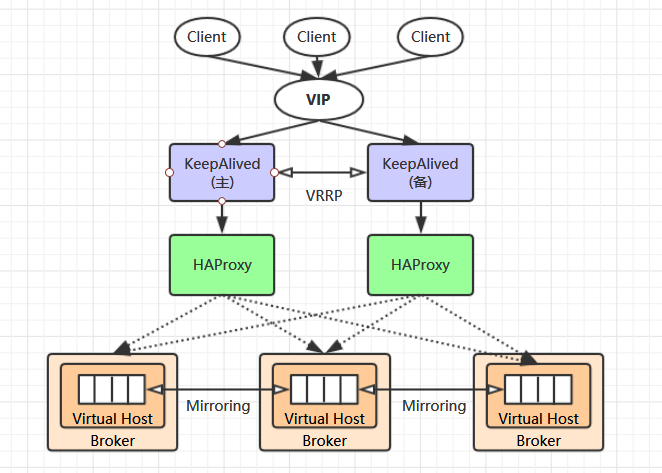
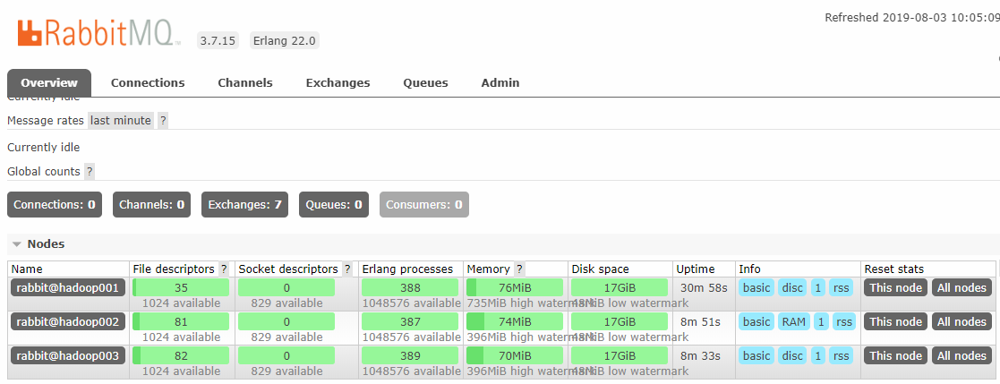
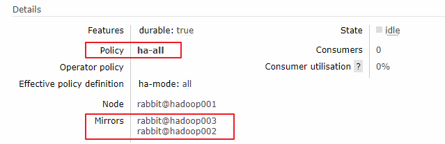
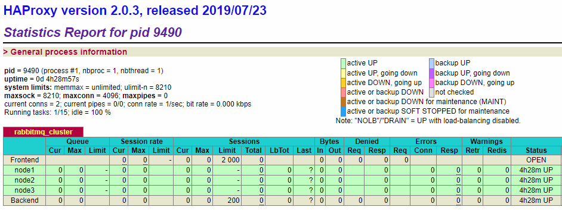
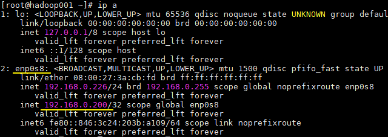
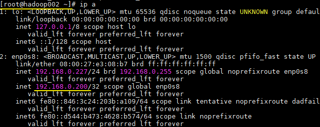

# 基于 HAProxy + KeepAlived 搭建 RabbitMQ 高可用集群

<nav>
<a href="#一集群简介">一、集群简介</a><br/>
&nbsp;&nbsp;&nbsp;&nbsp;&nbsp;&nbsp;&nbsp;&nbsp;<a href="#11-集群架构">1.1 集群架构</a><br/>
&nbsp;&nbsp;&nbsp;&nbsp;&nbsp;&nbsp;&nbsp;&nbsp;<a href="#12-部署情况">1.2 部署情况</a><br/>
<a href="#二RabbitMQ-集群搭建">二、RabbitMQ 集群搭建</a><br/>
&nbsp;&nbsp;&nbsp;&nbsp;&nbsp;&nbsp;&nbsp;&nbsp;<a href="#21-拷贝-cookie">2.1 拷贝 cookie</a><br/>
&nbsp;&nbsp;&nbsp;&nbsp;&nbsp;&nbsp;&nbsp;&nbsp;<a href="#22-启动服务">2.2 启动服务</a><br/>
&nbsp;&nbsp;&nbsp;&nbsp;&nbsp;&nbsp;&nbsp;&nbsp;<a href="#23-集群搭建">2.3 集群搭建</a><br/>
&nbsp;&nbsp;&nbsp;&nbsp;&nbsp;&nbsp;&nbsp;&nbsp;<a href="#24-查看集群状态">2.4 查看集群状态</a><br/>
&nbsp;&nbsp;&nbsp;&nbsp;&nbsp;&nbsp;&nbsp;&nbsp;<a href="#25-配置镜像队列">2.5 配置镜像队列</a><br/>
&nbsp;&nbsp;&nbsp;&nbsp;&nbsp;&nbsp;&nbsp;&nbsp;<a href="#26-节点下线">2.6 节点下线</a><br/>
&nbsp;&nbsp;&nbsp;&nbsp;&nbsp;&nbsp;&nbsp;&nbsp;<a href="#27-集群的关闭与重启">2.7 集群的关闭与重启</a><br/>
<a href="#三HAProxy-环境搭建">三、HAProxy 环境搭建</a><br/>
&nbsp;&nbsp;&nbsp;&nbsp;&nbsp;&nbsp;&nbsp;&nbsp;<a href="#31-下载">3.1 下载</a><br/>
&nbsp;&nbsp;&nbsp;&nbsp;&nbsp;&nbsp;&nbsp;&nbsp;<a href="#32-编译">3.2 编译</a><br/>
&nbsp;&nbsp;&nbsp;&nbsp;&nbsp;&nbsp;&nbsp;&nbsp;<a href="#33-配置环境变量">3.3 配置环境变量</a><br/>
&nbsp;&nbsp;&nbsp;&nbsp;&nbsp;&nbsp;&nbsp;&nbsp;<a href="#34-负载均衡配置">3.4 负载均衡配置</a><br/>
&nbsp;&nbsp;&nbsp;&nbsp;&nbsp;&nbsp;&nbsp;&nbsp;<a href="#35-启动服务">3.5 启动服务</a><br/>
<a href="#四KeepAlived-环境搭建">四、KeepAlived 环境搭建</a><br/>
&nbsp;&nbsp;&nbsp;&nbsp;&nbsp;&nbsp;&nbsp;&nbsp;<a href="#41-下载">4.1 下载</a><br/>
&nbsp;&nbsp;&nbsp;&nbsp;&nbsp;&nbsp;&nbsp;&nbsp;<a href="#42-编译">4.2 编译</a><br/>
&nbsp;&nbsp;&nbsp;&nbsp;&nbsp;&nbsp;&nbsp;&nbsp;<a href="#43-环境配置">4.3 环境配置</a><br/>
&nbsp;&nbsp;&nbsp;&nbsp;&nbsp;&nbsp;&nbsp;&nbsp;<a href="#44-配置-HAProxy-检查">4.4 配置 HAProxy 检查</a><br/>
&nbsp;&nbsp;&nbsp;&nbsp;&nbsp;&nbsp;&nbsp;&nbsp;<a href="#45-启动服务">4.5 启动服务</a><br/>
&nbsp;&nbsp;&nbsp;&nbsp;&nbsp;&nbsp;&nbsp;&nbsp;<a href="#46-验证故障转移">4.6 验证故障转移</a><br/>
</nav>

## 一、集群简介

### 1.1 集群架构

当单台 RabbitMQ 服务器的处理消息的能力达到瓶颈时，此时可以通过 RabbitMQ 集群来进行扩展，从而达到提升吞吐量的目的。RabbitMQ 集群是一个或多个节点的逻辑分组，集群中的每个节点都是对等的，每个节点共享所有的用户，虚拟主机，队列，交换器，绑定关系，运行时参数和其他分布式状态等信息。一个高可用，负载均衡的 RabbitMQ 集群架构应类似下图：


<div align="center">  </div>
这里对上面的集群架构做一下解释说明：

首先一个基本的 RabbitMQ 集群不是高可用的，虽然集群共享队列，但在默认情况下，消息只会被路由到某一个节点的符合条件的队列上，并不会同步到其他节点的相同队列上。假设消息路由到 node1 的 my-queue 队列上，但是 node1 突然宕机了，那么消息就会丢失，想要解决这个问题，需要开启队列镜像，将集群中的队列彼此之间进行镜像，此时消息就会被拷贝到处于同一个镜像分组中的所有队列上。

其次 RabbitMQ 集群本身并没有提供负载均衡的功能，也就是说对于一个三节点的集群，每个节点的负载可能都是不相同的，想要解决这个问题可以通过硬件负载均衡或者软件负载均衡的方式，这里我们选择使用 HAProxy 来进行负载均衡，当然也可以使用其他负载均衡中间件，如 LVS 等。HAProxy 同时支持四层和七层负载均衡，并基于单一进程的事件驱动模型，因此它可以支持非常高的井发连接数。

接着假设我们只采用一台 HAProxy ，那么它就存在明显的单点故障的问题，所以至少需要两台 HAProxy ，同时这两台 HAProxy 之间需要能够自动进行故障转移，通常的解决方案就是 KeepAlived 。KeepAlived 采用 VRRP (Virtual Router Redundancy Protocol，虚拟路由冗余协议) 来解决单点失效的问题，它通常由一组一备两个节点组成，同一时间内只有主节点会提供对外服务，并同时提供一个虚拟的 IP 地址 (Virtual Internet Protocol Address ，简称 VIP) 。 如果主节点故障，那么备份节点会自动接管 VIP 并成为新的主节点 ，直到原有的主节点恢复。

最后，任何想要连接到 RabbitMQ 集群的客户端只需要连接到虚拟 IP，而不必关心集群是何种架构，示例如下：

```java
ConnectionFactory factory = new ConnectionFactory();
// 假设虚拟ip为 192.168.0.200
factory.setHost("192.168.0.200");
```

### 1.2 部署情况

下面我们开始进行搭建，这里我使用三台主机进行演示，主机名分别为 hadoop001，002 和 003 ，其功能分配如下：

+ **hadoop001 服务器**：部署 RabbitMQ + HAProxy + KeepAlived ；
+ **hadoop002 服务器**：部署 RabbitMQ + HAProxy + KeepAlived ；
+ **hadoop003 服务器**：部署 RabbitMQ 

以上三台主机上我均已安装好了 RabbitMQ ，关于 RabbitMQ 的安装步骤可以参考：[RabbitMQ单机环境搭建](https://github.com/heibaiying/Full-Stack-Notes/blob/master/notes/installation/RabbitMQ单机环境搭建.md)


## 二、RabbitMQ 集群搭建

首先先进行 RabbitMQ 集群的搭建，具体步骤如下：

### 2.1 拷贝 cookie

将 hadoop001 上的 `.erlang.cookie` 文件拷贝到其他两台主机上。该 cookie 文件相当于密钥令牌，集群中的 RabbitMQ 节点需要通过交换密钥令牌以获得相互认证，因此处于同一集群的所有节点需要具有相同的密钥令牌，否则在搭建过程中会出现 Authentication Fail 错误。

RabbitMQ 服务启动时，erlang VM 会自动创建该 cookie 文件，默认的存储路径为 `/var/lib/rabbitmq/.erlang.cookie` 或 `$HOME/.erlang.cookie`，该文件是一个隐藏文件，需要使用 `ls -al` 命令查看。这里我使用的是 root 账户，$HOME 目录就是 /root 目录，对应的拷贝命令如下：

```shell
scp /root/.erlang.cookie root@hadoop002:/root/
scp /root/.erlang.cookie root@hadoop003:/root/
```

由于你可能在三台主机上使用不同的账户进行操作，为避免后面出现权限不足的问题，这里建议将 cookie 文件原来的 400 权限改为 777，命令如下：

```shell
chmod  777 /root/.erlang.cookie
```

> 注：cookie 中的内容就是一行随机字符串，可以使用 cat 命令查看。

### 2.2 启动服务

在三台主机上均执行以下命令，启动 RabbitMQ 服务：

```shell
rabbitmq-server start -detached
```

这里预先进行一下说明：该命令会同时启动 Erlang 虚拟机和 RabbitMQ 应用服务。而后文用到的 `rabbitmqctl start_app` 只会启动 RabbitMQ 应用服务， `rabbitmqctl stop_app` 只会停止 RabbitMQ 服务。

### 2.3 集群搭建

RabbitMQ 集群的搭建需要选择其中任意一个节点为基准，将其它节点逐步加入。这里我们以 hadoop001 为基准节点，将 hadoop002 和 hadoop003 加入集群。在 hadoop002 和 hadoop003 上执行以下命令：

```shell
# 1.停止服务
rabbitmqctl stop_app
# 2.重置状态
rabbitmqctl reset
# 3.节点加入
rabbitmqctl join_cluster --ram rabbit@hadoop001
# 4.启动服务
rabbitmqctl start_app
```

`join_cluster` 命令有一个可选的参数 `--ram` ，该参数代表新加入的节点是内存节点，默认是磁盘节点。如果是内存节点，则所有的队列、交换器、绑定关系、用户、访问权限和 vhost 的元数据都将存储在内存中，如果是磁盘节点，则存储在磁盘中。内存节点可以有更高的性能，但其重启后所有配置信息都会丢失，因此RabbitMQ 要求在集群中至少有一个磁盘节点，其他节点可以是内存节点。当内存节点离开集群时，它可以将变更通知到至少一个磁盘节点；然后在其重启时，再连接到磁盘节点上获取元数据信息。除非是将 RabbitMQ 用于 RPC 这种需要超低延迟的场景，否则在大多数情况下，RabbitMQ 的性能都是够用的，可以采用默认的磁盘节点的形式。这里为了演示，hadoop002 我就设置为内存节点。

另外，如果节点以磁盘节点的形式加入，则需要先使用 `reset` 命令进行重置，然后才能加入现有群集，重置节点会删除该节点上存在的所有的历史资源和数据。采用内存节点的形式加入时可以略过 `reset` 这一步，因为内存上的数据本身就不是持久化的。

### 2.4 查看集群状态

#### 1. 命令行查看

在 hadoop002 和 003 上执行以上命令后，集群就已经搭建成功，此时可以在任意节点上使用 `rabbitmqctl cluster_status` 命令查看集群状态，输出如下：

```shell
[root@hadoop001 ~]# rabbitmqctl cluster_status
Cluster status of node rabbit@hadoop001 ...
[{nodes,[{disc,[rabbit@hadoop001,rabbit@hadoop003]},{ram,[rabbit@hadoop002]}]},
{running_nodes,[rabbit@hadoop003,rabbit@hadoop002,rabbit@hadoop001]},
{cluster_name,<<"rabbit@hadoop001">>},
{partitions,[]},
{alarms,[{rabbit@hadoop003,[]},{rabbit@hadoop002,[]},{rabbit@hadoop001,[]}]}]
```

可以看到 nodes 下显示了全部节点的信息，其中 hadoop001 和 hadoop003 上的节点都是 disc 类型，即磁盘节点；而 hadoop002 上的节点为 ram，即内存节点。此时代表集群已经搭建成功，默认的 cluster_name 名字为 rabbit@hadoop001，如果你想进行修改，可以使用以下命令：

```shell
rabbitmqctl set_cluster_name my_rabbitmq_cluster
```

#### 2. UI 界面查看

除了可以使用命令行外，还可以使用打开任意节点的 UI 界面进行查看，情况如下：

<div align="center">  </div>

### 2.5 配置镜像队列

#### 1. 开启镜像队列

这里我们为所有队列开启镜像配置，其语法如下：

```shell
rabbitmqctl set_policy ha-all "^" '{"ha-mode":"all"}'
```

#### 2. 复制系数

在上面我们指定了 ha-mode 的值为 all ，代表消息会被同步到所有节点的相同队列中。这里我们之所以这样配置，因为我们本身只有三个节点，因此复制操作的性能开销比较小。如果你的集群有很多节点，那么此时复制的性能开销就比较大，此时需要选择合适的复制系数。通常可以遵循过半写原则，即对于一个节点数为 n 的集群，只需要同步到  n/2+1 个节点上即可。此时需要同时修改镜像策略为 exactly，并指定复制系数 ha-params，示例命令如下：

```bash
rabbitmqctl set_policy ha-two "^" '{"ha-mode":"exactly","ha-params":2,"ha-sync-mode":"automatic"}'
```

除此之外，RabbitMQ 还支持使用正则表达式来过滤需要进行镜像操作的队列，示例如下：

```shell
rabbitmqctl set_policy ha-all "^ha\." '{"ha-mode":"all"}'
```

此时只会对 ha 开头的队列进行镜像。更多镜像队列的配置说明，可以参考官方文档：[Highly Available (Mirrored) Queues](https://www.rabbitmq.com/ha.html)

#### 3. 查看镜像状态

配置完成后，可以通过 Web UI 界面查看任意队列的镜像状态，情况如下：

<div align="center">  </div>


### 2.6 节点下线

以上介绍的集群搭建的过程就是服务扩容的过程，如果想要进行服务缩容，即想要把某个节点剔除集群，有两种可选方式：

第一种：可以先使用 `rabbitmqctl stop `  停止该节点上的服务，然后在其他任意一个节点上执行  `forget_cluster_node` 命令。这里以剔除 hadoop003 上的服务为例，此时可以在 hadoop001 或 002 上执行下面的命令：

```shell
rabbitmqctl forget_cluster_node rabbit@hadoop003
```

第二种方式：先使用 `rabbitmqctl stop `  停止该节点上的服务，然后再执行 `rabbitmqctl reset` 这会清空该节点上所有历史数据，并主动通知集群中其它节点它将要离开集群。

### 2.7 集群的关闭与重启

没有一个直接的命令可以关闭整个集群，需要逐一进行关闭。但是需要保证在重启时，最后关闭的节点最先被启动。如果第一个启动的不是最后关闭的节点，那么这个节点会等待最后关闭的那个节点启动，默认进行 10 次连接尝试，超时时间为 30 秒，如果依然没有等到，则该节点启动失败。

这带来的一个问题是，假设在一个三节点的集群当中，关闭的顺序为 node1，node2，node3，如果 node1 因为故障暂时没法恢复，此时 node2 和 node3 就无法启动。想要解决这个问题，可以先将 node1 节点进行剔除，命令如下：

```shell
rabbitmqctl forget_cluster_node rabbit@node1 -offline
```

此时需要加上 `-offline` 参数，它允许节点在自身没有启动的情况下将其他节点剔除。


## 三、HAProxy 环境搭建

### 3.1 下载

HAProxy 官方下载地址为：https://www.haproxy.org/#down ，如果这个网站无法访问，也可以从 https://src.fedoraproject.org/repo/pkgs/haproxy/ 上进行下载。这里我下载的是 2.x 的版本，下载后进行解压：

```
tar -zxvf haproxy-2.0.3.tar.gz
```

### 3.2 编译

进入解压后根目录，执行下面的编译命令：

```shell
make TARGET=linux-glibc  PREFIX=/usr/app/haproxy-2.0.3
make install PREFIX=/usr/app/haproxy-2.0.3
```

### 3.3 配置环境变量

配置环境变量：

```shell
vim /etc/profile
```

```shell
export HAPROXY_HOME=/usr/app/haproxy-2.0.3
export PATH=$PATH:$HAPROXY_HOME/sbin
```

使得配置的环境变量立即生效：

```
source /etc/profile
```

### 3.4 负载均衡配置

新建配置文件 `haproxy.cfg`，这里我新建的位置为：/etc/haproxy/haproxy.cfg，文件内容如下：

```shell
# 全局配置
global
    # 日志输出配置、所有日志都记录在本机，通过 local0 进行输出
    log 127.0.0.1 local0 info
    # 最大连接数
    maxconn 4096
    # 改变当前的工作目录
    chroot /usr/app/haproxy-2.0.3
    # 以指定的 UID 运行 haproxy 进程
    uid 99
    # 以指定的 GID 运行 haproxy 进程
    gid 99
    # 以守护进行的方式运行
    daemon
    # 当前进程的 pid 文件存放位置
    pidfile /usr/app/haproxy-2.0.3/haproxy.pid

# 默认配置
defaults
    # 应用全局的日志配置
    log global
    # 使用4层代理模式，7层代理模式则为"http"
    mode tcp
    # 日志类别
    option tcplog
    # 不记录健康检查的日志信息
    option dontlognull
    # 3次失败则认为服务不可用
    retries 3
    # 每个进程可用的最大连接数
    maxconn 2000
    # 连接超时
    timeout connect 5s
    # 客户端超时
    timeout client 120s
    # 服务端超时
    timeout server 120s

# 绑定配置
listen rabbitmq_cluster
    bind :5671
    # 配置TCP模式
    mode tcp
    # 采用加权轮询的机制进行负载均衡
    balance roundrobin
    # RabbitMQ 集群节点配置
    server node1 hadoop001:5672 check inter 5000 rise 2 fall 3 weight 1
    server node2 hadoop002:5672 check inter 5000 rise 2 fall 3 weight 1
    server node3 hadoop003:5672 check inter 5000 rise 2 fall 3 weight 1

# 配置监控页面
listen monitor
    bind :8100
    mode http
    option httplog
    stats enable
    stats uri /stats
    stats refresh 5s
```

负载均衡的主要配置在 `listen rabbitmq_cluster` 下，这里指定负载均衡的方式为加权轮询，同时定义好健康检查机制：

```shell
server node1 hadoop001:5672 check inter 5000 rise 2 fall 3 weight 1
```

以上配置代表对地址为 hadoop001:5672 的 node1 节点每隔 5 秒进行一次健康检查，如果连续两次的检查结果都是正常，则认为该节点可用，此时可以将客户端的请求轮询到该节点上；如果连续 3 次的检查结果都不正常，则认为该节点不可用。weight 用于指定节点在轮询过程中的权重。

### 3.5 启动服务

以上搭建步骤在 hadoop001 和 hadoop002 上完全相同，搭建完成使用以下命令启动服务：

```shell
haproxy -f /etc/haproxy/haproxy.cfg
```

启动后可以在监控页面进行查看，端口为设置的 8100，完整地址为：http://hadoop001:8100/stats ，页面情况如下：

<div align="center">  </div>
所有节点都为绿色，代表节点健康。此时证明 HAProxy 搭建成功，并已经对 RabbitMQ 集群进行监控。


## 四、KeepAlived 环境搭建

接着就可以搭建 Keepalived 来解决 HAProxy 故障转移的问题。这里我在 hadoop001 和 hadoop002 上安装 KeepAlived ，两台主机上的搭建的步骤完全相同，只是部分配置略有不同，具体如下：

### 4.1 下载

直接从 Keepalived 官方下载所需版本，这里我下载的为 2.x 的版本。下载后进行解压：

```shell
wget https://www.keepalived.org/software/keepalived-2.0.18.tar.gz
tar -zxvf keepalived-2.0.18.tar.gz
```

### 4.2 编译

安装相关依赖后进行编译：

```shell
# 安装依赖
yum -y install libnl libnl-devel
# 编译安装
./configure --prefix=/usr/app/keepalived-2.0.18
make && make install
```

### 4.3 环境配置

由于不是采用 yum 的方式进行安装，而是采用压缩包的方式进行安装，此时需要进行环境配置，具体如下：

Keepalived 默认会从 `/etc/keepalived/keepalived.conf` 路径读取配置文件，所以需要将安装后的配置文件拷贝到该路径：

```shell
mkdir /etc/keepalived
cp /usr/app/keepalived-2.0.18/etc/keepalived/keepalived.conf /etc/keepalived/
```

将所有 Keepalived 脚本拷贝到 /etc/init.d/ 目录下：

```shell
# 编译目录中的脚本
cp /usr/software/keepalived-2.0.18/keepalived/etc/init.d/keepalived /etc/init.d/
# 安装目录中的脚本
cp /usr/app/keepalived-2.0.18/etc/sysconfig/keepalived /etc/sysconfig/
cp /usr/app/keepalived-2.0.18/sbin/keepalived /usr/sbin/
```

设置开机自启动：

```shell
chmod +x /etc/init.d/keepalived
chkconfig --add keepalived
systemctl enable keepalived.service
```

### 4.4 配置 HAProxy 检查

这里先对 hadoop001 上 keepalived.conf 配置文件进行修改，完整内容如下：

```shell
global_defs {
   # 路由id,主备节点不能相同
   router_id node1
}

# 自定义监控脚本
vrrp_script chk_haproxy {
    # 脚本位置
    script "/etc/keepalived/haproxy_check.sh" 
    # 脚本执行的时间间隔
    interval 5 
    weight 10
}

vrrp_instance VI_1 {
    # Keepalived的角色，MASTER 表示主节点，BACKUP 表示备份节点
    state MASTER  
    # 指定监测的网卡，可以使用 ifconfig 进行查看
    interface enp0s8
    # 虚拟路由的id，主备节点需要设置为相同
    virtual_router_id 1
    # 优先级，主节点的优先级需要设置比备份节点高
    priority 100 
    # 设置主备之间的检查时间，单位为秒 
    advert_int 1 
    # 定义验证类型和密码
    authentication { 
        auth_type PASS
        auth_pass 123456
    }

    # 调用上面自定义的监控脚本
    track_script {
        chk_haproxy
    }

    virtual_ipaddress {
        # 虚拟IP地址，可以设置多个
        192.168.0.200  
    }
}
```

以上配置定义了 hadoop001上的 Keepalived 节点为 MASTER 节点，并设置对外提供服务的虚拟 IP 为 192.168.0.200。此外最主要的是定义了通过 `haproxy_check.sh` 来对 HAProxy 进行监控，这个脚本需要我们自行创建，内容如下：

```shell
#!/bin/bash

# 判断haproxy是否已经启动
if [ ${ps -C haproxy --no-header |wc -l} -eq 0 ] ; then
    #如果没有启动，则启动
    haproxy -f /etc/haproxy/haproxy.cfg
fi

#睡眠3秒以便haproxy完全启动
sleep 3

#如果haproxy还是没有启动，此时需要将本机的keepalived服务停掉，以便让VIP自动漂移到另外一台haproxy
if [ ${ps -C haproxy --no-header |wc -l} -eq 0 ] ; then
    systemctl stop keepalived
fi
```

创建后为其赋予执行权限：

```shell
chmod +x /etc/keepalived/haproxy_check.sh
```

这个脚本主要用于判断 HAProxy 服务是否正常，如果不正常且无法启动，此时就需要将本机 Keepalived 关闭，从而让虚拟 IP 漂移到备份节点。备份节点的配置与主节点基本相同，但是需要修改其 state 为 BACKUP；同时其优先级 priority 需要比主节点低。完整配置如下：

```yaml
global_defs {
   # 路由id,主备节点不能相同    
   router_id node2  

}

vrrp_script chk_haproxy {
    script "/etc/keepalived/haproxy_check.sh" 
    interval 5 
    weight 10
}

vrrp_instance VI_1 {
    # BACKUP 表示备份节点
    state BACKUP 
    interface enp0s8
    virtual_router_id 1
    # 优先级，备份节点要比主节点低
    priority 50 
    advert_int 1 
    authentication { 
        auth_type PASS
        auth_pass 123456
    }
    
    track_script {
        chk_haproxy
    }

    virtual_ipaddress {
        192.168.0.200  
    }
}
```

### 4.5 启动服务

分别在 hadoop001 和 hadoop002 上启动 KeepAlived 服务，命令如下：

```shell
systemctl start  keepalived
```

启动后此时 hadoop001 为主节点，可以在 hadoop001 上使用 `ip a` 命令查看到虚拟 IP 的情况：

<div align="center">  </div>
此时只有 hadoop001 上是存在虚拟 IP 的，而 hadoop002 上是没有的。

<div align="center">  </div>

### 4.6 验证故障转移

这里我们验证一下故障转移，因为按照我们上面的检测脚本，如果 HAProxy 已经停止且无法重启时 KeepAlived 服务就会停止，这里我们直接使用以下命令停止 Keepalived 服务：

```shell
systemctl stop keepalived
```

此时再次使用 `ip a` 分别查看，可以发现 hadoop001 上的 VIP 已经漂移到 hadoop002 上，情况如下：

<div align="center">  </div>


此时对外服务的 VIP 依然可用，代表已经成功地进行了故障转移。至此集群已经搭建成功，任何需要发送或者接受消息的客户端服务只需要连接到该 VIP 即可，示例如下：

```shell
ConnectionFactory factory = new ConnectionFactory();
factory.setHost("192.168.0.200");
```


## 参考资料

1. 朱忠华 . RabbitMQ实战指南 . 电子工业出版社 . 2017-11-1
2. RabbitMQ 官方文档 —— 集群指南：https://www.rabbitmq.com/clustering.html
3. RabbitMQ 官方文档 —— 高可用镜像队列：https://www.rabbitmq.com/ha.html
4. HAProxy 官方配置手册：http://cbonte.github.io/haproxy-dconv/1.9/configuration.html
5. KeepAlived 官方配置手册：https://www.keepalived.org/manpage.html


