# 使用 WireShark 分析 HTTPS 握手过程

<nav>
<a href="#一WireShark">一、WireShark</a><br/>
&nbsp;&nbsp;&nbsp;&nbsp;&nbsp;&nbsp;&nbsp;&nbsp;<a href="#11-下载安装">1.1 下载安装</a><br/>
&nbsp;&nbsp;&nbsp;&nbsp;&nbsp;&nbsp;&nbsp;&nbsp;<a href="#12-握手流程回顾">1.2 握手流程回顾</a><br/>
<a href="#二TCP-握手过程">二、TCP 握手过程</a><br/>
<a href="#三TLSSSL-握手过程">三、TLS/SSL 握手过程</a><br/>
&nbsp;&nbsp;&nbsp;&nbsp;&nbsp;&nbsp;&nbsp;&nbsp;<a href="#31-Client-Hello">3.1 Client Hello</a><br/>
&nbsp;&nbsp;&nbsp;&nbsp;&nbsp;&nbsp;&nbsp;&nbsp;<a href="#32-Server-Hello">3.2 Server Hello</a><br/>
&nbsp;&nbsp;&nbsp;&nbsp;&nbsp;&nbsp;&nbsp;&nbsp;<a href="#33-Server-Hello-的详细过程">3.3 Server Hello 的详细过程</a><br/>
&nbsp;&nbsp;&nbsp;&nbsp;&nbsp;&nbsp;&nbsp;&nbsp;<a href="#34-Client-Key-Exchange">3.4 Client Key Exchange</a><br/>
&nbsp;&nbsp;&nbsp;&nbsp;&nbsp;&nbsp;&nbsp;&nbsp;<a href="#35-计算预主密钥和主密钥">3.5 计算预主密钥和主密钥</a><br/>
&nbsp;&nbsp;&nbsp;&nbsp;&nbsp;&nbsp;&nbsp;&nbsp;<a href="#36-Change-Cipher-Spec">3.6 Change Cipher Spec</a><br/>
&nbsp;&nbsp;&nbsp;&nbsp;&nbsp;&nbsp;&nbsp;&nbsp;<a href="#37-Encrypted-Handshake-Message">3.7 Encrypted Handshake Message</a><br/>
&nbsp;&nbsp;&nbsp;&nbsp;&nbsp;&nbsp;&nbsp;&nbsp;<a href="#38-New-Session-Ticket">3.8 New Session Ticket</a><br/>
</nav>


## 一、WireShark

这篇文章是对上一篇文章的补充，主要是使用 WireShark 来进行抓包分析，以更加直观的方式，帮助大家理解 HTTPS 的整个握手过程。

### 1.1 下载安装

Wireshark 是一个网络抓包分析软件，下载地址为：https://www.wireshark.org/index.html#download ，下载后直接安装即可。启动后，进入主页面，需要先选择对应的抓包网络：

<div align="center"> 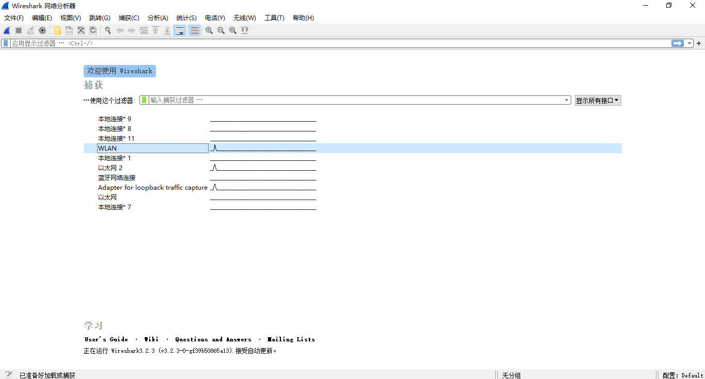 </div>


这里我使用的是无线网络，因此选择 **WLAN**，双击后即可进入抓包页面。下面我们以 CSDN 的首页 `https://www.csdn.net` 为例，我们首先通过 ping 命令获取其 IP 地址：

<div align="center"> 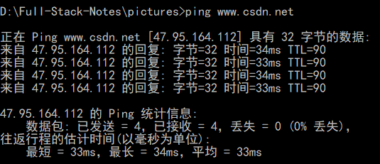 </div>


可以看到，其 IP 地址为 `47.95.164.112` 。为了避免浏览器上其他网站的干扰，我们先通过该 IP 地址进行过滤：

<div align="center"> 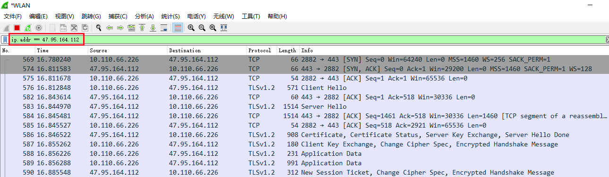 </div>


输入过滤条件 `ip.addr == 47.95.164.112` 后，敲击回车键即可。可以看到 TCP 和 TLS 的握手消息都已经被过滤出来。

### 1.2 握手流程回顾

这里首先以图片的方式回顾整个 HTTPS 的握手过程：

<div align="center"> 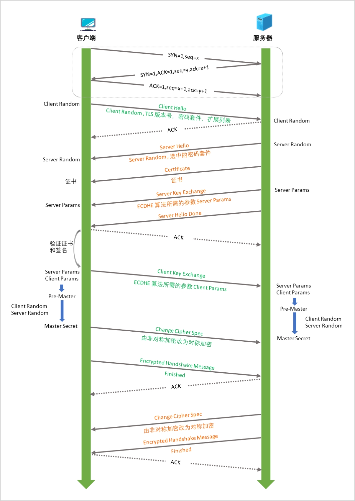 </div>


然后我们再逐步通过 WireShark 进行分析：

## 二、TCP 握手过程

首先 TLS/SSL 协议是基于 TCP/IP 协议的，因此需要先等待 TCP 三次握手完成：

<div align="center"> 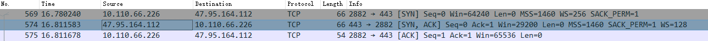 </div>


从上图被被捕获的记录中，可以很直观的看出整个握手过程与下图是完全匹配的：

<div align="center">  </div>


该过程比较简单，这里就不再进行赘述了。

## 三、TLS/SSL 握手过程

整个 TLS/ SSL 的握手过程如下：

<div align="center"> 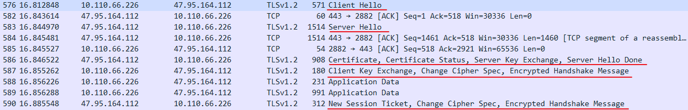 </div>


### 3.1 Client Hello

TCP 握手完成后，客户端首先发起一个 `Client Hello` 请求，里面包含客户端版本号、所有支持的密码套件、以及一个随机数 `Client Random`：

<div align="center"> 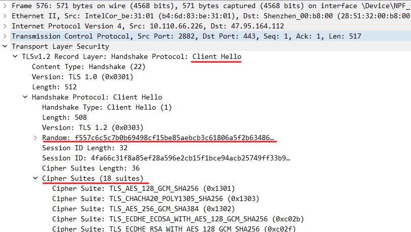 </div>


### 3.2 Server Hello

服务器收到该请求后，会返回一个 `Server Hello` 消息，里面包含选中的用于本次通信的密码套件，以及一个随机数 `Server Random`；

<div align="center"> 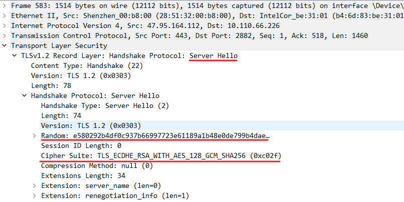 </div>


### 3.3 Server Hello 的详细过程

接着服务器会在一次返回里面返回多组消息：

<div align="center"> 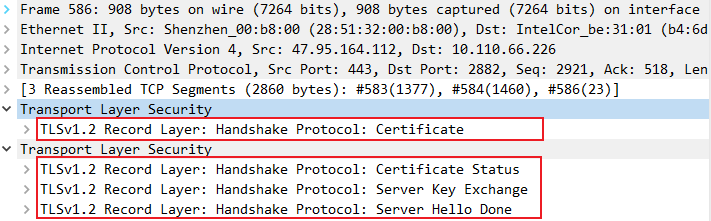 </div>


这里分别对其进行解释：

#### 1. Certificate

这里面包含的是证书信息：

<div align="center">  </div>


这里我将里面的部分内容复制了出来：

```shell
Certificate: 308206873082056fa00302010202100b038a343b5b17ae92… (id-at-commonName=*.csdn.net,id-at-organizationalUnitName=IT,id-at-organizationName=北京创新乐知信息技术有限公司,id-at-localityName=北京市,id-at-countryName=CN
```

可以看到，这就是在浏览器中使用的证书的：

<div align="center"> 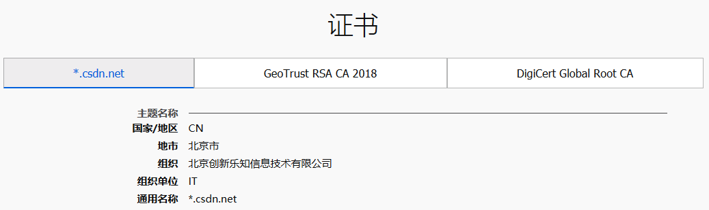 </div>


#### 2. Certificate Status

这一步主要是依据在线证书状态协议（OCSP，Online Certificate Status Protocol）对当前证书状态进行查询：

<div align="center"> 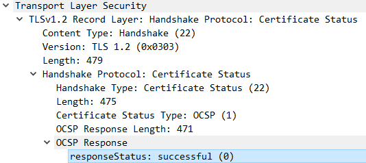 </div>


#### 3. Server Key Exchange

这里面包含了进行 ECDHE 算法所需的各种参数 `Server Params` ：

<div align="center"> 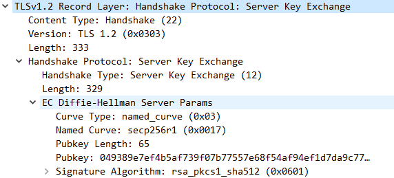 </div>


#### 4. Server Hello Done

这个就是用于告知客户端服务器的整个 Hello 过程已经结束，并不包含任何内容：

<div align="center"> 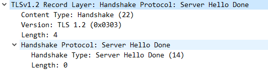 </div>


### 3.4 Client Key Exchange

之后，客户端按照密码套件的要求，也生成一个 `Client Params`，并通过 `Client Key Exchange` 消息发送给服务器；

<div align="center"> 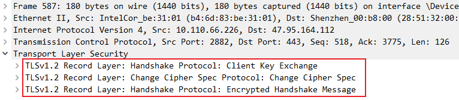 </div>


`Client Key Exchange` 具体内容如下：

<div align="center"> 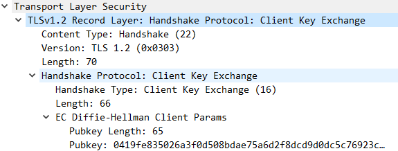 </div>


### 3.5 计算预主密钥和主密钥

1. 经过以上步骤的交换，服务器和客户端都有了 `Client Params` 和 `Server Params`，它们分别根据这两个参数进行计算，ECDHE 算法能够保证客户端和服务器算出来的值是一样的，这个算出来的值就是预主密钥 `Pre-Master`；

2. 最后再利用预主秘钥，客户端随机数，服务器随机数共同算出真正的主密钥 `Master_Secret`，算法如下：

   ```shell
   master_secret = PRF(pre_master_secret, 
                       "master secret", 
                       ClientHello.random + ServerHello.random)
   ```

   这里的 PRF 是一个伪随机函数，用于增强 master_secret 的随机性。主密钥 `Master_Secret` 的长度固定为 48 个字节，从中可以推导出以下四个密钥：

   + client_write_MAC_key
   + server_write_MAC_key
   + client_write_key
   + server_write_key

   `client_write_MAC_key` 和 `server_write_MAC_key` 主要用于身份验证和完整性校验，而 `client_write_key` 和 `server_write_key` 则是对称加密中真正使用的会话密钥：

   + 客户端使用 `client_write_key` 加密，服务器对称地使用 `client_write_key` 解密；
   + 服务器使用 `server_write_key` 加密，客户端对称地使用 `server_write_key` 解密。


### 3.6 Change Cipher Spec

有了会话密钥后，客户端会发送一个 `Change Cipher Spec` 请求，告知服务器将加密方式由非对称加密转换为对称加密；

<div align="center"> 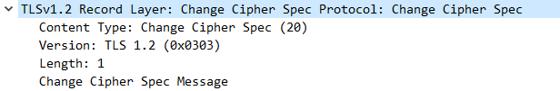 </div>


### 3.7 Encrypted Handshake Message

紧接着，为了验证对称加密，客户端会将所有的握手消息（Handshake Message）进行加密，通过一个 `Encrypted Handshake Message` 请求发送给服务器；

<div align="center"> 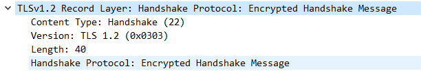 </div>


### 3.8 New Session Ticket

1. 服务器解密并进行验证，如果验证通过，则也返回给客户端 `Change Cipher Spec` 和 `Encrypted Handshake Message` 消息，代表双方共同达成协议，之后的通信都采用对称加密的方式。

2. 除此之外，服务器还会返回一个 `New Session Ticket` 消息。 `New Session Ticket` 是一种优化连接的方式：服务器将会话信息加密后以 Ticket（票据）的方式发送给客户端 ，服务器本身并不存储会话信息。客户端接收到 Ticket 后，将其储到内存中，如果想恢复会话，则下次连接的时候将票据发送给服务器端；服务器端进行解密，如果确认无误则表示可以进行会话恢复，这样就简化了以上复杂的握手过程。


<div align="center"> 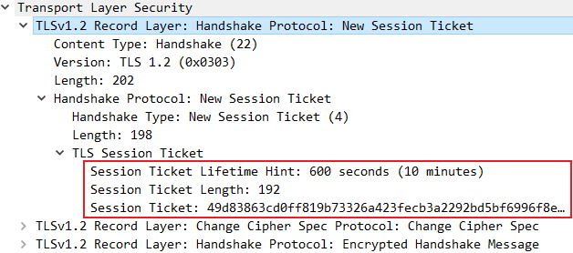 </div>


至此，握手过程全部完成。