# 计算机网络
<nav>
<a href="#一体系结构">一、体系结构</a><br/>
&nbsp;&nbsp;&nbsp;&nbsp;&nbsp;&nbsp;&nbsp;&nbsp;<a href="#11-七层网络模型">1.1 七层网络模型</a><br/>
&nbsp;&nbsp;&nbsp;&nbsp;&nbsp;&nbsp;&nbsp;&nbsp;<a href="#12-四层网络模型">1.2 四层网络模型</a><br/>
&nbsp;&nbsp;&nbsp;&nbsp;&nbsp;&nbsp;&nbsp;&nbsp;<a href="#13-五层网络模型">1.3 五层网络模型</a><br/>
<a href="#二物理层">二、物理层</a><br/>
&nbsp;&nbsp;&nbsp;&nbsp;&nbsp;&nbsp;&nbsp;&nbsp;<a href="#21-传输媒介">2.1 传输媒介</a><br/>
&nbsp;&nbsp;&nbsp;&nbsp;&nbsp;&nbsp;&nbsp;&nbsp;<a href="#22-信道分类">2.2 信道分类</a><br/>
&nbsp;&nbsp;&nbsp;&nbsp;&nbsp;&nbsp;&nbsp;&nbsp;<a href="#23-信道复用">2.3 信道复用</a><br/>
<a href="#三数据链路层">三、数据链路层</a><br/>
&nbsp;&nbsp;&nbsp;&nbsp;&nbsp;&nbsp;&nbsp;&nbsp;<a href="#31-基本功能">3.1 基本功能</a><br/>
&nbsp;&nbsp;&nbsp;&nbsp;&nbsp;&nbsp;&nbsp;&nbsp;<a href="#32-PPP-协议">3.2 PPP 协议</a><br/>
&nbsp;&nbsp;&nbsp;&nbsp;&nbsp;&nbsp;&nbsp;&nbsp;<a href="#33-Mac-地址">3.3 Mac 地址</a><br/>
&nbsp;&nbsp;&nbsp;&nbsp;&nbsp;&nbsp;&nbsp;&nbsp;<a href="#34-局域网">3.4 局域网</a><br/>
&nbsp;&nbsp;&nbsp;&nbsp;&nbsp;&nbsp;&nbsp;&nbsp;<a href="#35-以太网">3.5 以太网</a><br/>
<a href="#四网络层">四、网络层</a><br/>
&nbsp;&nbsp;&nbsp;&nbsp;&nbsp;&nbsp;&nbsp;&nbsp;<a href="#41-网际协议-IP">4.1 网际协议 IP</a><br/>
&nbsp;&nbsp;&nbsp;&nbsp;&nbsp;&nbsp;&nbsp;&nbsp;<a href="#42-ARP-协议">4.2 ARP 协议</a><br/>
&nbsp;&nbsp;&nbsp;&nbsp;&nbsp;&nbsp;&nbsp;&nbsp;<a href="#43-IP-地址分类">4.3 IP 地址分类</a><br/>
&nbsp;&nbsp;&nbsp;&nbsp;&nbsp;&nbsp;&nbsp;&nbsp;<a href="#44-划分子网">4.4 划分子网</a><br/>
&nbsp;&nbsp;&nbsp;&nbsp;&nbsp;&nbsp;&nbsp;&nbsp;<a href="#45-构成超网">4.5 构成超网</a><br/>
&nbsp;&nbsp;&nbsp;&nbsp;&nbsp;&nbsp;&nbsp;&nbsp;<a href="#46-ICMP-和-IGMP">4.6 ICMP 和 IGMP</a><br/>
&nbsp;&nbsp;&nbsp;&nbsp;&nbsp;&nbsp;&nbsp;&nbsp;<a href="#47-专用地址">4.7 专用地址</a><br/>
&nbsp;&nbsp;&nbsp;&nbsp;&nbsp;&nbsp;&nbsp;&nbsp;<a href="#48-VPN">4.8 VPN</a><br/>
&nbsp;&nbsp;&nbsp;&nbsp;&nbsp;&nbsp;&nbsp;&nbsp;<a href="#48-NAT">4.8 NAT</a><br/>
&nbsp;&nbsp;&nbsp;&nbsp;&nbsp;&nbsp;&nbsp;&nbsp;<a href="#49-IPv6">4.9 IPv6</a><br/>
<a href="#五传输层">五、传输层</a><br/>
&nbsp;&nbsp;&nbsp;&nbsp;&nbsp;&nbsp;&nbsp;&nbsp;<a href="#51-UDP">5.1 UDP</a><br/>
&nbsp;&nbsp;&nbsp;&nbsp;&nbsp;&nbsp;&nbsp;&nbsp;<a href="#52-TCP-简介">5.2 TCP 简介</a><br/>
&nbsp;&nbsp;&nbsp;&nbsp;&nbsp;&nbsp;&nbsp;&nbsp;<a href="#53-TCP-报文首部">5.3 TCP 报文首部</a><br/>
&nbsp;&nbsp;&nbsp;&nbsp;&nbsp;&nbsp;&nbsp;&nbsp;<a href="#54-三次握手">5.4 三次握手</a><br/>
&nbsp;&nbsp;&nbsp;&nbsp;&nbsp;&nbsp;&nbsp;&nbsp;<a href="#55-四次挥手">5.5 四次挥手</a><br/>
&nbsp;&nbsp;&nbsp;&nbsp;&nbsp;&nbsp;&nbsp;&nbsp;<a href="#56-可靠传输的原理">5.6 可靠传输的原理</a><br/>
&nbsp;&nbsp;&nbsp;&nbsp;&nbsp;&nbsp;&nbsp;&nbsp;<a href="#57-TCP-的可靠传输">5.7 TCP 的可靠传输</a><br/>
&nbsp;&nbsp;&nbsp;&nbsp;&nbsp;&nbsp;&nbsp;&nbsp;<a href="#58-流量控制">5.8 流量控制</a><br/>
&nbsp;&nbsp;&nbsp;&nbsp;&nbsp;&nbsp;&nbsp;&nbsp;<a href="#59-拥塞控制">5.9 拥塞控制</a><br/>
<a href="#六应用层">六、应用层</a><br/>
&nbsp;&nbsp;&nbsp;&nbsp;&nbsp;&nbsp;&nbsp;&nbsp;<a href="#61-域名系统--DNS">6.1 域名系统  DNS</a><br/>
&nbsp;&nbsp;&nbsp;&nbsp;&nbsp;&nbsp;&nbsp;&nbsp;<a href="#62-文件传输协议-FTP">6.2 文件传输协议 FTP</a><br/>
&nbsp;&nbsp;&nbsp;&nbsp;&nbsp;&nbsp;&nbsp;&nbsp;<a href="#63-远程终端协议-TELNET">6.3 远程终端协议 TELNET</a><br/>
&nbsp;&nbsp;&nbsp;&nbsp;&nbsp;&nbsp;&nbsp;&nbsp;<a href="#64-万维网-WWW">6.4 万维网 WWW</a><br/>
&nbsp;&nbsp;&nbsp;&nbsp;&nbsp;&nbsp;&nbsp;&nbsp;<a href="#65-动态主机配置协议-DHCP">6.5 动态主机配置协议 DHCP</a><br/>
</nav>

## 一、体系结构

计算机网络的各层及其协议的集合被称为网络的体系结构，按照不同的维度，其常被分为七层、五层、四层网络结构：

### 1.1 七层网络模型

开放式系统互联模型（Open System Interconnection Model，简称为 OSI 模型）是一种概念模型，由国际标准化组织提出，并试图成为计算机在世界范围内互连为网络的标准框架，它具有七层网络结构。

### 1.2 四层网络模型

互联网协议套件（Internet Protocol Suite，IPS）是多个网络传输协议的集合，它为网际网络的基础通信提供架构支撑。由于该协议族中最核心的两个协议分别为 TCP（传输控制协议）和 IP（网际协议），因此它也被称为 TCP/IP 协议族（TCP/IP Protocol Suite 或 TCP/IP Protocols），简称 TCP/IP，它具有四层网络结构 。

### 1.3 五层网络模型

OSI 七层网络模型由国际标准化组织进行制定，它是正统意义上的国际标准。但其实现过于复杂，且制定周期过长，在其整套标准推出之前，TCP/IP 模型已经在全球范围内被广泛使用，所以 TCP/IP 模型才是事实上的国际标准。TCP/IP 模型定义了应用层、传输层、网际层、网络接口层这四层网络结构，但并没有给出网络接口层的具体内容，因此在学习和开发中，通常将网络接口层替换为 OSI 七层模型中的数据链路层和物理层来进行理解，这就是五层网络模型：

<div align="center"> 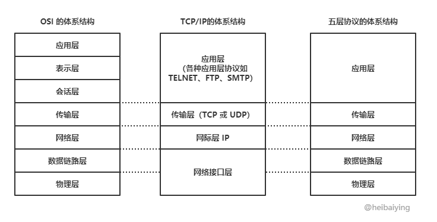 </div>


1. **应用层 (application layer)**：直接为应用进程提供服务。应用层协议定义的是应用进程间通讯和交互的规则，不同的应用有着不同的应用层协议，如 HTTP协议（万维网服务）、FTP协议（文件传输）、SMTP协议（电子邮件）、DNS（域名查询）等。
2. **传输层 (transport layer)**：有时也译为运输层，它负责为两台主机中的进程提供通信服务。该层主要有以下两种协议：
   + 传输控制协议 (Transmission Control Protocol，TCP)：提供面向连接的、可靠的数据传输服务，数据传输的基本单位是报文段（segment）；
   + 用户数据报协议 (User Datagram Protocol，UDP)：提供无连接的、尽最大努力的数据传输服务，但不保证数据传输的可靠性，数据传输的基本单位是用户数据报。
3. **网络层 (internet layer)**：有时也译为网际层，它负责为两台主机提供通信服务，并通过选择合适的路由将数据传递到目标主机。
4. **数据链路层 (data link layer)**：负责将网络层交下来的 IP 数据报封装成帧，并在链路的两个相邻节点间传送帧，每一帧都包含数据和必要的控制信息（如同步信息、地址信息、差错控制等）。
5. **物理层 (physical Layer)**：确保数据可以在各种物理媒介上进行传输，为数据的传输提供可靠的环境。

## 二、物理层

物理层考虑的是如何在各种媒介上传输数据，它定义了与传输媒介相关的接口特性，如：

+ **机械特性**：指明接口所用的接线器的形状和尺寸、引线数目和排列、固定和锁定装置等。
+ **电气特性**：指明在接口电缆的各条线上出现的电压的范围。
+ **功能特性**：指明某条线上出现的某一电平的电压的意义。
+ **规程特性**：指明对于不同功能的各种可能事件的出现顺序。

### 2.1 传输媒介

物理层并不指具体的传输媒介，相反物理层希望能够尽量屏蔽不同媒介间的差异。这些传输媒介可以分为以下两类：

+ **导引型传输媒介**：信号被导引沿着固体媒介进行传播，如双绞线、同轴电缆、光缆。
+ **非导引型传输媒介**：信号在自由空间内进行传播，如短波通信、微波通信。

### 2.2 信道分类

信道是指信息传输的基本通道，它可以分为以下三类：

+ **单工信道**：只能有一个方向的通信而没有反方向的通信；
+ **半双工信道**：通信的双方都能发送信息，但双方不能同时发送或接收信息。
+ **全双工信道**：通信的双方可以同时发送和接收信息。

### 2.3 信道复用

信道复用是信息传输当中最常使用的技术，用于提高信息传输的效率，根据采用技术的不同，可以分为以下几类：

**1. 频分复用**

频分复用（FDM，Frequency Division Multiplexing）是将用于传输信道的总带宽划分成若干个子频带（或称子信道），每个子信道传输一路信号：

<div align="center"> 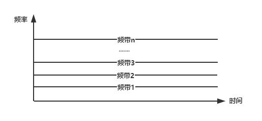 </div>


**2. 时分复用**

时分复用（TDM，Time Division Multiplexing) 是指采用同一物理连接的不同时段来传输不同的信号：

<div align="center"> 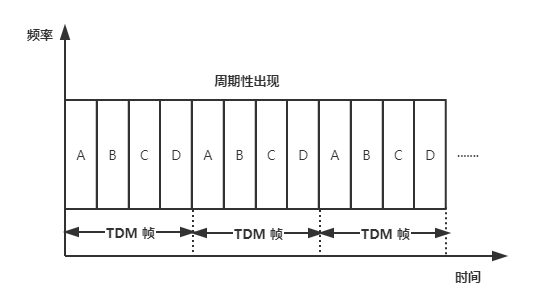 </div>


如上图所示，在一个时分复用帧中，不同用户的信号周期性出现，如果某个用户处于闲置状态，则其对应的帧上也会出现空闲：

<div align="center"> 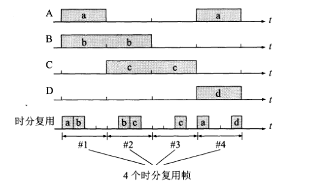 </div>


为了解决时分复用的这个缺点就产生了统计时分复用。

**3. 统计时分复用**

在统计时分复用（Statistic TDM）模式下，各用户将数据发送到集中器的输入缓存中，然后由集中器进行顺序扫描并放入到 STDM 帧中：

<div align="center"> 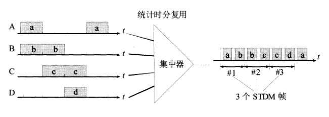 </div>


**4. 波分复用**

波分复用（WDM，Wavelength Division Multiplexing）是将两种或多种不同波长的光载波信号在发送端经复用器汇合在一起，并耦合到光线路的同一根光纤中进行传输；在接收端，经分用器将各种波长的光载波分离，然后由光解调器作进一步处理以恢复原信号：

<div align="center"> 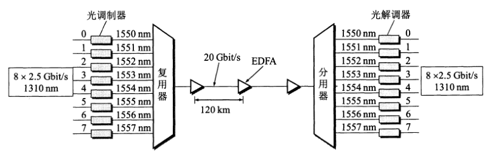 </div>


**5.码分复用**

码分复用（CDM，Code Division Multiplexing）是靠不同的编码来区分各路原始信号的一种复用方式。

## 三、数据链路层

### 3.1 基本功能

**1. 封装成帧**

数据链路层会将网络层传递下来的数据拆分为多段，并在每段数据前后分别添加首部和尾部，以构成一个完成的帧，帧是链路层传输的基本数据单元。帧首部用控制字符 `SOH` 表示，帧尾部用控制字符 `EOT` 表示：

<div align="center"> 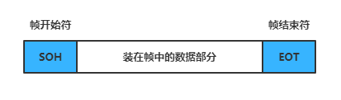 </div>


**2. 透明传输**

透明传输是指不论何种数据都应当能够在链路上进行安全地传输。由于我们采用控制字符来封装帧，当传输数据中出现了控制字符时，就会导致无法正确区分出帧头帧尾，此时需要使用转移字符 `ESC` 来进行转义：

<div align="center"> 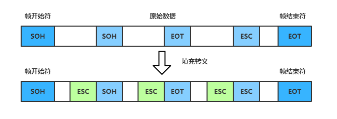 </div>


**3. 差错检测**

由于现实环境中的通信链路都是不理想的，因此比特在传输过程中可能会产生差错：1 可能会变成 0，而 0 也可能变成 1，这称为比特差错。在一段时间内，传输错误的比特占所传输比特总数的比率称为误码率。为了解决这个问题，数据链路层将待发送的数据分为多组，并采用循环冗余校验（CRC，Cyclic Redundancy Check）技术为每组数据生成冗余校验码，之后将每组数据和其校验码共同构成一帧后再发送出去。

### 3.2 PPP 协议

点到点协议（PPP，Point to Point Protocol）是目前使用最为广泛的数据链路层协议，主要用于建立点对点的连接来传输数据单元。它由以下三部分组成：

+ 一个将 IP 数据报封装到串行链路的方法；
+ **链路控制协议 (LCP)** ：一种扩展链路控制协议，用于建立、配置、测试和管理数据链路连接。
+ **网络控制协议 (NCP)** ：协商该链路上所传输的数据包格式与类型，建立、配置不同的网络层协议。

### 3.3 Mac 地址

MAC 地址（Media Access Control Address），直译为媒体存取控制地址，也称为局域网地址（LAN Address）或物理地址（Physical Address）。MAC 地址用于在网络中唯一标识一个网卡，一台设备若有多个网卡，则每个网卡都会有一个唯一的 MAC 地址。链路层通过 Mac 地址来识别需要发送数据的目标节点。

MAC地址为 48 位的（6 个字节），通常表示为 12 个 16 进制数，每两个 16 进制数之间用冒号隔开，如 `08：00：20：0A：8C：6D`，前 3 字节为组织机构唯一标识（OUI，Organizationally Unique Identifier），由 IEEE 的注册管理机构统一分配给硬件生产厂家，以确保在全球范围内的唯一；后 3 字节由厂家自行分配。

### 3.4 局域网

局域网（LAN，Local Area Network）是连接住宅、学校、实验室、大学校园或办公大楼等有限区域内计算机的网络。 按照 IEEE802 标准，局域网体系结构分为三层，即物理层，媒体链路控制层（MAC），逻辑链路控制层（LLC）。实际上是两层，该标准将数据链路层拆分为更具体的媒体链路控制层和逻辑链路控制层。

### 3.5 以太网

以太网（Ethernet）是目前使用范围最广的局域网，以常用的以太网 v2 标准为例，其帧格式如下：

<div align="center">  </div>


其中 Mac Header 分别记录了目的地的 Mac 地址和来源地的 Mac 地址。

## 四、网络层

### 4.1 网际协议 IP

网际协议（Internet Protocol）是网络层中最重要的协议，也是 TCP\IP 两大核心协议之一，所有需要互联的计算机网络都需要遵循该协议，以便能够将不同网络在全世界范围内连接起来。该层传输的基本数据单元是 IP 数据报，其格式如下：

<div align="center"> 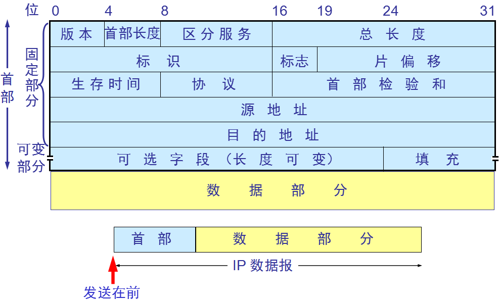 </div>


各字段的含义如下：

+ **版本**：占 4 位，指 IP 协议的版本（IPv4 或 IPv6）。
+ **首部长度**：占 4 位，可表示的最大十进制数是 15 。
+ **区分服务**：只有在使用区分服务时，该字段才有用，一般情况下不会用到。
+ **总长度**：指首部长度和数据长度之和，单位为字节。该字段为 16 位，因此数据报最大长度为 65535 个字节，由于数据链路层规定了一个帧中数据字段的最大长度 MTU（Maximum Transfer Unit，最大传送单元），以以太网为例，该值为 1500，所以当数据报长度超过 MTU 时，需要对数据进行分片。
+ **标识**：占 16 位，由 IP 软件内部的计数器维护，每产生一个数据报，计数器就加 1，用于发生分片时，将相同数据报标识的分片重组为原数据报。
+ **标志**：占 3 位，目前只有两位有意义：
  + 最低位 MF（More Fragment）：为 1 时表示后面还有分片，为 0 时表示该数据报分片已经是最后一个；
  + 中间位 DF（Don't Fragment）：代表不能分片，只有将其设为 1 时，才允许分片。
+ **片偏移**：占 13 位，标识该片在原数据报中的偏移位置。
+ **生存时间**：TTL，每经过一个路由器，其值就会减 1，当值为 0 时，就将该数据报丢弃。这样做是为了避免数据报目的地址不存在时，数据报一直在网络中无限制转发。
+ **协议**：占 8 位，指明数据报携带的数据所使用的协议。
+ **首部校验和**：占 16 位，其只校验数据报的首部，不包括数据部分。
+ **源地址**：占 32 位，数据来源的 IP 地址；
+ **目的地址**：占 32 位，目的地的 IP 地址。

### 4.2 ARP 协议

IP 数据报中的源地址和目标地址均是 IP 地址，而数据链路层的帧中的源地址和目标地址均是 Mac 地址，那么怎样根据 IP 地址获得 Mac 地址？这就需要使用到 ARP 协议。互联网络中的每台主机都有一个 ARP 缓存表，存储了本局域网内各主机和路由器的 IP 地址与 Mac 地址的映射关系，示例如下：

| 主机名称 |    IP地址     |      MAC地址      |
| :------: | :-----------: | :---------------: |
|    A     | 192.168.38.10 | 00-AA-00-62-D2-02 |
|    B     | 192.168.38.11 | 00-BB-00-62-C2-02 |
|    C     | 192.168.38.12 | 00-CC-00-62-C2-02 |
|    D     | 192.168.38.13 | 00-DD-00-62-C2-02 |
|    E     | 192.168.38.14 | 00-EE-00-62-C2-02 |

> 你也可以使用 `arp -a` 来查看你本机的 ARP 缓存表 。

拥有 ARP 表后，数据链路层中帧的发送过程如下：

+ 主机 A 发送数据前， 会先查看自己的 ARP 表中是否有目标 IP 对应的 Mac 地址，如果有则将其封装到帧里，然后发送；
+ 如果没有找到，主机 A 则会以广播的方式向同一网段内的所有主机发出对该 IP 地址的询问；
+ 对应 IP 地址的主机接收到这个消息后以单播的方式将对应的 Mac 地址回复给主机 A 。

### 4.3 IP 地址分类

IP 地址由 ICANN（The Internet Corporation for Assigned Names and Numbers，互联网名称与数字地址分配机构）进行分配，它是一个在全世界范围内唯一的 32 位标识符，最早的 IP 地址采用两级分类，只由 `网络号 + 主机号` 组成，分为以下五类：

<div align="center"> 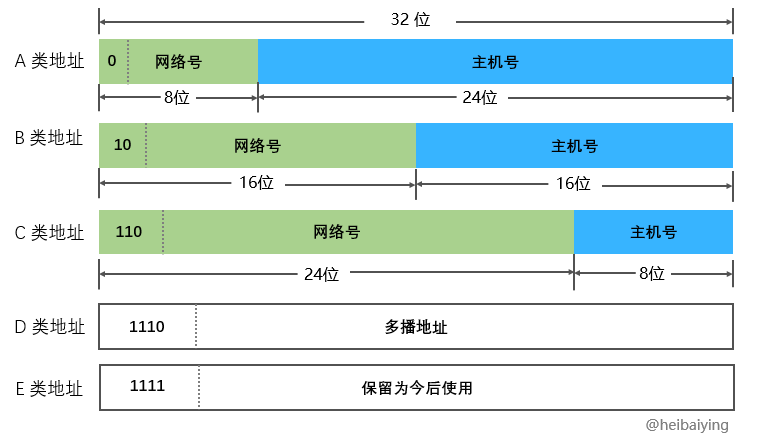 </div>


A，B，C 三类是最常使用的类型，其类别位分别为 0，10，110 。需要注意的是另外并非所有 IP 地址都可用来分配，限制如下：

**网络号限制**：

+ 网络号全为 0 的 IP 地址是保留地址，代表 “本网络”（B，C 两类地址的网络号开头都是 1，所以不存在全 0 的情况）；
+ 网络号为 127（即 01111111）也是保留地址，作为回环测试使用（同上，B 和 C 两类地址也不存在该情况）；
+ B 类地址 128.0.0.0 （网络号为 10000000 00000000）不能用于分配；
+ C 类地址 192.0.0.0 （网络号为 11000000 00000000）不能用于分配；

**主机号限制**：

+ 全 0 主机号表示该 IP 地址是本主机所连接到的单个网络地址，如 IP 地址为 5.6.7.8 的主机所在的网络地址就是 5.0.0.0，该地址不能用于分配；
+ 全 1 主机号表示该网络上的所有主机，因此也不能被分配。

综上所述，每种网络类型所能分配到 IP 地址的情况如下：

| 网络类别 | 最大可分配的网络数         | 第一个可分配的网络号 | 最后一个可分配的网络号 | 每个网络的最大主机数   |
| -------- | -------------------------- | -------------------- | ---------------------- | ---------------------- |
| A        | 126（2<sup>7</sup>-2）     | 1 | 126 | 16 777 215（2<sup>24</sup>-2） |
| B        | 16 383（2<sup>14</sup>-1） | 128.1 | 191.255 | 65 534（2<sup>16</sup>-2） |
| C        | 2 097 151（2<sup>21</sup>-1） | 192.0.1 | 223.255.255 | 254（2<sup>8</sup>-2） |

从该表我们可以看出来，两级 IP 地址灵活性不足，且利用率较低，假设你现在的公司有 4 个机房（每个机房 20 台主机），出于信息安全的考虑，每个机房的网络需要彼此隔离，在两级 IP 的架构下你就只能申请 4 个 C 类地址，此时你浪费的 IP 数量为 `(254-20)*4` ，为解决两级 IP 地址灵活性不足问题，就产生了三级 IP 地址，即划分子网。此时你只需要申请一个 C 类地址，然后将其划分为 4 个子网。

### 4.4 划分子网

划分子网方案诞生与 1985 年，它从主机号借用若干位作为子网号，从而将 IP 地址划分为三级：网络号 + 子网号 + 主机号。假设网络地址为 192.168.10.0，利用子网掩码 255.255.255.224 对其进行划分子网，此时可以划分为四个子网：

<div align="center"> 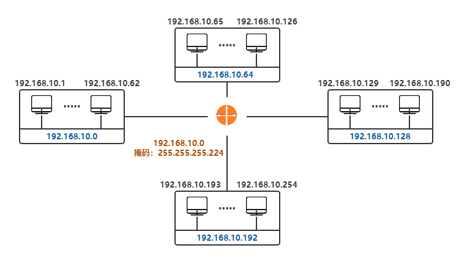 </div>


由于子网对外是不可见的，所以需要使用子网掩码来辅助路由，假设目标 IP 地址为 192.168.10.198，想要正确到达该地址，必须先正确到达网络地址 192.168.10.192 。网络地址，子网掩码和主机 IP 之间的关系如下：

```
IP 地址：192.168.10.198             二进制IP地址：11000000.10101000.00001010.11000110
子网掩码：255.255.255.224           二进制掩码：11111111.11111111.11111111.11100000
网络地址：192.168.10.192            按位逻辑与运算结果为：11000000.10101000.00001010.11000000
```

现代互联网标准规定：所有网络都必须使用子网掩码，同时路由器的路由表中也必须包含子网掩码这一项。因为路由表包含了 IP 地址和子网掩码，所以通过位运算就能很快计算出网络地址。

最后，如果一个网络不划分子网掩码，则其子网掩码取默认值，各类 IP 地址默认的掩码如下：

| 类别 | 子网掩码的二进制数值                | 子网掩码的十进制数值 |
| ---- | ----------------------------------- | -------------------- |
| A    | 11111111 00000000 00000000 00000000 | 255.0.0.0            |
| B    | 11111111 11111111 00000000 00000000 | 255.255.0.0          |
| C    | 11111111 11111111 11111111 00000000 | 255.255.255.0        |

### 4.5 构成超网

无类别域间路由（CIDR，Classless Inter-Domain Routing）是一个给用户分配 IP 地址以及在互联网上有效地路由 IP 数据报的地址归类方法。它消除了传统的 A 类，B 类 和 C 类地址以及划分子网的概念，采用无分类的两级编址：
```
IP地址 ::= {<网络前缀>,<主机号>}
```
并使用斜线记法进行表示：

<center>128.14.35.7 / 20 = <u>10000000 00001110 0010</u>0011 00000111</center>
此时表示前 20 位都是网络前缀，该地址所处的地址块中的最小地址和最大地址则分别为：

|          | 十进制        | 二进制                                     |
| -------- | ------------- | ------------------------------------------ |
| 最小地址 | 128.14.32.0   | <u>10000000 00001110 0010</u>0000 00000000 |
| 最大地址 | 128.14.47.255 | <u>10000000 00001110 0010</u>1111 11111111 |

每个地址块可以使用地址块中的最小地址和网络前缀的位数进行指定，例如上面的地址块可以记为 128.14.32.0 / 20 ，也可以简称为 `/20地址块` 。为更方便的进行路由选择，CIDR 使用 32 位的地址掩码，斜线后面的数字同时表示地址掩码中 1 的个数，例如 `/20地址块` 的地址掩码为 11111111 11111111 11110000 00000000 。

由于一个 CIDR 地址块可以包含多个地址，所以路由表就利用 CIDR 地址块来查找目标网络，这种地址聚合常称为路由聚合，也称为**构成超网**。通过路由聚合，可以极大减少路由表中项目的数量，从而提高网络的整体性能。

### 4.6 ICMP 和 IGMP

在网络层，除了上面介绍的 IP 协议和 ARP 协议外，最常使用的还有以下两个协议：

+ **互联网控制消息协议 (ICMP，Internet Control Message Protocol)**：为了提高 IP 数据报的交付率，ICMP 允许主机或路由器报告差错情况和提供异常报告给发送者，以便发送者进行补偿行为。
+ **网路群组管理协议 (IGMP，Internet Group Management Protocol)** ：是用于管理网路协议多播组成员的一种通信协议。IP 主机和相邻的路由器可以利用 IGMP 来建立多播组的组成员。

### 4.7 专用地址

RFC 1918 中指明了一些专用地址（Private Address），这些地址只能用于一个机构的内部通信，但不能用于和互联网上的主机进行通信。在互联网中的所有路由器，对目的地址是专用地址的数据报一律不进行转发。下面是三个专用的地址块：

+ 10.0.0.0 -- 10.255.255.255（或记为 10.0.0.0/8 ，又称为 24 位块）；
+ 172.16.0.0 -- 172.31.255.255（或记为 172.16.0.0/12 ，又称为 20 位块）；
+ 192.168.0.0 -- 192.168.255.255（或记为 192.168.0.0/16 ，又称为 16 位块）。

因为不同机构可以采用相同的专用地址，因此其也被称为可重用地址。

### 4.8 VPN

如果一个机构内使用的是由专用地址构成的专用网，但该机构的部门却分布在不同的、远距离的地理位置上，此时可以利用公共的互联网作为本机构内各专用网之间的通信载体，这样的专用网称为虚拟专用网（Virtual Private Network）。此时通过公共互联网的数据可以使用 IPSec（IP Security）协议加密来保证安全性。

### 4.8 NAT

当某台主机获取到的地址是专用地址时，其是无法和外部互联网进行通讯的，如果想要和外部互联网进行通讯，可以采用 NAT（Network Address Translation，网络地址转换）技术来实现。该方法需要在专用网连接到互联网的路由器上安装 NAT 软件，NAT 路由器需要至少一个有效的全球 IP 地址，当使用专用地址的主机在和外界进行通信时，NAT 路由器会将其转换为全球 IP 地址。

由上面的原理也可以看出，具有 n 个全球 IP 地址的路由器最多只允许 n 台主机同时接入到互联网。 为了解决这个问题，现在常用的 NAT 转换表会把传输层的端口号也利用上。

<div align="center"> 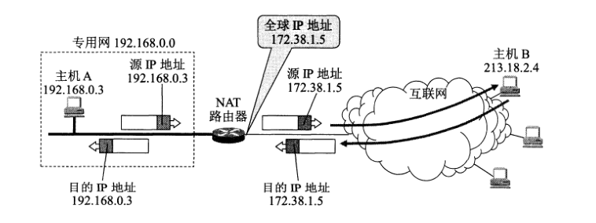 </div>


### 4.9 IPv6

上面我们介绍过 IPv4 的长度为 32 位，因此所有可分配的 IP 地址大约为 42 亿个，到 2011 年 2 月，所有可分配地址均已耗尽，因此产生了 IPv6，IPv6 的地址长度为 128 位，采用十六进制表示。

## 五、传输层

传输层负责为两台主机中的进程提供通信服务，它使用 16 位的端口号来标识端口，当两个计算机中的进程要进行通讯时，除了要知道对方的 IP 地址外，还需要知道对方的端口。该层主要有以下两个协议：用户数据报协议（UDP，User Datagram Protocol）和传输控制协议（TCP，Transmission Control Protocol）：

### 5.1 UDP

用户数据报协议 UDP 具有以下特点：

+ UDP 是无连接的；

+ UDP 提供尽最大努力的交付服务，但不保证交付的可靠性；

+ UDP 是面向报文的；

+ UDP 没有拥塞控制，因此网络出现拥塞不会使源主机的发送速率降低；

+ UDP 支持一对一、一对多、多对一和多对多的交互通信；

+ UDP 的首部开销较小，只有 8 个字节，远小于 TCP 的  20 个字节。首部共由四个字段组成，每个字段两个字节：

  + 源端口号：在需要对方回信时选用，不需要时可用全 0 表示；
  + 目标端口号；
  + 长度：UDP 用户数报的总长度；
  + 校验和：检测 UDP 用户数据报在传输中是否有错，如果有错则丢弃。

  <div align="center"> 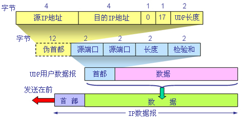 </div>


### 5.2 TCP 简介

传输控制协议 TCP 具有以下特点：

+ TCP 是面向连接的；

+ TCP 提供可靠的交付服务；

+ TCP 提供全双工的通信，两端都设有缓存，用来临时存放通信数据；

+ 面向字节流，这里的流指的是流入或流出进程的字节序列；

+ 每一条 TCP 连接唯一地被通信两端的两个端点所确定，即：

  ```
  TCP 连接 ::= {socket1,socket2} = {(IP1,port1),(IP2,port2)}
  ```

### 5.3 TCP 报文首部

TCP 虽然是面向字节流的，但其传输的基本数据单元则是报文段。一个 TCP 报文段分为首部和数据两部分，TCP 首部的前 20 个字节是固定的，后面有 4n 字节是根据需要而增加的选项（n 为整数），具体格式如下：

<div align="center"> 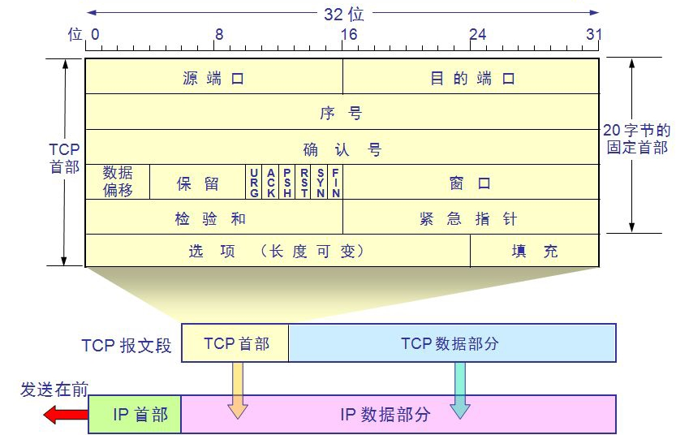 </div>


各字段的含义如下：

1. **源端口和目的端口**：各占 2 个字节。
2. **序号**：占 4 字节，序号范围为 [ 0 , 2<sup>32</sup> - 1 ] ，序号增加到 2<sup>32</sup> - 1 后又会回到 0 。在一个 TCP 连接中，传送的字节流中的每一个字节都要按顺序进行编号。
3. **确认号**：占 4 字节，表示期望收到对方下一个报文段的第一个数据字节的序号。例如 B 收到 A 的报文，序号值为 501 ，数据长度为 200 字节（序号 501 ~ 700），此时表明 B 正确收到了序号 700 及其之前的所有数据，因此 B 在发送给 A 的确认报文段中确认号的值为 701。
4. **数据偏移**：占 4 位，其所能表达的最大数字是 15 。数据偏移表示该数据报中数据的起始位置，由于数据报是由 首部+数据 组成，所以实际上就是指报文段的首部长度。数据偏移的单位是 32 位字（即以 4 字节长为单位），所以数据偏移的最大长度是 60 （15*4）字节，即 TCP 报文段的首部长度不能超过 60 字节，对应的选项长度不能超过 40 字节。
5. **保留**：占 6 位，保留为今后使用，目前应置为 0 。
6. **六个控制位**：其作用分别如下：
   + **紧急 URG (URGent)**：当值为 1 时，表明紧急指针字段有效，代表此报文中有紧急数据，应尽快传送，而无需按原来的排队顺序传送。
   + **确认 ACK (ACKnowledgment)**：当值为 1 时，确认号有效；值为 0 时，确认号无效。TCP 规定，在连接建立后所有传送的报文段都必须把 ACK 置为 1。
   + **推送 PSH (Push)**：当值为 1 时，表示接受方应该将数据立即交付给应用进程，而不是等待缓存填满后再向上交付。
   + **复位 RST (Reset)**：当值为 1 时，表明 TCP 连接出现严重差错，必须立即释放，然后再重新建立连接；也可以用来拒绝一个非法的报文段或拒绝打开一个连接。
   + **同步 SYN (SYNchronization)**：在连接建立时用来同步序号。当 SYN = 1 而 ACK = 0 时，表明这是一个连接请求报文段；对方若同意建立连接，则应在响应的报文段中使 SYN = 1 和 ACK = 1 。
   + **终止 FIN (FINis)**：当值为 1 时，表明此报文段发送方的数据已发送完毕，并要求释放连接。
7. **窗口**：占 2 字节，取值范围为 [ 0 , 2<sup>16</sup> - 1 ] 之间的整数。窗口字段保持动态变化，用于指明接收方允许发送方发送的数据量。
8. **校验和**：占 2 字节，校验的字段范围包括首部和数据。
9. **紧急指针**：占 2 字节，仅在 URG = 1 时才有意义，用于指明紧急数据的结束位置，位于结束位置之后的就是普通数据。
10. **选项**：长度可变，最长可达 40 字节。可用的选项有：最大报文段长度 ，窗口扩大选项、时间戳选项等。

### 5.4 三次握手

TCP 建立连接的过程叫做握手，握手需要在客户和服务器之间交换三个 TCP 报文段，具体如下：

<div align="center"> 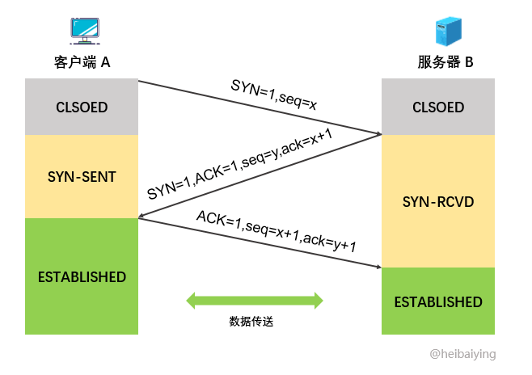 </div>


1. 服务器进程 B 首先创建传输控制模块 TCB，然后进入 LISTEN（收听）状态，准备接受客户端的连接请求；
2. 客户端进程 A 首先创建传输控制模块 TCB，然后发出连接请求报文段，此时同步位 `SYN = 1` ，同时选择一个初始序号 `seq = x` ，之后进入 SYN-SENT（同步已发送）状态；
3. B 收到连接请求报文段后，如果同意建立连接，则发送确认报文段，此时 SYN 和 ACK 都置为 1，确认号 `ack = x + 1` ，并为自己选择一个初始序号 `seq =y` ，之后进入 SYN-RCVD（同步收到）状态；
4. A 收到来自 B 的确认后，发出最后的确认，确认报文段的 ACK 为 1，确认号 `ack = y + 1`，序号 `seq = x + 1`。TCP 标准规定，ACK 报文段可以携带数据也可以不携带，如果不携带则该序号不被消耗，下一个数据报文段的序号仍然是 `seq = x + 1`。之后 A 进入 ESTABLISHED（已连接）状态；
5. 当 B 收到 A 的确认后，也进入 ESTABLISHED 状态。 

### 5.5 四次挥手

数据传输结束后，通信的双方都可以释放连接，具体过程如下：

<div align="center"> 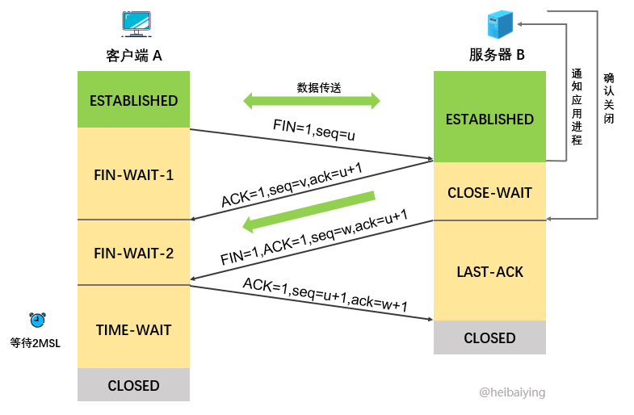 </div>


1. 假设应用进程 A 先主动关闭连接，此时需要发送连接释放报文段：首部终止控制位 FIN 为 1，序号 `seq = u`，其中 u 等于前面传送过的数据的最后一个字节的序号加 1 。之后 A 进入 FIN-WAIT-1（终止等待 1）状态；
2. 应用进程 B 收到连接释放报文段后立即发出确认，确认号 `ack = u + 1`，序号 `seq = v` ，其中 v 等于前面传送过的数据的最后一个字节的序号加 1 。之后 B 进入 CLOSE-WAIT（关闭等待）状态，并通知高层应用进程。此时 TCP 连接处于半关闭状态，即 A 已经没有数据需要发送，但如果 B 发送数据，A 仍要接收；
3. A 收到来自 B 的确认后就进入 FIN-WAIT-2（终止等待 2）状态，等待 B 发出连接释放报文段；
4. 若高层应用进程已经没有数据要发送，则通知 B 释放 TCP 连接。此时 B 发出释放连接报文段：首部终止控制位 FIN 为 1，序号 `seq = w`（在半关闭状态下 B 可能又发送了一些数据），另外还需要重复上次已经发送过的确认号 `ack = u + 1`。之后 B 进入 LAST-ACK（最后确认）状态；
5. A 收到 B 的连接释放报文段后，发出最后确认：ACK 为 1，确认号 `ack = w + 1`，序号 `seq = u + 1`，然后进入 TIME-WAIT（有时间限制的等待）状态；
6. B 收到来自 A 的最后确认后进入 CLOSED（关闭）状态；
7. A 经过 2 倍的 MSL（Maximum Segment Lifetime，最长报文段寿命）后，才进入 CLOSED 状态。

RFC 793 建议 MSL 设置为 2 分钟，现在的网络环境已经有了质的提升，该值可以按需缩短。A 之所以要等待两倍的 MSL 时间后才进入 CLOSED 状态，主要基于以下两个原因：

+ 为了保证 A 发送的最后一个 ACK 报文段能够到达 B。如果 B 没有收到该最后确认，则会进行超时重发 FIN+ACK 报文段，A 在 2MSL 等待时间内会响应该报文段并重发最后确认；
+ 确保本次连接内产生的所有报文段都从网络消失，进而确保下一个新的连接中不会出现旧的连接请求报文段。

### 5.6 可靠传输的原理

**1. 停止等待协议**

想要实现可靠性传输，最基本的可以使用停止等待协议：每发送完一个数据单元就停止发送，并等待对方的确认。

<div align="center"> 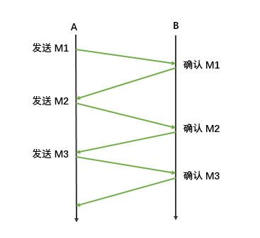 </div>


此时面临两个问题：

+ 如果 A 给 B 发送数据的过程中出现了丢失，此时 B 无法收到数据，自然也不会返回确认，那么程序就会一直等待；
+ 如果 B 给 A 发送确认的过程中出现了丢失或经过很长时间才到达 A，那么程序也会持续等待。

针对第一个问题，解决方案是如果在给定的时间内没有收到确认，则进行超时重传：

<div align="center"> 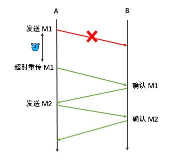 </div>


针对第二个问题，其解决方案依然是超时重传，具体细分为以下两种情况：

+ 如果 B 收到了 M1，只是返回的确认丢失了，当超时重传后，B 需要丢弃重复收到的 M1；

+ 如果 B 的返回确认没有丢失，只是超过了重传时间后才到达 A，此时 A 可能会收到两次确认，一次是补传得到确认，一次是原有的延迟到达的确认，A 需要丢弃延时到达的确认，不做任何处理：

  <div align="center"> 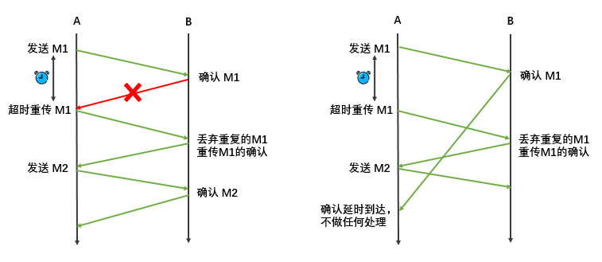 </div>


在基本的停止等待协议中，一次只发送一个数据单元，此时信道利用率非常低，为了解决这个问题，可以采用流水线传输，一次发送多个数据单元：

<div align="center"> 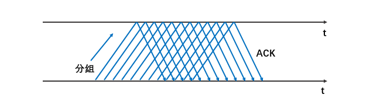 </div>


当使用流水线传输时，为保证可靠性，需要配合使用连续 ARQ 协议和滑动窗口协议。

**2. 连续 ARQ 协议**

连续ARQ（Automatic Repeat reQuest）协议指发送方维持着一个一定大小的发送窗口，位于发送窗口内的所有分组都可连续发送出去，中途不需要等待对方的确认，发送方在每收到一个确认时就把发送窗口向前滑动一个分组的位置：

<div align="center"> 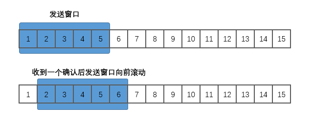 </div>


通常接收方一般都是采用累积确认的方式。此时接收方不必对收到的分组逐个发送确认，而是在收到几个分组后，对按序到达的最后一个分组发送确认，它表示：这个分组及其之前的所有分组都已正确到达。

### 5.7 TCP 的可靠传输

TCP 的滑动窗口以字节为单位，并采用以下方法来计算超时重传时间 RTO（Retransmission Time Out）：

```
RTO = RTT_S + 4 × RTT_D
```

其中 RTT<sub>S</sub> 表示加权平均往返时间，计算方式如下：
```
新的 RTT_S = (1-α) × 旧的 RTT_S +  α × 新的 RTT 值
```

+ RTT （Round Trip Time）代表报文段的往返时间，它记录一个报文段从发出去到收到确认的时间长度；
+ 第一次测量时， RTT<sub>S</sub> 的值就等于 RTT 的值，之后的 RTT<sub>S</sub> 则采用上面的公式进行计算；
+ 其中 0 ≤ α＜1 ，RFC 6298 推荐其值取 0.125 。

 RTT<sub>D</sub> 是 RTT 偏差的加权平均值，计算方式如下：
```
新的 RTT_D = (1-β) × 旧的 RTT_D +  β × |RTT_S - 新的 RTT 值|
```

+ 第一次测量时，RTT<sub>D</sub> 的值就等于 RTT 值的一半，之后的 RTT<sub>D</sub> 则采用上面的公式进行计算；
+ β 值是一个小于 1 的系数，RFC 6298 推荐其值取 0.25 。

### 5.8 流量控制

流量控制（flow control）是指控制发送方的发送速率，以便接收方来得及接收。假设 A 向 B 发送数据，在连接建立时，B 会将自己接收窗口（rwnd，receiver window）的大小告诉 A ，而 A 需要保证发送窗口的大小不能超过 B 接收窗口的大小，通过该机制就可以实现对发送方的流量控制。

### 5.9 拥塞控制

网络拥塞（congestion）是指传输的数据量超过节点承受能力而导致传输能力下降的情况。而拥塞控制就是防止过多的数据注入到网络中而造成路由器和链路过载。TCP 采用四种算法来进行拥塞控制，分别是：慢启动（slow start）、拥塞避免（congestion avoidance）、快重传（fast retransmit）和快恢复（fast recovery）：

**1. 慢启动**

慢开始和拥塞避免都是基于窗口的拥塞控制：发送方会维持一个名为拥塞窗口 cwnd（congestion window）的状态变量，其值取决于网络的拥塞程度，并会动态变化，同时发送方会让自己的发送窗口等于拥塞窗口。

慢启动的思路如下：由于不知道网络的负载能力，所以最好的选择就是逐步探测，即由小到大成倍地增大发送窗口，也就是说，由小到大成倍地增大拥塞窗口的值。

**2. 拥塞避免**

拥塞避免算法的思路是让拥塞窗口 cwnd 缓慢地增大：每经过一个往返时间 RTT 就把发送方的拥塞窗口 cwnd  加 1，而不是像慢启动阶段那样加倍地增长。慢启动和拥塞避免通常是配合使用，以保证启动速度，一开始使用慢启动进行成倍增长，当达到某一个阈值 ssthresh  后采用拥塞避免进行稳步尝试：

<div align="center"> 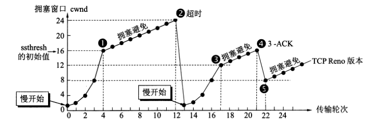 </div>


**3. 快重传和快恢复**

快重传算法要求接收方不要等待自己发送数据时才进捎带确认，而是要立即发送确认，即使收到了失序报文段也要立即发出对已收到的报文段的重复确认。示例如下：

<div align="center">  </div>


如上图所示，当 M<sub>3</sub> 丢失时，之后发送 M<sub>4</sub> ， M<sub>5</sub> ， M<sub>6</sub> 时收到的都是对于 M<sub>2</sub> 的重复确认，此时发送方就可以知道 M<sub>3</sub> 已经丢失，需要立即进行重传。由于此时只是个别报文出现了丢失，而不是网络拥塞，所以执行**快恢复**：发送方调整 ssthresh = cwnd / 2，并设置 cwnd = ssthresh = 8 （图中点5），并开始执行拥塞避免算法。

<div align="center">  </div>


## 六、应用层

### 6.1 域名系统  DNS

目前我们都是使用易于理解的域名来访问互联网应用，但传输层需要的则是 IP 地址，因此需要使用域名系统（DNS，Domain Name System）来进行域名与 IP 地址之间的转换 。

域名是一个逻辑上的概念，分为多级域名，其中最基础的是根域名，其次是顶级域名，顶级域名共分为四类：

+ **国家顶级域名 nTLD**：如 cn  表示中国，us 表示美国；
+ **通用顶级域名 gTLD**：如 com 表示公司企业，org 表示非盈利性组织，net 表示网络服务机构；
+ **基础结构域名**：又称为反向域名，用于反向域名解析，该顶级域名只有一个 arpa；
+ **新顶级域名 New gTLD**：ICANN 机构在 2011 年 6 月 20 日批准新顶级域名，允许任何满足条件的公司或机构进行申请。

<div align="center"> 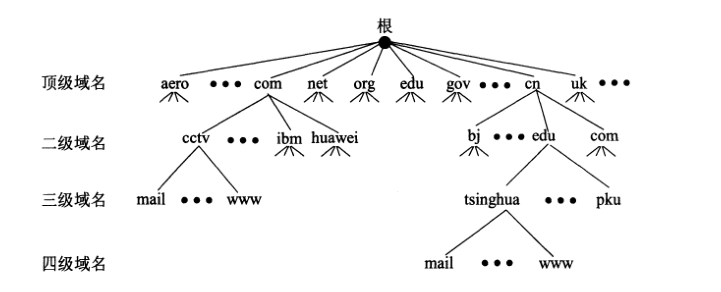 </div>


### 6.2 文件传输协议 FTP

文件传输协议（FTP，File Transfer Protocol）是用于在网络上进行文件传输的一套标准协议，允许客户指明文件的类型和格式，并获得文件的存储权限。FTP 的服务器进程由两大部分组成：

+ **一个主进程**：负责接收新的请求；
+ **若干个从属进程**：负责处理单个请求。

因此一个 FTP 服务器进程可以同时为多个客户端进程提供服务。

### 6.3 远程终端协议 TELNET

Telnet 协议是 Internet 远程登录服务的标准协议和主要方式，它为用户提供了在本地计算机上访问远程主机的能力。Telnet 能将用户的击键传到远程主机，同时也能将远程主机的输出通过 TCP 连接返回到用户屏幕，这种服务是透明的，用户感觉键盘和显示器好像都是直接连在远程主机上，因此 Telnet 又称为终端仿真协议。

### 6.4 万维网 WWW

万维网是一个分布式的超媒体系统，它是超文本系统的扩展。它包含以下重要概念：

**1. 统一资源定位符 URL**

用于定位互联网上资源的位置和访问这些资源的方法，其格式如下：
```
<协议>://<主机>:<端口>/<路径>
```
**2. 超文本传送协议 HTTP**

HTTP 协议定义了浏览器如何向万维网请求文档，以及服务器如何把文档传送给浏览器。

**3. 超文本标记语言 HTML**

超文本标记语言 HTML 是一种标识性的语言，包括一系列标签，这些标签可以用于说明文字、图形、动画、声音、表格、链接等各种类型的资源，并能将网络文档格式进行统一。

### 6.5 动态主机配置协议 DHCP

通常连接到互联网的计算机的协议软件都需要配置多个项目，如 IP 地址，子网掩码，默认路由器的 IP 地址以及域名服务器的 IP 地址等等，为了省去配置的麻烦，现在互联网普遍采用动态主机配置协议 DHCP（Dynamic Host Configuration Protocol），它提供了一种即插即用联网的机制。此时你只需要采用默认的配置即可，如下所示：

<div align="center"> 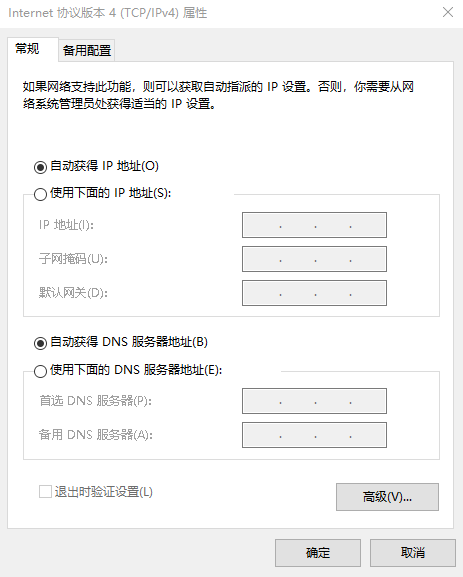 </div>


此时需要进行联网的主机在启动时候会广播发现报文（DHCP DISCOVER），其目的地址为 255.255.255.255（即受限广播地址），此时本地网络上的所有主机都能接收到这个广播报文，但只有 DHCP 服务器才会通过提供报文（DHCP OFFER）对此广播进行响应。DHCP 服务器先在其数据库中查找该计算机的配置信息，若找到，则直接返回；若找不到，则从服务器的 IP 地址池取一个地址分配给该计算机。

通常不是每个网络都有 DHCP 服务器，但每个网络都至少有一个 DHCP 中继代理（通常是路由器），它配置了 DHCP 服务器的 IP 地址信息。当 DHCP 中继代理收到主机 A 的发现报文后，就以单播的方式向 DHCP 服务器进行转发；并等待其回复后，再转发回主机 A 。

DHCP 服务器分配给 DHCP 客户的 IP 地址是临时性的，只能在一段时间内使用，该时间称为租用期，由 DHCP 服务器进行设置。

## 参考资料

1. 谢希仁 . 计算机网络（第七版）. 电子工业出版社 . 2017-01
2. James F. Kurose / Keith W. Ross . 计算机网络 —— 自顶向下方法（第七版）. 机械工业出版社 . 2018-06
3. [子网划分详解与子网划分实例精析](https://blog.csdn.net/gui951753/article/details/79412524)
4. [网络基础之 -- IP 数据报、分片策略、路由表](https://blog.51cto.com/11418774/1834234)
5. [完全理解 ICMP 协议](https://www.cnblogs.com/iiiiher/p/8513748.html)


